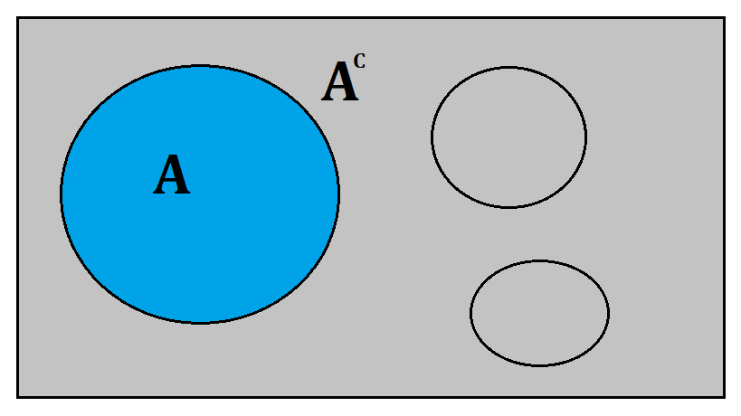

La __Estadística Matemática__ estudia de forma más profunda y formal a la Teoría de la Probabilidad, que a la vez está basada en Teoría de la Medida. Este curso sirve como base para Teoría Estadística para un doctorado en Estadística.

En ocasiones se requiere una fuerte formación en _Teoría de la Medida_, pero en esta página se usarán los conceptos más indispensables para abordar su estudio.

## Conceptos básicos

Para el estudio de la estadística matemática, se requieren ciertas definiciones que nos permitirán abordar su estudio.

Una definición muy general es el espacio muestral $\Omega$.

!!! note "Espacio muestral"
    Sea $\Omega$ un conjunto de elementos de interés. $\Omega$ es llamado _Espacio Muestral_.

Usualmente nos referimos a $\Omega$ como el conjunto de todos los resultados posibles de un experimento, aunque de acuerdo con Shao (1999) tambíen podría ser un conjunto de números, un intervalo de la recta real, entre otros.

!!! note "Medida"
    Una _medida_ es una extensión matamética natural de longitud, área o volumen de subconjuntos en espacios Euclideanos de dimensión 1 2 o 3.

Cuando se trabaja con un espacio muestral, una medida será una función definida para _ciertos_ subconjuntos de $\Omega$ que satisfagan ciertas propiedades.

!!! note "$\sigma$-álgrebra"
    Sea $\mathcal{F}$ una colección de subconjuntos de un espacio muestral $\Omega$. $\mathcal{F}$ es llamado una $\sigma$__-álgebra__ o $\sigma$__-campo__ si y solo si tiene las siguientes propiedades:

    1. $\emptyset \in \mathcal{F}$ (El conjunto vacío pertenece a la colección).
    2. $A \in \mathcal{F} \rightarrow A^C \in \mathcal{F}$ (Si el conjunto A pertenece a la colección, también su complemento).
    3. $A_i \in \mathcal{F},i=1,2,\dots, \rightarrow \cup A_i \in \mathcal{F}$ (La unión también pertenece a la colección).

!!! tip "Espacio medible"
    Un par $(\Omega,\mathcal{F})$ es llamado _espacio medible_. Los elementos de $\mathcal{F}$ son llamados _eventos_ en probabilidad y estadística.

El concepto de $\sigma$-campo se ilustra con los siguientes ejemplos.

??? example "El $\sigma$-campo más pequeño"
    Sea A un conjunto propio no vacío de $\Omega$, es decir $A \in \Omega, A \ne \Omega$. ¿Será $\lbrace \emptyset,A,A^C,\Omega \rbrace$ un $\sigma$-campo?

    Considere la siguiente imagen

    

    Observese que este conjunto $\lbrace \emptyset,A,A^C,\Omega \rbrace$ cumple con las 3 propiedades (está el conjunto vacío $\emptyset$,está su complemento $A^C$). De hecho este $\sigma$-campo es el más pequeño que contiene a $A$, ya que cualquier $\mathcal{F}$ podría contener a $A$.

    Este $\sigma$-campo se denota como $\sigma(\lbrace A \rbrace)$.

??? example "$\sigma$-campo Borel"
    Sea $\mathcal{C}$ el conjunto de todos los intervalos abiertos en los números reales $\mathbb{R}$. Entonces $\mathcal{B}=\sigma(\mathcal{C})$ es llamado $\sigma$__-campo Borel__ y los elementos de $\mathcal{B}$ son llamados _conjuntos Borel_.

    Considere un intervalo abierto arbitrario, por ejemplo el intervalo $A=(5,9)$, este intervalo pertenece a $\mathcal{C}$ y también su complemento, en este caso los intervalos abiertos $(-\infty,5) \cup (9,\infty)$.

    Finalmente $\cup A_i=(-\infty,\infty)$ también está en $\mathcal{C}$.

Aunque ya se había mencionado anteriorment una idea de _medida_, continuación se definirá el concepto de manera formal.

!!! note "Medida"
    Sea $(\Omega,\mathcal{F})$ un espacio medible. Una función $v$ definida sobre $\mathcal{F}$ es llamada _medida_ si y solo si tiene las siguientes propiedades.

    1. $0 \le v(A) \le \infty, A \in \mathcal{F}$.
    2. $v(\emptyset) = 0$.
    3. Si $A_i \in \mathcal{F}$ y son disjuntos, entonces

    \(v \left( \bigcup_{i=1}^{\infty} A_i \right) = \sum_{i=1}^{\infty} v(A_i)\).

!!! note "Espacio de medida"
    A la tripleta $(\Omega,\mathcal{F},v)$ se le conoce como _espacio de medida_.

A continuación se definirá un concepto de medida de especial interés.

!!! note "Medida de probabilidad"
    Si $v(\Omega)=1$ entonces $v$ es llamada una _medida de probabilidad_ y usualmente se denota por $P$ en vez de $v$ y la tripleta $(\Omega,\mathcal{F},P)$ es llamada _espacio de probabilidad_.

## Referencias

Shao, J. (1999). _Mathematical statistics_. Springer-Verlag.
