## Introducción

La estadística multivariada es un área que estudia datos recolectados de individuos a los cuales se les mide una o más características.

Usualmente los datos, denotados por $\mathbf{X}$, son registrados en forma rectangular por medio de columnas y renglones. Esta forma permite representar los datos en forma *matricial*.

\(\mathbf{X} =\lbrace X_{i,j}\rbrace = 
\begin{bmatrix}
X_{1,1} & X_{1,2} & \dots & X_{1,p} \\
X_{2,1} & X_{2,2} & \dots & X_{2,p} \\
\vdots & \vdots &\ddots & \vdots \\
X_{n,1} & X_{n,2} & \dots & X_{n,p} \\
\end{bmatrix}
\)

Note que cada renglón representa una observación multivariada, mientras que cada columna denota una variable, se usarán letras minúsculas para refereirse a *observaciones* o *realizaciones*.

??? example "Datos multivariados"
    La siguiente base contiene información de 20 países y 17 indicadores. Esta información fue tomada del banco mundial con información de 2020.

    Country|Agriculture|Exports|Fertility|Forest_area|GDP_growth|GNI_pc|Gross_capital_formation|High_tech_exports|Imports|Industry|Inflation|Life_expectancy|Merchandise_trade|Military_expenditure|Mobile_subs|Mortality_rate|Pop_density
    -------|---------|------|-----|------|------|------|-------|-------|-----|------|------|------|---------|---------|--------|------|-------
    ARG|5.93|16.59|2.233|285730|-9.89|9080|14.01|6.90|13.55|23.31|39.89|76.813|24.95|0.76|121.17|8.6|16.581
    AUS|2.00|23.98|1.581|1340051|-0.003|53680|22.26|21.48|20.05|25.46|1.78|83.2|34.84|2.06|107.65|3.7|3.34
    BRA|5.89|16.79|1.706|4966196|-3.87|7800|15.93|11.35|16.09|17.70|5.14|76.08|25.92|1.43|96.83|14.7|25.43
    CHN|7.69|18.54|1.7|2199781.8|2.23|10530|43.36|31.28|16.04|37.84|0.49|77.097|31.69|1.74|119.39|7.3|149.72
    FRA|1.59|27.87|1.83|172530|-7.85|39500|23.81|23.14|29.89|16.44|2.52|82.17|40.67|2.07|111.45|4.4|123.05
    DEU|0.73|43.41|1.53|114190|-4.56|47520|21.14|15.49|37.69|26.53|1.59|80.94|66.40|1.39|128.18|3.7|238.02
    IND|18.22|18.70|2.184|721600|-6.59|1910|27.89|11.03|19.09|24.53|5.60|69.887|24.35|2.88|83.60|32.6|464.14
    IDN|13.70|17.27|2.266|921332|-2.06|3870|32.35|8.42|15.70|38.25|-0.43|71.908|28.80|0.86|130.01|23|145.68
    ITA|2.009|29.53|1.24|95661.3|-9.02|32380|17.70|9.04|25.87|21.60|1.37|82.34|48.96|1.56|128.31|2.9|199.67
    JPN|1.04|15.55|1.34|249350|-4.50|40810|25.41|18.60|15.80|29.01|0.90|84.61|25.33|0.99|154.22|2.5|346.39
    KOR|1.83|36.44|0.837|62870|-0.85|32930|31.86|35.70|32.76|32.58|1.31|83.42|59.84|2.84|137.53|3|531.54
    MEX|3.79|39.60|2.079|656920.8|-8.16|8530|19.16|21.50|37.55|29.62|4.01|75.131|74.53|0.57|95.31|13.7|66.32
    NLD|1.58|77.85|1.55|3695|-3.79|51070|21.74|23.14|67.44|17.77|2.29|81.40|138.93|1.42|124.97|4.2|518.013
    RUS|4.002|25.53|1.505|8153116|-2.68|10740|23.48|9.20|20.43|29.82|0.60|71.33|38.50|4.26|163.58|5.4|8.79
    SAU|2.54|26.18|2.238|9770|-4.13|22270|27.62|0.60|25.89|40.10|-8.69|75.28|44.33|8.44|124.13|7|16.19
    ESP|3.14|30.62|1.23|185721.7|-10.82|27360|20.69|7.76|29.14|20.37|1.10|82.33|49.51|1.40|119.02|3.2|94.80
    CHE|0.68|62.34|1.46|12691.1|-2.39|82620|28.35|12.84|53.54|25.24|-0.50|83.1|81.26|0.77|127.30|4|218.55
    TUR|6.68|28.66|2.039|222203.6|1.79|9040|31.88|3.15|32.47|28.01|14.82|77.928|54.05|2.77|97.37|9.5|109.58
    GBR|0.58|28.36|1.56|31900|-9.27|39970|16.72|22.99|28.06|17.10|5.09|80.90|37.64|2.24|116.38|4.2|277.27
    USA|1.05|10.16|1.63|3097950|-3.40|64140|21.15|19.48|13.27|18.43|1.20|77.28|18.33|3.74|106.18|6.3|36.23

    Como puede apreciarse, la variable *Country* muestra el nombre de los individuos o paises, mientras que las demás variables miden alguna caraterística de los individuos.

    Note que el supuesto de que las observaciones es independientes es lógico, mientras que es posible que haya cierta asocicacón o correlación entre las variables para cada individuo.

??? example "Lectura de datos"
    En aplicaciones, es común tener que leer bases con una gran cantidad de datos, para ello es necesario saber cómo importar la información. En este ejemplo se mostrará cómo leer una base en formato csv en distintos softwares. Los datos se encuentran en la [siguiente liga](src/indicadores.csv).
    
    === "Julia"

        ``` julia
        using CSV, DataFrames
        indicadores = CSV.read(download("https://franciscoariel.github.io/site/estadistica/src/indicadores.csv"),DataFrame)
        ```

    === "Python"

        ``` python
        import pandas as pd
        indicadores=pd.read_csv("https://franciscoariel.github.io/site/estadistica/src/indicadores.csv")
        ```

    === "R"

        ``` r
        indicadores=read.csv("https://franciscoariel.github.io/site/estadistica/src/indicadores.csv")
        ```

    === "SAS"

        ``` sas
        FILENAME web URL "https://franciscoariel.github.io/site/estadistica/src/indicadores.csv";

        PROC IMPORT OUT = indicadores DATAFILE = web DBMS = CSV REPLACE;
            GETNAMES = YES;
            DATAROW = 2;
        RUN;
        ```

En muchas ocasiones, se prefiere trabajar con la *matriz de covarianzas* $\mathbf{\Sigma}$ en lugar de la matriz de datos, ya que resume las relaciones que hay entre las variables. 

\(\mathbf{\Sigma} =\lbrace \sigma_{i,j}\rbrace = 
\begin{bmatrix}
\sigma_{1,1} & \sigma_{1,2} & \dots & \sigma_{1,p} \\
\sigma_{2,1} & \sigma_{2,2} & \dots & \sigma_{2,p} \\
\vdots & \vdots &\ddots & \vdots \\
\sigma_{p,1} & \sigma_{p,2} & \dots & \sigma_{p,p} \\
\end{bmatrix}
\)

La matriz de covarianzas (llamada en ocasiones *matriz de varianza-covarianza*) resume las relaciones que hay entre las variables de un conjunto de datos. Esta matriz tiene propiedades interesantes que se mencionarán a continuación:

* Es una matriz cuadrada de dimensión $p \times p$, es decir, igual al número de variables numéricas que tengamos en la base.
* En la diagonal de la matriz, se encuentra la varianza de cada variable (denotada como $\sigma_{i,i}$), mientras que los otros elementos representan la covarianza entre cuales quiera dos variables (se denota por $\sigma_{i,j}$).
* Es simétrica.
* Es una matriz definida positiva.

!!! abstract "Matriz definda positiva"
    Se dice que una matriz $\mathbf{A}$ es definida positiva si para todo $\mathbf{c}\ne \mathbf{0}$, entonces $\mathbf{c}^t\mathbf{A}\mathbf{c}>0$. Note que $\mathbf{c}^t\mathbf{A}\mathbf{c}$ es un escalar y se le conoce como *forma cuadrática*.

!!! abstract "Eigenvalores y eigenvectores de una matriz"
    Sea $\mathbf{A}$ una matriz cuadrada simétrica de dimensión $p \times p$. Entonces $A$ tendrá las parejas:

    \( \lbrace \lambda_1,\mathbf{e}_1\rbrace,\lbrace \lambda_2,\mathbf{e}_2\rbrace,\dots \lbrace \lambda_p,\mathbf{e}_p\rbrace
    \)

    donde $\mathbf{A}\mathbf{e}_j=\lambda_j\mathbf{e}_j$, para $j=1,2,\dots,p$ y los eigenvectores son *ortonormales*, decir $\mathbf{e}_i^t\mathbf{e}_j=1$ si $i=j$ y $\mathbf{e}_i^t\mathbf{e}_j=0$ si $i\ne j$.

Para el cálculo de un eigenvalores y eigenvectores, se requiere el uso de sotfware. Para un ejemplo numérico de una matriz de $2 \times 2$, vease Johnson, R., & Wichern, D., (2007) pp. 97.

??? example "Cálculo de eigenvalores y eigenvectores"
    Sea $\mathbf{A}=\begin{pmatrix}9&-2\\-2&6\end{pmatrix}$. Encontrar los eigenvalores y eigenvectores de $\mathbf{A}$.

    === "Julia"

        Para definir una matriz en julia se usan los corchetes cuadrados  `[]` ys se pueden definir los renglones de la matriz la notación de vectores `[]` separados por un espacio.
        
        Para obtener los eigenvalores y eigenvectores, se usa la función `eigen` de la librería `LinearAlgebra`. También se pueden usar las funciones `eigvals` y `eigvecs`.

        ``` julia
        using LinearAlgebra
        A = [[9,-2] [-2,6]]
        eigen(A)
        # opcionalmente 
        eigvals(A)
        eigvecs(A)
        ```

        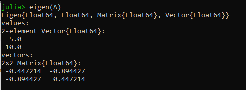

    === "Python"

        En python es necesario usar la librería `numpy` y el módulo `linalg`.

        Para definir una matriz, se usa la función `array` para definir un arreglo (o matriz) y usar la función `eig`.

        ``` python
        import numpy as np
        from numpy.linalg import eig

        A=np.array([[9,-2],[-2,6]])
        eig(A)
        ```

        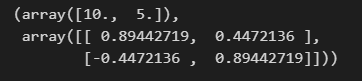

    === "R"

        En R se debe definir una matriz, a partir de un vector, usando la función `matrix` y especificando las dimensiones, opcionalmente se le puede indicar que la matriz se llene por renglones con la opción `byrow=TRUE`.

        Los eigenvalores y eigenvectores se puede obtener con la función `eigen`.

        ``` r
        A = matrix(c(9,-2,-2,6),2,2,byrow=TRUE)
        eigen(A)
        ```

        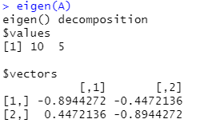

    === "SAS"

        En SAS se debe usar el procedimiento IML, que es el lenguaje de SAS para manejar matrices.

        La forma de definir una matriz es mediante llaves `{}`. SAS solo acepta valores numéricos y cada valor se separa con un espacio y los renglones con una coma.

        Para obtener los eigenvalores y eigenvectores se hace uso de la llamada a la rutina `eigen`, especificando en donde se deben guardar los valores obtenidos. Opcionalmente pueden usarse las funciones `eigval` y `eigvec`.

        ``` sas
        proc iml;
            A = {9 -2,-2 6};
            CALL eigen(L,e,A);
            PRINT L,e;
            /* opcionalmente */
            L2 = eigval(A);
            e2 = eigvec(A);
            PRINT L2,e2;
        quit;
        ```

        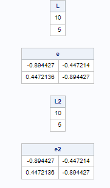

Un resultado importante es que si la matriz de covarianzas $\mathbf{\Sigma}$ es positiva definida, existe su inversa $\mathbf{\Sigma}^{-1}$, tal que $\mathbf{\Sigma}^{-1}\mathbf{\Sigma}=\mathbf{I}$ y se cumple que:

\(
\mathbf{\Sigma}\mathbf{e}=\lambda \mathbf{e} \rightarrow \mathbf{\Sigma}^{-1}\mathbf{e}=\frac{1}{\lambda} \mathbf{e}
\)

donde $\lambda$ es un eigenvalor y $\mathbf{e}$ es un eigenvector.

Una propiedad interesante es que la matriz $\mathbf{\Sigma}$ puede descomponerse por medio de sus eigenvalores y eigen vectores.

!!! abstract "Descomposición espectral"
    Sea $A$ una matriz de dimensión $p \times p$, entonces

    \(
    A=\sum_{j=1}^{p}\lambda_j\mathbf{e}_j\mathbf{e}_j^t
    \)

??? example "Ilustración de la descomposición espectral"
    Usando la descomposición espectral, se mostrará el resultado anterior usando la matriz $\mathbf{A}=\begin{pmatrix}9&-2\\-2&6\end{pmatrix}$.

    === "Julia"

        Para mostrar que se puede expresar una matriz a partir de sus eigenvalores y eigenvectores, primero se definirá una matriz de ceros de dimensión $2 \times 2$ en donde se almacenará el resultado con la función `zeros`, después se hará uso de la multiplicación de matrices con el operador `*` y el uso del vector transpuesto con la función `transpose`. La suma se hará de manera iterativa mediante el uso de un ciclo.

        ``` julia
        using LinearAlgebra
        A = [[9,-2] [-2,6]]
        lj=eigvals(A)
        ej=eigvecs(A)
        A2=zeros(2,2)
        for j in 1:2
            A2=A2+lj[j]*ej[:,j]*transpose(ej[:,j])
        end
        ```

        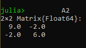
    
    === "Python"

        Note que en python, los eigenvectores corresponderían a las columnas del arreglo, por lo que se recomienda transponer la matriz de los eigenvectores que arroja python para que cada renglón corresponda a un eigenvector.

        Debido a esto, el producto punto `@` se debe hacer de forma `\mathbf{e}_j^t \mathbf{e}_j` ya que se accede por renglones a la matriz.

        ``` python
        import numpy as np
        from numpy.linalg import eig
        A=[[9,-2],[-2,6]]
        dim=(2,2)
        jj=[0,1]
        A2=np.zeros(dim)
        lj,ej=eig(A)
        lj=np.matrix(lj)
        ej=np.matrix(ej.transpose())
        for j in jj:
            A2=A2+lj[0,j]*ej[j].transpose()@ej[j]
        
        print(A2)
        ```

        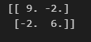

    === "R"

        En R el resultado se almacena en una lista y de ahí se pueden obtener los eigen valores y eigenvectores de la matriz usando `$`. Se puede definir una matriz de ceros en donde se almacenen los resultados.

        Note que el producto de matrices se realiza con el operador `%*%` mientras que multiplicar un escalar por una matriz se hace con `*`.

        ``` r
        A = matrix(c(9,-2,-2,6),2,2,byrow=TRUE)
        EV=eigen(A)
        lj=EV$values
        ej=EV$vectors
        A2=matrix(rep(0,4),2,2)
        for(j in 1:2)
        {
          A2=A2+lj[j]*ej[,j]%*%t(ej[,j])
        }
        A2
        ```

        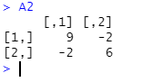

    === "SAS"

        En SAS simplemente basta con realizar la suma iterativa mediante un ciclo, de manera similar a los otros softwares, se recomienda definir una matriz de ceros en donde se pueda almacenar el resultado, esto se puede hacer con la función `j`.

        El producto de matrices se realiza con `*` mientras que la multiplicación de un escalar por una matriz se realiza con `#`.

        ```` sas
        proc iml;
            A = {9 -2,-2 6};
            A2 = j(2,2,0);
            CALL eigen(lj,ej,A);
            DO j= 1 to 2;
                A2 = A2 + lj[j] # ej[,j] * t(ej[,j]);
            END;
            print A2;
        quit;
        ````

        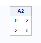

Los eigenvectores tienen muchas aplicaciones en estadística multivariada ya que son ortonormales. Sea $\mathbf{P}=[\mathbf{e}_1,\mathbf{e}_2,\cdots,\mathbf{e}_k]$ de dimensión $p \times p$, entonces $\mathbf{P}\mathbf{P}^t = \mathbf{P}^t\mathbf{P}=\mathbf{I}$.

Una aplicación es que si se define la matriz:

\(
\mathbf{\Lambda}=\begin{bmatrix}
\lambda_1 & 0 & \dots & 0\\
0 & \lambda_2 & \dots & 0\\
\vdots & \vdots & \ddots & \vdots\\
0 & 0 & \dots & \lambda_p\\
\end{bmatrix}
\)

entonces $\mathbf{A}=\mathbf{P}\mathbf{\Lambda}\mathbf{P}^t=\sum_{j=1}^{p}\lambda_j\mathbf{e}_j\mathbf{e}_j^t$ y $\mathbf{A}^{-1}=\mathbf{P}\mathbf{\Lambda}^{-1}\mathbf{P}^t=\sum_{j=1}^{p}\frac{1}{\lambda_j}\mathbf{e}_j\mathbf{e}_j^t$. 

??? example "Calculando la inversa de una matriz con eigenvalores"
    En este ejemplo se mostrará cómo hallar la matriz inversa de $\mathbf{A}=\begin{pmatrix}9&-2\\-2&6\end{pmatrix}$ mediante los eigenvalores y eigenvectores.

    === "Julia"

        Para mostrar que se puede expresar la inversa de una matriz a partir de sus eigenvalores y eigenvectores, se hará uso de la multiplicación de matrices con el operador `*` y el uso de la función `transpose`. 
        
        Para crear una matriz diagonal cuyos elementos sean el recíproco de los eigenvalores, se puede usar la función `diagm` cuyo argumento sea el recíproco de los eigenvalores. Note que se debe usar el operador *punto-vectorizado* `./` separado por un espacio.

        ``` julia
        using LinearAlgebra
        A = [[9,-2] [-2,6]]
        lj=eigvals(A)
        P=eigvecs(A)
        D=diagm(1 ./lj)
        Ainv=P*D*transpose(P)
        # función inversa
        inv(A)
        ```

        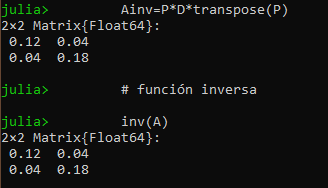
    
    === "Python"

        Note que en python, se puede usar directamente el resultado generado por la función `eig()` donde la matriz $P$ correspondería a los eigenvectores y la matriz diagonal se puede construir a partir de los recíprocos de los eigenvalores con la función `diag()`.

        ``` python
        import numpy as np
        from numpy.linalg import eig
        A=[[9,-2],[-2,6]]
        lj,ej=eig(A)
        D=np.diag(1/lj)
        Ainv=ej@D@ej.transpose()
        print(Ainv)
        # Función inversa
        np.linalg.inv(A)
        ```

        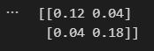

    === "R"

        En R, como se mostró en el ejemplo anterior, el resultado se almacena en una lista y de ahí se pueden obtener los eigen valores y eigenvectores de la matriz usando `$`. Se puede definir la matriz diagonal conla función `diag()` usando los recíprocos de los eigenvalores.

        Note que el producto de matrices se realiza con el operador `%*%`.

        ``` r
        A = matrix(c(9,-2,-2,6),2,2,byrow=TRUE)
        EV=eigen(A)
        lj=EV$values
        ej=EV$vectors
        D=diag(1/lj)
        Ainv=ej%*%D%*%t(ej)
        Ainv
        # Función inversa
        solve(A)
        ```

        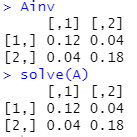

    === "SAS"

        En SAS se puede definir la matriz diagonal con la función `diag` usando los recíprocos de los eigenvalores.

        El producto de matrices se realiza con `*`.

        ```` sas
        proc iml;
            A = {9 -2,-2 6};
            A2 = j(2,2,0);
            CALL eigen(lj,ej,A);
            D=diag(1/lj);
            Ainv = ej*D*t(ej);
            print Ainv;
            /*Función inversa*/
            print (inv(A));
        quit;
        ````

        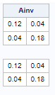

Note que es posible definir la raiz de una matriz,denotada por $\mathbf{A}^{1/2}$, que cumple con la propiedad $\mathbf{A}^{1/2}\mathbf{A}^{1/2}=\mathbf{A}$ y $\mathbf{A}^{-1/2}\mathbf{A}^{-1/2}=\mathbf{A}^{-1}$, simplemente definiendo $\mathbf{A}^{1/2}=\mathbf{P}\mathbf{\Lambda}^{1/2}\mathbf{P}^t=\sum_{j=1}^{p}\sqrt{\lambda_j}\mathbf{e}_j\mathbf{e}_j^t$.

Debido a que muchas veces las variables están distintas escalas o unidades, las covarianzas podrían tomar valores muy grandes y es complicado de interpreta, por ello se puede definir la matriz de correlaciones $\mathbf{R}=\mathbf{D}^{-1/2}\mathbf{S}\mathbf{D}^{-1/2}$ a partir de la matriz de covarianzas, donde 

\(
\mathbf{D}^{-1/2}=\begin{bmatrix}
1/\sqrt{\sigma_{1,1}} & 0 & \dots & 0\\
0 & 1/\sqrt{\sigma_{2,2}} & \dots & 0\\
\vdots & \vdots & \ddots & \vdots\\
0 & 0 & \dots & 1/\sqrt{\sigma_{p,p}}\\
\end{bmatrix}
\)

o viceversa, es decir  $\mathbf{S}=\mathbf{D}^{1/2}\mathbf{R}\mathbf{D}^{1/2}$ donde

\(
\mathbf{D}^{1/2}=\begin{bmatrix}
\sqrt{\sigma_{1,2}} & 0 & \dots & 0\\
0 & \sqrt{\sigma_{2,2}} & \dots & 0\\
\vdots & \vdots & \ddots & \vdots\\
0 & 0 & \dots & \sqrt{\sigma_{p,p}}\\
\end{bmatrix}
\)

### Muestras aleatorias

Debido a que en estadística es de interés hacer inferencias sobre el conjunto de datos, se requiere hacer ciertos supuestos sobre la información. En particular se supondrá que la información es una *muestra aleatoria multivariada* de una población específica.

En este sentido, la matriz de datos $\mathbf{X}$ será considerada como una *muestra aleatoria* de dimensión $n$.

\(\mathbf{X} =
\begin{bmatrix}
X_{1,1} & X_{1,2} & \dots & X_{1,p} \\
X_{2,1} & X_{2,2} & \dots & X_{2,p} \\
\vdots & \vdots &\ddots & \vdots \\
X_{n,1} & X_{n,2} & \dots & X_{n,p} \\
\end{bmatrix} =
\begin{bmatrix}
\mathbf{X}_{1}^t \\
\mathbf{X}_{2}^t \\
\vdots \\
\mathbf{X}_{n}^t \\
\end{bmatrix}
\)

!!! note "Muestra aleatoria"
    Se dice que los vectores renglón $\mathbf{X}_{1}^t,\mathbf{X}_{2}^t,\dots,\mathbf{X}_{n}^t$ son una muestra aleatoria de una función de distribución conjunta $f(X)$ con vector de medias $\mathbf{\mu}$ y covarianzas $\mathbf{\Sigma}$. La función de distribución conjunta está dada por $f(\mathbf{X}_{1})f(\mathbf{X}_{2})\dots f(\mathbf{X}_{n})$.

Note que generalmente en cada observación, $\mathbf{X}_i=(X_{i,1},X_{i,2},\dots,X_{i,p})$, proviene de una distribución *multivariada* de dimensión $p$, cuyo vector de medias es $E(\mathbf{X})=\mathbf{\mu}= \begin{pmatrix}\mu_1&\mu_2&\cdots&\mu_p\end{pmatrix}$ y matriz de covarianzas es $Cov(\mathbf{X})=\mathbf{\Sigma}=\lbrace \sigma_{j,j} \rbrace, j=1,2,\dots,p$. De hecho las $p$ variables pueden estar correlacionadas debido a que se mide a un mismo individuo; sin embargo, se asume que los individuos han de ser independientes unos de otros.

Debido a que se tiene una muesta aleatoria, es de interés conocer los momentos o características de dicha función de distribución, para ello se usan los estimadores insesgados para estimar el vector de medias. A continuación se mostrará cómo estimar dichos parámetros.

### Vector de medias y matriz de covarianzas muestrales

Para estimar a $\mathbf{\mu}$ de la matriz de datos se puede usar el *vector de medias muestrales* $\bar{\mathbf{X}}=\frac{1}{n}\mathbf{X}^t\mathbf{1}$, donde $\mathbf{1}^t=\begin{pmatrix}1&1&\dots&1\end{pmatrix}$ es de $1\times n$.

De manera similar, para estimar la matriz de covarianzas, se usa la *matriz de covarianzas muestrales* $\mathbf{S}=\frac{1}{n-1}\mathbf{X}^t\left(\mathbf{I}-\frac{1}{n}\mathbf{1}\mathbf{1}^t\right)\mathbf{X}$.

Se usará la notación $\bar{\mathbf{x}}$ y $\mathbf{s}$ para referirse a realizaciones

??? example "Cálculo del vector de medias y matriz de covarianzas muestrales"
    En este ejemplo se mostrará cómo calcular el vector de medias muestrales. Supónga que se tiene la siguiente matriz de datos con $n=3$ y $p=2$.

    \(\mathbf{x} =
    \begin{bmatrix}
    9 & 1 \\
    5 & 3 \\
    1 & 2 \\
    \end{bmatrix} 
    \)

    Haciendo la sustitución se tiene que el vector de medias es:

    \(
    \bar{\mathbf{x}}= \frac{1}{3}\begin{bmatrix}
    9 & 5 & 1 \\
    1 & 3 & 2\\
    \end{bmatrix}
    \begin{bmatrix}
    1 \\
    1 \\
    1 \\
    \end{bmatrix} = \frac{1}{3}\begin{bmatrix}
    15\\
    6\\
    \end{bmatrix} =
    \begin{bmatrix}
    5\\
    2\\
    \end{bmatrix}
    \)

    y la matriz de covarianzas:

    \(
    \begin{align*}
    \mathbf{s}&=\frac{1}{2}\begin{bmatrix}
    9 & 5 & 1 \\
    1 & 3 & 2\\
    \end{bmatrix}\left( \begin{bmatrix}
    1 & 0 & 0 \\
    0 & 1 & 0\\
    0 & 0 & 1\\
    \end{bmatrix} -\frac{1}{3}    \begin{bmatrix}
    1 \\
    1 \\
    1 \\
    \end{bmatrix}
    \begin{bmatrix}
    1 & 1 & 1 
    \end{bmatrix}\right)
    \begin{bmatrix}
    9 & 1 \\
    5 & 3 \\
    1 & 2 \\
    \end{bmatrix} \\
    & = \frac{1}{2}
    \begin{bmatrix}
    9 & 5 & 1 \\
    1 & 3 & 2\\
    \end{bmatrix}
    \begin{bmatrix}
    2/3 & -1/3 & -1/3 \\
    -1/3 & 2/3 & -1/3\\
    -1/3 & -1/3 & 2/3\\
    \end{bmatrix}
    \begin{bmatrix}
    9 & 1 \\
    5 & 3 \\
    1 & 2 \\
    \end{bmatrix}\\
    & =\frac{1}{2}
    \begin{bmatrix}
    4 & 0 & -4 \\
    -1 & 1 & 0\\
    \end{bmatrix}
    \begin{bmatrix}
    9 & 1 \\
    5 & 3 \\
    1 & 2 \\
    \end{bmatrix}\\
    & =\frac{1}{2}
    \begin{bmatrix}
    32 & -4 \\
    -4 & 2 \\
    \end{bmatrix}\\
    &=\begin{bmatrix}
    16 & -2 \\
    -2 & 1 \\
    \end{bmatrix}
    \end{align*}
    \)

??? example "Cálculo de la matriz de varianza covarianza"
    Actualmente los softwares ofrecen muchas opciones para realizar estos cálculos. A continuación se mostrará cómo calcular una matriz de covarianzas de una base con muchas observaciones usando diversos programas estadísticos.

    === "Julia"

        En julia se puede usar la función `cov` del paquete `Statistics`; note que esta función requiere una matriz que contenga únicamente valores numéricos.

        ``` julia
        using Statistics
        cov(Matrix(indicadores[:,2:18]))
        ```

    === "Python"

        En python se puede hacer aplicando el método `cov` del paquete `pandas` a un objeto `dataframe`.

        ``` python
        import pandas as pd
        import numpy as np
        indicadores.cov()
        ```

    === "R"

        En R se puede hacer con la función `cov`, sin embargo, esta función requiere un dataframe que contenga únicamente valores numéricos.

        ``` r
        datos=indicadores[,-1]
        cov(datos)
        ```
    
    === "SAS"

        En SAS se puede realizar de 2 maneras distintas: con el `PROC CORR` y `PROC IML`.

        Con el `PROC CORR` se debe especificar en la sentecia `PROC CORR` la opcion `COV` y opcionalmente la opción de guardar la tabla resultante. SAS Automáticamente realizará el cálculo de las variables numéricas.

        Por otro lado, con el `PROC IML` primero se debe leer el dataset en una matriz y posteriormente se usa la función `cov` y se guarda en la matriz `S`. Para visualizar el resultado se usa la función `print`.

        ``` sas
        /*Usando el procedimiento corr*/
        PROC CORR data= indicadores cov OUT=cv_ind;
        RUN;
        /*Usando PROC IML*/
        PROC IML;
        USE work.indicadores;
        READ ALL VAR _NUM_ INTO X[rowname=country];
        S = COV(X);
        PRINT S;
        QUIT;
        ```

### Matriz de Combinaciones lineales

En estadística multivariada es posible realizar combinaciones lineales de variables para formar una nueva variable. Las combinaciones lineales estudiadas tienen la forma:

\(
\mathbf{a}^t\mathbf{X}=a_1 \mathbf{X}_1 + a_2 \mathbf{X}_2 + \dots + a_p \mathbf{X}_p
\)

Note que el vector $\mathbf{a}^t$ es de dimensión $1 \times p$ y la matriz $\mathbf{X}=\begin{pmatrix}\mathbf{X}_1&\mathbf{X}_2&\dots&\mathbf{X}_p\end{pmatrix}$ es de dimensión $n\times p$, aunque solo nos interesa trabajar con las $p$ variables.

Es posible calcular la media, la varianza y las covarianzas muestrales de dichas combinaciones lineales sin la necesidad de calcular las nuevas variables.

Estadístico|Combinación lineal|Fórmula
-----------|------------------|-------
Media muestral|$\mathbf{a}^t\mathbf{X}$|$\mathbf{a}^t\bar{\mathbf{x}}$
Varianza muestral|$\mathbf{a}^t\mathbf{X}$|$\mathbf{a}^t\mathbf{s}\mathbf{a}$
Covarianzas muestrales|$\mathbf{a}^t\mathbf{X}$ y $\mathbf{b}^t\mathbf{X}$|$\mathbf{a}^t\mathbf{s}\mathbf{b}$

## Distribución normal multivariada

En estadística multivariada, el modelo de distribución normal juega un papel muy importante, debido a que cuando se tienen muchos datos, muchas estadísticas multivariadas tienen distribución normal, debido al *Teorema Central del Límite*. También muchos fenómenos se comportan de manera normal.

!!! note "Distribución normal multivariada"
    La distribución normal multivariada, de dimensión $p$ para el vector aleatorio $\mathbf{X}^t=\begin{pmatrix}X_1&X_2&\cdots&X_p\end{pmatrix}$ es:

    \(
    f_{\mathbf{X}}(\mathbf{x})=\frac{1}{(2\pi)^{p/2}|\mathbf{\Sigma}|^{1/2}}e^{\frac{-1}{2}(\mathbf{x}-\mathbf{\mu})^t\mathbf{\Sigma}^{-1}(\mathbf{x}-\mathbf{\mu})}
    \)

    donde $-\infty < x_j < \infty, i=1,2,\dots,p$; $;-\infty < \mu_j < \infty, i=1,2,\dots,p$ y $\mathbf{\Sigma}$ es positiva definida.

Es posible calcular contornos en los que la densidad es constante usando $\lbrace \mathbf{x} | (\mathbf{x}-\mathbf{\mu})^t\mathbf{\Sigma}^{-1}(\mathbf{x}-\mathbf{\mu}) = c^2 \rbrace$.

Note que los elipsoides están centrados en $\mathbf{\mu}$ y tiene ejes $c\sqrt{\lambda_j}\mathbf{e}_j$, para $j=1,2,\dots,p$.

Si se usa $c^2=\chi_{p}(\alpha)$, donde $\chi_{p}(\alpha)$ se obtienen contornos que contienen $(1-\alpha) \times 100 \%$ de la probabilidad, donde $\chi_{p}(\alpha)$ es el persentil superior de una distribución chic cuadrada con $p$ grados de libertad.

### Propiedades de la distribución normal multivariada

La distribución normal multivariada tiene muchas propiedades y resultados análagos a la distribución normal univariada, los cuales se estudiarán a continuación.

!!! note "Distribución de una combinación lineal"
    Si $\mathbf{X}\sim N_p(\mathbf{\mu},\mathbf{\Sigma})$, entonces cualquier combinación lineal de sus variables $\mathbf{a}^t\mathbf{X}=a_1\mathbf{X}_1+a_2\mathbf{X}_2+\dots+a_n\mathbf{X}_n$ se distribuye normal univariada, es decir $\mathbf{a}^t\mathbf{X}\sim N(\mathbf{a}^t\mathbf{\mu},\mathbf{a}^t\mathbf{\Sigma}\mathbf{a})$.

!!! note "Distribución de varias combinaciones lineal"
     Si $\mathbf{X}\sim N_p(\mathbf{\mu},\mathbf{\Sigma})$, entonces las $q$ combinaciones lineales

    \(
    \mathbf{A}\mathbf{X}=
    \begin{pmatrix}
    a_{1,1}\mathbf{X}_1+a_{1,2}\mathbf{X}_2+\dots+a_{1,p}\mathbf{X}_p\\
    \vdots\\
    a_{q,1}\mathbf{X}_1+a_{q,2}\mathbf{X}_2+\dots+a_{q,p}\mathbf{X}_p\\
    \end{pmatrix}
    \)

    tiene distribución normal $q$ variada, es decir: $\mathbf{A}\mathbf{X}\sim N_q(\mathbf{A}\mathbf{\mu},\mathbf{A}\mathbf{\Sigma}\mathbf{A}^{t})$.

!!! note "Distribución de subconjuntos de una normal multivariada"
    Si se tiene un vector aleatorio $\mathbf{X}$ de dimensión $p \times 1$, se puede partir dicho vector como se muestra a continuación:

    \(
    \begin{align*}
    \mathbf{X} ({p \times 1})&=
    \begin{bmatrix}
    \mathbf{X}_1 ({q \times 1})\\
    \mathbf{X}_2 ({(p-q) \times 1})\\
    \end{bmatrix}\\
    \mathbf{\mu} ({p \times 1})&=
    \begin{bmatrix}
    \mathbf{\mu}_1 ({q \times 1})\\
    \mathbf{\mu}_2 ({(p-q) \times 1})\\
    \end{bmatrix}\\
    \mathbf{\Sigma} ({p \times p})&=
    \begin{bmatrix}
    \mathbf{\Sigma}_{11} ({q \times q}) & \mathbf{\Sigma}_{12} ({q \times (p-q)})\\
    \mathbf{\Sigma}_{21} ({(p-q) \times q}) & \mathbf{\Sigma}_{22} ({(p-q) \times (p-q)})\\
    \end{bmatrix}\\
    \end{align*}
    \)

    entonces $\mathbf{X}_1 \sim N_q(\mathbf{\mu}_1,\Sigma_{11})$.

!!! note "Variables independientes de una normal multivariada"
    a) Si $\mathbf{X}_1$ y $\mathbf{X}_2$ de dimensión $q_1 \times 1$ y $q_2 \times 1$ son independientes, entonces $Cov(\mathbf{X}_1,\mathbf{X}_2)=\mathbf{0}$.

    b) Si

    \(
    \begin{bmatrix}
    \mathbf{X}_1 \\
    \mathbf{X}_2 \\
    \end{bmatrix} \sim N_p\left(\begin{bmatrix}
    \mathbf{\mu}_1 \\
    \mathbf{\mu}_2 \\
    \end{bmatrix}, \begin{bmatrix}
    \mathbf{\Sigma}_{11} & \mathbf{\Sigma}_{12}\\
    \mathbf{\Sigma}_{21} & \mathbf{\Sigma}_{22}\\
    \end{bmatrix}\right)
    \)

    entonces $\mathbf{X}_1$ y $\mathbf{X}_2$ son independientes si y solo si $\mathbf{\Sigma}_{12}=\mathbf{0}$.

    c) Si $\mathbf{X}_1 \sim N_{q_1}(\mathbf{\mu}_1,\mathbf{\Sigma}_{11})$ y $\mathbf{X}_2 \sim N_{q_1}(\mathbf{\mu}_2,\mathbf{\Sigma}_{22})$ son independientes, entonces

    \(
    \begin{bmatrix}
    \mathbf{X}_{q_1}\\
    \mathbf{X}_{q_2}\\
    \end{bmatrix} \sim N_{q_1+q_2}\left( \begin{bmatrix}
    \mathbf{\mu}_1 \\
    \mathbf{\mu}_2 \\
    \end{bmatrix}, \begin{bmatrix}
    \mathbf{\Sigma}_{11} & \mathbf{0}\\
    \mathbf{0}^t & \mathbf{\Sigma}_{22}\\
    \end{bmatrix} \right)
    \)

!!! note "Distribución condicional normal multivariada"
    Sea

    \(
    \begin{bmatrix}
    \mathbf{X}_{1}\\
    \mathbf{X}_{2}\\
    \end{bmatrix} \sim N_{p}\left( \begin{bmatrix}
    \mathbf{\mu}_1 \\
    \mathbf{\mu}_2 \\
    \end{bmatrix}, \begin{bmatrix}
    \mathbf{\Sigma}_{11} & \mathbf{\Sigma}_{12}\\
    \mathbf{\Sigma}_{21} & \mathbf{\Sigma}_{22}\\
    \end{bmatrix} \right)
    \)
    
    con $|\mathbf{\Sigma}_{22}|>0$. Entonces la distribución condicional de $\mathbf{X}_{1}$ dado que $\mathbf{X}_{2}=\mathbf{x}_{2}$, es normal y tiene media $\mathbf{\mu}_1+\mathbf{\Sigma}_{12}\mathbf{\Sigma}_{22}^{-1}(\mathbf{x}_{2}-\mathbf{\mu}_2)$ y covarianza $\mathbf{\Sigma}_{11}-\mathbf{\Sigma}_{12}\mathbf{\Sigma}_{22}^{-1}\mathbf{\Sigma}_{21}$. 

!!! note "Distribución de una forma cuadrática"
    Sea $\mathbf{X}\sim N_p(\mathbf{\mu},\mathbf{\Sigma})$ con $|\mathbf{\sigma}|> 0$. Entonces
    $(\mathbf{X}-\mathbf{\mu})^{t}\mathbf{\Sigma}^{-1}(\mathbf{X}-\mathbf{\mu}) \sim \chi_p^2$.

### Inferencia en la distribución normal multivariada

En esta sección se estudiarán la forma de hacer inferencia con una muestra aleatoria multivariada.

!!! note "Distribución conjunta multivariada"
    Suponga que $\mathbf{X}_1,\mathbf{X}_2,\dots,\mathbf{X}_n$, cada uno es un vector de dimensión $1\times p$, es una *muestra aleatroria* de tamaño $n$ que proviene de una población normal multivariada con vector de medias $\mathbf{\mu}$ y matriz de covarianzas $\mathbf{\Sigma}$. La función de densidad conjunta es el producto de todas las densidades marginales:

    \(
    \begin{align*}
    f_{\mathbf{X}_1,\mathbf{X}_2,\dots,\mathbf{X}_n}(\mathbf{x}_1,\mathbf{x}_2,\dots,\mathbf{x}_n) & =\prod_{i=1}^{n}\frac{1}{(2\pi)^{p/2}|\mathbf{\Sigma}|^{1/2}}e^{\frac{-1}{2}(\mathbf{x}_i-\mathbf{\mu})^t\mathbf{\Sigma}^{-1}(\mathbf{x}_i-\mathbf{\mu})}\\
    & = \frac{1}{(2\pi)^{np/2}|\mathbf{\Sigma}|^{n/2}}e^{\frac{-1}{2}\sum_{i=1}^{n}(\mathbf{x}_i-\mathbf{\mu})^t\mathbf{\Sigma}^{-1}(\mathbf{x}_i-\mathbf{\mu})}
    \end{align*}
    \)

Note que, una vez observados los datos, dicha función es ahora función de $\mathbf{\mu}$ y $\mathbf{\Sigma}$, a esta función se le conoce como *función de verosimilitud*. Es de interés encontrar los valores $\hat{\mathbf{\mu}}$ y $\hat{\mathbf{\Sigma}}$ que maximicen dicha verosimilitud dados los datos.

!!! note "Estimadores de máxima verosimilitud"
    Sea $\mathbf{X}_1,\mathbf{X}_2,\dots,\mathbf{X}_n$ una muestra aleatoria de una población normal con media $\mathbf{\mu}$ y covarianza $\mathbf{\Sigma}$. Entonces 

    \(
    \hat{\mathbf{\mu}} = \bar{\mathbf{X}};
    \hat{\mathbf{\Sigma}} = \frac{n-1}{n}\mathbf{S}
    \)

    son los *estimadores de máxima verosimilitud* de $\mathbf{\mu}$ y $\mathbf{\Sigma}$. Las realizaciones $\bar{\mathbf{x}}$ y $\frac{n-1}{n}\mathbf{s}$ son llamadas *estimaciones de máxima verosimilitud*.

Note que los estimadores de máxima verosimilitud son *aleatorios*, mientras que las *estimaciones* son fijos. Por esta razón, es de interés estudiar las distribuciones de los estimadores de máxima verosimilitud.

Los estimadores de Máxima Verosimilitud tambien tienen propiedades deseables, por ejemplo son invariantes, es decir si $\hat{\mathbf{\theta}}$ es un estimador de máxima verosimilitud, entonces un estimador de $h(\mathbf{\theta})$ es $h(\hat{\mathbf{\theta}})$.

Otra propiedad interesante es la suficiencia, en pocas palabras, toda la información acerca de $\mathbf{\mu}$ y $\mathbf{\Sigma}$ está contenida en $\hat{\mathbf{\mu}}$ y $\hat{\mathbf{\Sigma}}$.

### Distribuciones muestrales multivariada

Las distribuciones de $\bar{\mathbf{X}}$ y $\mathbf{S}$ son análogas al caso univariado, aunque hay ciertas generalizaciones.

!!! note "Distribución del vector de medias muestral"
    La distribución de $\bar{\mathbf{X}}$ es normal con vector de medias $\mathbf{\mu}$ y covarianza $\frac{1}{n}\mathbf{\Sigma}$.

!!! note "Distribución de la matriz de covarianza muestral"
    La distribución de $(n-1)\mathbf{S}=\sum_{i=1}^{n}\mathbf{V}_i\mathbf{V}_i^t$ es Wishart $p$ variada con parámetros $n-1$ y $\mathbf{\Sigma}$, donde cada $\mathbf{V}_i = (\mathbf{X}-\bar{\mathbf{X}}) \sim N_p(\mathbf{0},\mathbf{\Sigma})$.

!!! note "Independencia del vector de medias y matriz de covarianzas muestrales"
    $\bar{\mathbf{X}}$ y $\mathbf{\Sigma}$ son independientes.

### Distribución para tamaños de muestras grandes del vector de medias y matriz de covarianzas muestrales

Las distribuciones de $\bar{\mathbf{X}}$ y $\mathbf{\Sigma}$ son similares al caso univariado cuando el tamaño de muestra aumenta, es decir se cumple la *Ley de los grandes números* y el *Teorema Central del Límite*.

!!! note "Ley de los grandes números"
    $\bar{\mathbf{X}}$ converge en probabilidad a $\mathbf{\mu}$ y $\mathbf{S}$ converge en probabilidad a $\mathbf{\Sigma}$.

!!! note "Teorema central del límite"
    Sea $\mathbf{X}_1,\mathbf{X}_2,\dots,\mathbf{X}_n$ una muestra aleatoria de una población normal con media $\mathbf{\mu}$ y covarianza $\mathbf{\Sigma}$ finita. Entonces $\sqrt{n}(\mathbf{X}-\mathbf{\mu})$ tiene distribución aproximadamente $N_p(\mathbf{0},\mathbf{\Sigma})$ para $n - p$ grande.

!!! note "Distribuciones aproximadas"
    Sea $\mathbf{X}_1,\mathbf{X}_2,\dots,\mathbf{X}_n$ una muestra aleatoria de una población normal con media $\mathbf{\mu}$ y covarianza $\mathbf{\Sigma}$ finita. Entonces $n(\mathbf{X}-\mathbf{\mu})^t\mathbf{S}^{-1}(\mathbf{X}-\mathbf{\mu})$ es aproximadamente $\chi_p^2$ para $n-p$ grande.

## Inferencias sobre el vector de medias

Es de interés hacer inferencias sobre el vector de medias. En particular se requiere saber si el vector de medias es igual a cierto vector de valores.

Puede establecerse una pruaba de hipótesis de la forma:

\(
H_0: \mathbf{\mu} = \mathbf{\mu}_0 \text{ vs } H_a: \mathbf{\mu} \ne \mathbf{\mu}_0
\)

De manera análoga al caso univariado, se puede realizar un contraste de hipótesis similar a la prueba F llamado T cuadrada de Hotelling, es decir.

\(
T^2=n(\bar{\mathbf{X}}-\mathbf{\mu}_0)^t\mathbf{S}^{-1}(\bar{\mathbf{X}}-\mathbf{\mu}_0)
\)

donde $T^2 \sim \frac{(n-1)p}{n-p}F_{p,n-p}$. Por lo que se rechaza $H_0$ si $T^2 > \frac{(n-1)p}{n-p}F_{p,n-p}(\aplha)$.

## Bibliografía

Johnson, R., & Wichern, D. (2007). *Applied Multivariate Statistical Analysis* (6th edition). Pearson Education.
