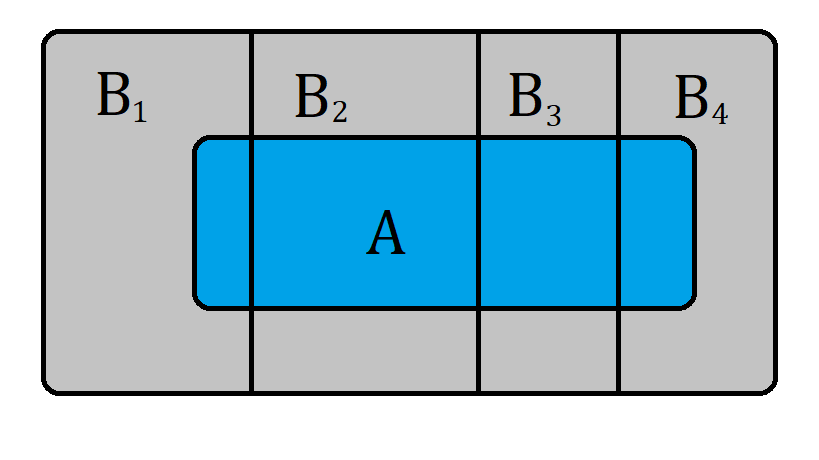
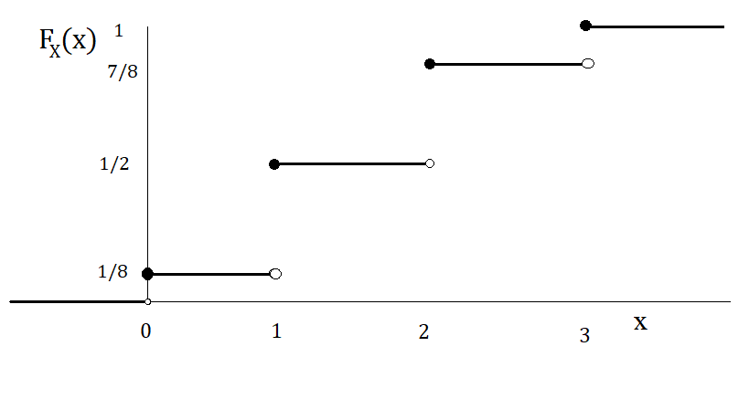
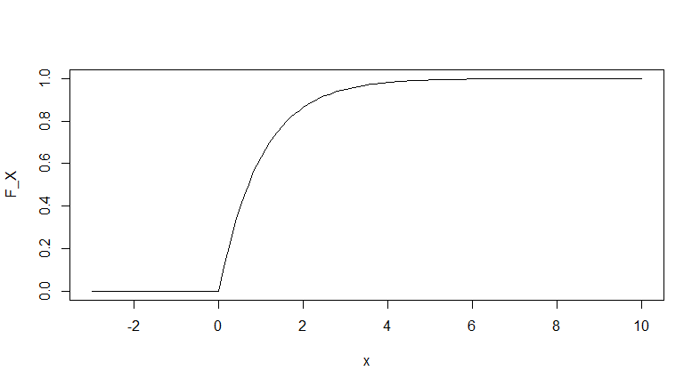

La probabilidad es una rama de las matemáticas que estudia el **azar o aleatoriedad**. En palabras simples, trata de medir la incertidumbre de que ocurra un suceso o evento. El resultado de dicho experimento  **no** puede ser determinado con antelación.

Imagen de [ToNic-Pics](https://pixabay.com/es/users/tonic-pics-3001971/) en [Pixabay](https://pixabay.com/images/id-1564042/)

Para darnos una idea de lo que es la probabilidad, Lipschutz & Lipson, (2001) proporcionan dos definiciones:

!!! note "Definición clásica (A priori)"
     Suponiendo que un evento $E$ puede ocurrir de $s$ formas de un total de $n$ formas igualmente posibles. Entonces $p=s/n$.

!!! note "Definición frecuentista (A posteriori)"
     Suponiendo que después de $n$ repeticiones, para valores muy grandes de $n$, un evento $E$ ocurre $s$ veces. Entonces $p=s/n$.

Estas definiciones a pesar de ser muy intuitivas, tienen grandes fallos. Por ejemplo, la primer definición es una definición circular, por que la frase _igualmente posible_ es un sinónimo de _igualmente probable_, justo lo que se quiere definir. En la segunda definición no se especifican los valores de $n$. Estas definiciones son muy antiguas, pero pueden ayudar a entender de forma muy general el concepto de **probabilidad**.

## Definición de probabilidad

Actualmente el estudio de la probabilidad se realiza mediante el uso de la teoría de conjuntos, a partir de ciertos axiomas.

A continucaión se abordarán algunas definiciones para tener más en que consiste la probabilidad.

### Espacio muestral y eventos

A continuación se presentarán algunas definiciones que serán de gran utilidad para conocer más de la probabilidad.

!!! note "Espacio muestral"
     El conjunto $\Omega$ de todos los resultados posibles de un experimento se denomina **espacio muestral**.

!!! note "Evento"
    Un evento $A$ es un subconjunto del espacio muestral $\Omega$, es decir,  es un conjunto de resultados. Cualquier colección de eventos y cada uno es un subconjunto de $\Omega$ se denominará con $\mathbb{s}$.

!!! note "Evento particular"
    El evento $\lbrace \omega \rbrace$ constituido por un solo punto $\omega \in \Omega$ se denomina **evento muestral** o **punto muestral**.

Los conceptos presentados se ilustran con unos ejemplos muy simples.

??? example "Lanzar una moneda"

    Considere el experimento de lanzar una moneda.

    
    Imagen de [OpenClipart-Vectors](https://pixabay.com/es/users/openclipart-vectors-30363/?utm_source=link-attribution&amp;utm_medium=referral&amp;utm_campaign=image&amp;utm_content=1300389) en [Pixabay](https://pixabay.com/es/?utm_source=link-attribution&amp;utm_medium=referral&amp;utm_campaign=image&amp;utm_content=1300389).

    Este experimento podría ser el de los más sencillos, pero permite representar claramente los conceptos.

    El espacio muestral estaría comformado por

    \(\Omega = \lbrace A,S \rbrace \)

    donde $A$ representra el resultado de que caiga águila y $S$ representa el resultado de que caiga sol. $\mathbb{s}$ podría estar representado por \( \lbrace \lbrace A \rbrace,\lbrace S \rbrace \rbrace \) quien tambien sería un subconjunto de $\Omega$.

    Note que $\emptyset$ y $\Omega$ también son subconjuntos de $\Omega$ pero no suelen ser considerados.

??? example "Lanzamiento de un dado"

    Considere el experimento de lanzar un dado de 6 caras.

    
    Imagen de [anncapictures](https://pixabay.com/es/users/anncapictures-1564471/?utm_source=link-attribution&amp;utm_medium=referral&amp;utm_campaign=image&amp;utm_content=2031512) en [Pixabay](https://pixabay.com/es/?utm_source=link-attribution&amp;utm_medium=referral&amp;utm_campaign=image&amp;utm_content=2031512).

    El espacio muestral estaría formado por los seis resultados posibles del dado, es decir:

    $$ \Omega = \lbrace 1,2,3,4,5,6 \rbrace $$

    Un *punto muestral* podría ser un resultado en específico, por ejemplo $\lbrace 1 \rbrace$. Todos los subconjuntos posibles de resultados consitituirían $\mathbb{s}$.

    Sean el evento $A$ que el resultado sea par, el evento $B$ que el resultado sea impar y el evento $C$ que el resultado sea mayor a 3.

    Entonces se tiene que

    \(A=\lbrace 2,4,6 \rbrace, \\
    B=\lbrace 1,3,5 \rbrace, \\
    C=\lbrace 4,5,6 \rbrace\)

    Observe que el evento $B \cup C = \lbrace 1,3,4,5,6\rbrace$ también es un evento en el espacio muestral $S$.

    Finalmente note que los eventos $A$ y $B$ no tienen elementos en común, es decir $A \cap B = \emptyset$, entonces se dice que estos eventos son *ajenos*, o *mutuamente excluyentes* o *disjuntos*.

### Axiomas de probabilidad

Como se mencionó anteriormente, actualmente la probabilidad se estudia de manera formal partiendo de 3 axiomas. Se usará como referencia a Mood et al., (1974).

!!! caution "Conocimiento avanzado"
    El estudio de la probabilidad requiere conocimientos avanzados de _Matemáticas_ y _Teoría de Conjuntos_ los cuales están fuera del alcance de esta página. Únicamente se mencionarán los temas más relevantes que sirvan como una guía para el estudio de la estadística.

    Para un estudio más formal se puede revisar [Apuntes de Estadística Matemática](estadistica_matematica.md).

Sea $A$ un evento del espacio muestral $\Omega$. Una función $P: \mathbb{s} \rightarrow [0,1]$ es llamada _función de probabilidad_ si satisface estas 3 condiciones.

- **Axioma 1**: $0\le P(A) \le 1$ para $A \in \mathbb{s}$
- **Axioma 2**: $P(\Omega) = 1$
- **Axioma 3**: Para cualquier secuencia de eventos $A_1,A_2,\dots$ mutuamente excluyentes, entonces

$$P\left( \bigcup_{i=1}^{\infty} A_i\right)=\sum_{i=1}^{\infty}A_i$$

Se dice que $P(A)$ es la _probabilidad de que ocurra el evento A_.

Para ilustrar estas ideas, considere la siguiente función de probabilidad.

!!! info "Función de probabilidad con probabilidades iguales"
    En ciertos problemas con espacios muestrales finitos $\Omega = \lbrace \omega_1,\dots,\omega_n\rbrace$, es posible asignarle a cada uno de los puntos una probabilidad igual a $1/n$. A esta función de probabilidad se le conoce como la **funcion de probabilidad con probabilidades iguales** y se define como:

    \(P^*(A)=\frac{\#(A)}{n}\)
    
    donde $\#(A)$ es el número de elementos en $A$ y $n$ el número de elementos del espacio muestral $\Omega$.

Se puede ver que la **función de probabilidad con probabilidades iguales** cumple con todas las propiedades, por lo que es una función de probabilidad bien definida.

A partir de los axiomas, se derivan otras propiedades que nos ayudarán a posible calcular las probabilidades de varios eventos.

1. $P(\emptyset)=0$.
2. Si $A_1,\dots,A_n$ son eventos mutuamente excluyentes, entonces $P\left( \bigcup_{i=1}^{n} A_i\right)=\sum_{i=1}^{n}P(A_i)$.
3. $P(A^c)=1-P(A)$.
4. Para cualesquiera 2 eventos: $P(A \cup B) = P(A) + P(B) - P(A \cap B)$.
5. Si $A \subset B$, entonces $P(A) < P(B)$.

??? example "Lanzamiento de un dado"
    Suponga que se lanza un dado balanceado.

    Se puede asumir que la probabilidad de que se obtenga un resultado en particular es $1/6$, por lo que la probabilidad de que caiga un número par es $P^*(A) = 1/2$.

    Usando la propiedad 3, se tiene que $B = A^c$, por lo que $P(B)=1-P(A)=0.5$.

### Probabilidad condicional

En ocasiones, es de interés conocer la probabilidad de un evento, dado que haya ocurrido otro. En este sentido, se define la probabilidad condicional.

!!! note "Probabilidad condicional"
     Sean $A$ y $B$ dos eventos en $\mathbb{s}$. La _probabilidad condicional_ del evento $A$ dado el evento $B$, denotada por $P\left( A|B \right)$, se define como
     $P \left( A|B\right) =\frac{P\left(A\cap B\right)}{P\left( B\right)}$ con $P(B) \ne 0$.

Note que la probabilidad anterior no está definida cuando $P(B) = 0$. También se desprende la fórmula $P(A \cap B )= P(A|B)P(B) = P(B|A)P(A)$ si $P(A) \ne 0$.

De la definición anterior, se desprenden las siguientes propiedades de la función de probabilidad condicional

- $P(\emptyset|B)=0$.
- Si $A_1,A_2,\dots,A_n$ son eventos mutuamente excluyentes en $\mathbb{s}$, entonces $P(A_1 \cup A_2 \cup \dots \cup A_n|B) = \sum_{i=1}^{n}P(A_i|B)$.
- $P(A^c|B)=1 - P(A|B)$.
- Si $A_1$ y $A_2 \in \mathbb{s}$, entonces $P(A_1|B)=P(A_1 \cap A_2|B)+P(A_1 \cap A^c_2|B)$.
- Para cualesquiera 2 eventos $A_1$ y $A_2 \in \mathbb{s}$, $P(A_1 \cup A_2 |B) = P(A_1|B)+P(A_2|B)-P(A_1 \cap A_2|B)$.
- Si $A_1$ y $A_2 \in \mathbb{s}$ y $A_1 \subset A_2$, entonces $P(A_1|B) \le P(A_2|B)$.
- Si $A_1,A_2,\dots,A_n \in \mathbb{s}$, entonces $P(A_1 \cup A_2 \cup \dots \cup A_n|B) \le \sum_{i=1}^{n}P(A_i|B)$.

A continuación se mencionan unos teoremas de gran importancia. La aplicación de dichos teoremas se ilustran con unos ejemplos

!!! note "Teorema de probabilidades totales"
    Si $B_1, B_2, \dots,B_n$ es una colección de eventos mutuamente disjuntos en $\mathbb{s}$ y satisfacen $\Omega = \cup^{n}_{j=1} B_j$ y $P(B_j)>0$ para $j = 1,\dots,n$, entonces para toda $A \in \mathbb{s}$ se tiene $P\left(A\right)=\sum^{n}_{j=1}P(A|B_j)P(B_j)$.

Representación gráfica del concepto de probabilidad total

??? example "Seleccionar una pelota de varias urnas"
    Suponga que se tienen 2 urnas con pelotas de distintos colores todas del mismo tamaño. La primera tiene 3 pelotas rojas, 3 blancas y 4 negras; la segunda tiene 4 pelotas rojas, 3 blancas y 1 negra. Se selecciona una urna al azar y se extrae una pelota. _¿Cúal es la probabilidad de que la pelota extraída sea blanca?_

    Observe que la elección de las urnas constituyen 2 eventos mutuamente disjuntos ya que la unión de ambos eventos constituye el espacio muestral (Todas las pelotas están en la urna 1 o en la urna 2). Llamemos $B_1$ al evento de seleccionar la urna 1 y $B_2$ al evento de seleccionar la urna 2.

    El evento *extraer una pelota blanca* puede ocurrir cuando se elige la urna 1 o la urna 2, por lo que se puede aplicar la fórmula del teorema de probabilidades totales. Llamemos $A$ al evento de seleccionar una pelota blanca.

    Por lo tanto

    \(P\left(A\right)=\sum^{2}_{j=1}P(A|B_j)P(B_j)=P(A|B_1)P(B_1)+P(A|B_2)P(B_2)\)

    Asumiendo probabilidades iguales, se tiene que $P(B_1)=P(B_2)=1/2$, $P(A|B_1)=3/10$ y $P(A|B_2)=3/8$, por lo que la probabilidad de elegir una pelota blanca es **0.3375**.

!!! note "Teorema de Bayes"
    Si $B_1, B_2, \dots,B_n$ es una colección de eventos mutuamente disjuntos en $\mathbb{s}$ y satisfacen $\Omega = \cup^{n}_{j=1} B_j$ y $P(B_j)>0$ para $j = 1,\dots,n$, entonces para toda $A \in \mathbb{s}$ con $P(A)>0$ se tiene $P\left(B_k|A\right)=\frac{P(A|B_k)P(B_k)}{\sum^{n}_{j=1}P(A|B_j)P(B_j)}$.

??? example "Seleccionar una pelota de varias urnas"
    Considérese el problema de las urnas. Sabiendo que la pelota extraída fue blanca. **¿Cuál es la probabilidad de que fuera de la primera urna?**

    Se debe calcular la probabilidad $P(B_1|A)$. Usando el teorema de Bayes, simplemente se susituye en la fórmula y se obtiene la probabilidad resultante es **0.4444**.

### Independencia de eventos

!!! note "Eventos independientes"
    Sean $A$ y $B$ dos eventos en $\mathbb{s}$ Los eventos $A$ y $B$ se dice que son independientes i y solo si una de las siguientes condiciones es satisfecha.

    - $P(A \cap B) = P(A)P(B)$
    - $P(A|B) = P(A)$ si $P(B) > 0$
    - $P(B|A) = P(B)$ si $P(A) > 0$

De la definición anterior, se desprenden las siguientes propiedades:

!!! note "Eventos independientes y sus complementos"
    Si los eventos $A$ y $B$ son independientes, entonces los siguientes eventos también son independientes: $A$ y $B^c$, $A^c$ y $B$ y $A^c$ y $B^c$.

!!! danger "Independencia y eventos disjuntos"
    No debe confundirse los términos **eventos independientes** y **eventos disjuntos**. De hecho, los eventos disjuntos suelen ser muy dependientes por que la ocurrencia de uno implica la no ocurrencia del otro. El único evento que es independiente y ajeno es el vacío $\emptyset$.

Estos conceptos se ilustran con el siguiente ejemplo.

??? example "Lanzar dos dados"
    Considere el experimento de lanzar 2 dados balanceados. El evento $A$ sería el resultado de lanzar el primer dado y el evento $B$ el resultado de lanzar el segundo dado. **¿Los eventos** $A$ **y** $B$ **son independientes?**.

    El espacio muestral estaría constituido por 36 pares de resultados posibles, cada uno con una probabilidad de 1/36.

    \(\Omega = \lbrace (1,1),(1,2),\dots,(6,6) \rbrace\)

    Para comprobar si son eventos independientes, se comprobará si se cumple al menos una de las 3 condiciones mencionadas en la definición, en este caso $P(A|B) = P(A)$.

    Consideremos el caso cuando el resultado del primer dado es 3. Note que $A=  \lbrace (3,1),(3,2),\dots,(3,6) \rbrace$ y su probabilidad es $6/36 = 1/6$.

    Ahora consideremos el caso cuando el resultado del segundo dado es 3. Note que $B=  \lbrace (1,3),(2,3),\dots,(6,3) \rbrace$ y su probabilidad es $6/36 = 1/6$.

    Para calcular la probabilidad condicional, primero se debe calcular la probabilidad de que ocurran ambos eventos, es decir, el caso cuando el resultado del primer dado es 3 *y* el caso cuando el resultado del segundo dado es 3, el único caso en que ocurre esto es en el par $\lbrace (3,3) \rbrace$, por lo que $P(A \cap B) = 1/36$. Por lo tanto:

    \(P(A|B)=\frac{P(A \cap B)}{P(B)}=\frac{1/36}{1/6}=1/6\)

    Se comprueba que ambos eventos son independientes.

## Variables aleatorias

Hasta el momento conocemos cómo asignar probabilidades a eventos del espacio muestral, sin embargo en la práctica esto no siempre es posible ya que sería complicado mencionar o enumerar todos los elementos del espacio muestral.

Por esta razón es necesario "traducir" dichos eventos a números reales. Esto es posible mediante el uso de _variables aleatorias_.

### Definición

!!! note "Variable aleatoria"
    Se dice que $X$ es una variable aleatoria si

    \(X:\Omega \rightarrow \mathbb{R}\).

    Si $\omega \in \Omega$ entonces $X(\omega) \in \mathbb{R}$. Si $B \subset \mathbb{R}$ entonces $X^{-1}(B) \in \mathbb{s}$, donde $X^{-1}(B)=\lbrace \omega \in \Omega |X(\omega) \in B\rbrace$. 

Una **variable aleatoria** asigna números reales a los eventos que ocurren en $\Omega$.

Existen dos tipos de variables aleatorias: _discretas_ y _continuas_.

Las variables aleatorias discretas toman sus valores en un conjunto finito o numerable, por ejemplo, el conjunto de los números naturales $\mathbb{N}$. A este conjunto de valores se le conoce como _conjunto de valores posibles_ o $D_X$.

Las variables aleatorias continuas, por el contrario, toman sus valores en el conjunto de los números reales $\mathbb{R}$.

??? example "Lanzar una moneda 3 veces"
    Supóngase que se lanza una moneda 3 veces y se quiere saber la probabilidad del evento "que caiga águila", es decir, es de nuestro interés conocer el número de águilas.

    Se puede ver que el espacio muestral del experimento es $\Omega = \lbrace (A,A,A),\dots,(S,S,S) \rbrace$. Por lo que se le puede asignar la siguiente variable aleatoria.

    La función o regla de asignación de nuestra variable aleatoria, será **el número de águilas que cayeron en 3 lanzamientos de moneda**.

    Evento muestral $\omega$|Variable aleatoria $X(\omega)$
    ------|---
    $(S,S,S)$|0
    $(A,S,S)$|1
    $(S,A,S)$|1
    $(S,S,A)$|1
    $(S,A,A)$|2
    $(A,S,A)$|2
    $(A,A,S)$|2
    $(A,A,A)$|3

    Además si se supone que la moneda es *honesta*, se le puede asignar la siguiente función de probabilidad.

    Evento ($A$)|$X$|Probabilidad
    ------------|---|------------
    Ningún águila|0|1/8
    Un águila|1|3/8
    Dos águilas|2|3/8
    Tres águilas|3|1/8

??? example "Duración de una llamada telefónica"
    Hasta el momento únicamente se han considerado espacios muestrales finitos, con el fin de enumerarlos. Sin embargo existen casos en los que es imposible numerarlos a todos, pero si es posible mencionarlos.

    Considere una llamada telefónica medida en minutos y segundos. ¿Cuanto tiempo podría durar una llamada telefónica? Podria tardar desde un segundo hasta horas, por lo que no es posible enumerar el espacio muestral.

    El tiempo de la llamada podría ser medido en minutos y podría ser considerado una variable aleatoria continua.

    Posteriormente se conocerá un modelo que describa el comportamiento que suelen tener este tipo de eventos y se podrá usar para calcular probabilidades del tipo $P(X \le 5)$.

### Función de distribución

Para describir el comportamiento de una variable aleatoria, se debe conocer cómo se comportan sus probabilidades, esto puede realizarse mediante la **función de distribución**.

!!! note "Función de distribución"
    La función de distribución de una variable aleatoria $X$ se define como $F_x:\mathbb{R} \rightarrow [0,1]$ tal que

    \( F_X(x) = P(X \le x) = P(\lbrace \omega : X(\omega) \le x \rbrace) \)

Una función de distribución definida es única para cada variable aleatoria y siempre existirá, es importante conocerla porque con ella se pueden calcular probabilidades de la variable aleatoria.

!!! caution "Conocimiento de cálculo"
    Algunas funciones de distribución requieren conocimiento de _cálculo_, incluyendo temas de límites, derivadas, integrales y series. En esta página sólo se usarán las herramientas más indispensables.

A continuación se enuncian sus propiedades en general:

1. $F_X(-\infty) = \lim_{x \to -\infty} F_X(x) = 0$ y $F_X(\infty) = \lim_{x \to \infty} F_X(x) = 1$
2. Es monótona creciente, es decir, para toda $a < b$ entonces $F_X(a) \le F_X(b)$.
3. Es continua por la derecha, esto es $\lim_{0< h \to 0} F_X(x+h) = F_X(x)$

Algunos autores también se refieren a esta función como **Función de distribución acumulada** (Mood et al., 1974).

Note que la definición no menciona nada acerca de la forma que podría tener la función de distribución. En los siguientes ejemplos se indagará un poco en el comportamiento para algunos casos.

??? example "Lanzar 3 monedas"
    Considérese el ejemplo del lanzamiento de las 3 monedas. Sea $X$ el número de águilas en 3 lanzamientos.

    La función de distribución es la siguiente:

    \(F_X(x)=\begin{cases}
    0 & \text{ si } x < 0\\
    1/8 & \text{ si } 0 \le x < 1 \\ 
    1/2 & \text{ si } 1  \le x < 2 \\
    7/8 & \text{ si } 2  \le x < 3 \\
    1 & \text{ si }  3 \le x
    \end{cases}\)
    
    A continuación se muestra una representación gráfica de la función.
    
    
    Representación gráfica de la distribución de $X$.

    Por ejemplo, la probabilidad de que se obtenga 0 o 1 águilas es 1/8.

??? example "Duración de una llamada telefónica"
    Para las variables aleatorias continuas, la forma de la función de distribución es un poco distinta, pero sigue cumpliendo las mismas propiedades.

    A continuación se representa una función de distribución acumulada de la variable aleatoria $X$ que podría ser usada para modelar la duración de las llamadas telefónicas.
    
    \(F_X(x)=\begin{cases}
    0 & \text{ si } x \le 0\\
    1-e^{-x} & \text{ si } 0 < x
    \end{cases}\)
    
    
    Representación de la función de distribución $F_X(x)$.
    
    En este caso, se puede ver que la probabilidad de que la variable aleatoria sea $X$ menor a cero es 0, ya que el soporte de la distribución son los números reales positivos.
    
    Como puede apreciarse, conociendo la función de distribución es posible obtener las probabilidades de cualquier evento, simplemente evaluando los valores en la función, por ejemplo:
    
    - $P(X < 2) = 1-e^{-2}=0.8646$
    - $P(X > 5) = 1-(1-e^{-5})=0.0067$
    - $P(1<X<3)=P(X<3)-P(X<1)=0.3180$

!!! caution "Cálculo de probabilidades"
    Se debe tener cuidado cuando se calcula probabilidades de variables aleatorias discretas ya que en general no es lo mismo $P(X < x)$ que $P(X \le x)$.

### Función de densidad

Otra función relacionada con las variables aleatorias es la función de densidad.

A diferencia de la función de distribución, esta función es distinta según si la variable aleatoria es discreta o continua. Primero se definirá para el caso discreto y posteriermente para el caso continuo.

#### Función de densidad de variables aleatorias discretas

!!! note "Función de densidad de una variable aleatoria discreta"
    Si $X$ es una variable aleatoria discreta con $D_x = x_1,x_2,\dots$ entonces

    \(f_X(x)=\begin{cases}
    P(X=x_j) & \text{ si } x \in D_x\\
    0 & \text{ cualquier otro caso.}  
    \end{cases}\)

    es la *función de densidad discreta* de $X$.

!!! tip "Función indicadora"
    En ocasiones se usa la función indicadora $I_{\lbrace D_x \rbrace}(x)=1 \text{ si } x \in D_x \text{ y } I_{\lbrace D_x \rbrace}(x)=0 \text{ si } x \notin D_x$ para expresar la función de densidad en una sola línea.

!!! tip "Otros nombres"
    Algunos autores tambien conocen a esta función como _función de masa de probabilidad_ o _función de probabilidad_ y en ocasiones la denotan como $p_X(x)$ (Mood et al., 1974).

Una propiedad interesante de esta función es que $F_X(x)$ se puede obtener a partir de $f_X(x)$ y viceversa.

??? example "Lanzar 3 monedas"
    Considere el ejemplo de las 3 monedas. Conociendo $F_X(x)$, se puede conocer $f_X(x)$.

    La función de densidad $f_X(x)$, puede obtenerse mediante

    \(f_X(x_j)=F_X(x_j)-\lim_{0 < h \to 0} F_X(x-h)\)

    para cada valor posible $x_j \in D_x$. Note que $f_X(x) = 0$ cuando $x \ne x_j$.

    Por ejemplo, si $x_j=0$ y $h = 0.0001$, al usar la fórmula anterior se tiene que

     \(f_X(0)=F_X(0)- F_X(-0.0001)= 1/8-0= 1/8\)

     y se hace lo mismo para los demás puntos en $D_x$.

    Por otro lado:

    \(F_X(x)=\sum_{\lbrace j: x_j < x \rbrace} f_X(x_j)\).

    En este caso si $x=1.5$, entonces

    \(F_X(1.5)=\sum_{\lbrace j: x_j < 1.5 \rbrace} f_X(x_j)=f_X(0)+f_X(0)=1/8+3/8=1/2\).

    Con esto se comprueba la propiedad para el caso de variables aleatorias discretas.

Las propiedades de la función de densidad son las siguientes.

!!! note "Propiedades de la función de densidad de una variabla aleatoria discreta"
    Cualquier función $f(x)$ con dominio en $\mathbb{R}$ y contradominio en $[0,1]$ es una _función de densidad_ si para algún conjunto contable $D = \lbrace x_1,x_2,\dots \rbrace$

    1. $f(x_j) > 0$ para $j = 1,2,\dots$
    2. $f(x) = 0$ para $x \ne x_j$ con $j = 1,2,\dots$
    3. $\sum_{D}f(x_j) = 1$

#### Función de densidad de variables aleatorias continuas

!!! note "Función de densidad de una variable aleatoria continua"
    Si $X$ es una variable aleatoria continua, entonces _si existe_ una función $f_X(x)$ tal que

    \(F_X(x)=\int_{-\infty}^{x}f_X(u)du\)

    es llamada la _función de densidad_ de $X$.

!!! tip "Función indicadora"
    En ocasiones se usa la función indicadora $I_{(a,b)}(x)=1 \text{ si } x \in (a,b) \text{ y } I_{(a,b)}(x)=0 \text{ si } x \notin (a,b)$ para expresar la función de densidad en una sola línea.

!!! tip "Otros nombres"
    Algunos autores tambien conocen a esta función como _función de densidad coninua_ o _función de densidad integrada_ (Mood et al., 1974).

Una propiedad interesante de la función de densidad $f_X(x)$ es que, si existe la función, es posible obtenerla a partir de $F_X(x)$ y viceversa.

??? example "Duración de una llamada telefónica"
    Usando el teorema fundamental del cálculo, se puede probar la propiedad anterior. Se ilustrará para el ejemplo de la duración de las llamadas telefónicas.

    Supóngase que la función de distribución para modelar la duración de las llamadas telefónicas es

    \(F_X(x)=\begin{cases}
    0 & \text{ si } x \le 0\\
    1-e^{-x} & \text{ si } 0 < x
    \end{cases}\)

    Note que $F_X(x)$ está definida en dos partes, por lo que la función no es _absolutamente continua_ en cero, por lo que solo será diferenciable en el intervalo de los reales positivos.

    \(f_X(x)=\frac{d F_X(x)}{dx} = \frac{d 1-e^{-x}}{dx}=-\frac{d e^{-x}}{dx}=e^{-x}\)

    es decir

    \( f_X(x)=e^{-x}I_{(0,\infty)}(x)\).

    Por otro lado, note que

    \( F_X(x)=\int_{-\infty}^{x}e^{-u}du=\int_{0}^{x}e^{-u}du=1-e^{-x}\),

    es decir

    \( F_X(x)=1-e^{-x}I_{(0,\infty)}(x)\).

    Comprobandose así la propiedad.

### Media

Ahora se definirá una de las principales características de una variable aleatoria, la media o valor esperado.

!!! note "Media"
    Sea $X$ una variable aleatoria. La media de $X$, denotada por $\mathbb{E}(X)$ o $\mu_X$ se define como:

    \(\mathbb{E}(X)=\begin{cases}
    \sum_{D_x}x_j f_X(x) ; x_j \in D_x \text{ si $X$ es discreta}\\
    \int_{-\infty}^{\infty} xf_X(x)dx \text{ si $X$ es continua}
    \end{cases}\)

!!! caution "Existencia de la media"
    Obsérvese que la media de una variable aleatoria $X$ podría no existir, en el sentido de que no es un número. En este contexto, el infinito ($\infty$) carece de sentido.

La media es una _medida de localización central_ de una variable aleatoria $X$ y puede ser considerada como "el centro" de una densidad o "el valor más probable",

En variables aleatorias discretas, sería el valor que "más se espera" que tome una realización de $X$. Tambien puede pensarse como una suma ponderada,en la cual se le da más peso a valores con mayor probabilidad.

En variables aleatorias continuas, un intervalo alrededor de $\mu_X$ es el "más probable" en el sentido de que sería el intervalo con mayor probabilidad que cualquier otro de igual tamaño.

??? example "Número esperado de águilas"
    Considere el ejemplo del lanzamiento de una moneda 3 veces.

    El valor esperado del número de águilas puede obtenerse con

    \(
    \begin{align*}
    \mathbb{E}(X) &= \sum_{i=0}^{3}x_iP(X = x_i)\\
    & = 0*1/8+1*3/8+2*3/8+3*1/8\\
    & = 1.5
    \end{align*}  
    \)

    Obsérvese que en este caso 1.5 __no es un valor posible__ de $X$, aunque denota el centro de la distribución. Se entendería que observar 1 y 2 águilas (por igual) es lo más esperado.

??? example "Duración de las llamadas"
    ¿Cual sería la duración promedio de las llamadas telefónicas?

    Se procederá a calcular la media de las llamadas telefónicas del ejemplo anterior.

    \(
    \begin{align*}
    \mathbb{E}(X) &= \int_{0}^{\infty}xe^{-x}dx\\
    & = \Gamma(2)\\
    & = 1
    \end{align*}
    \)

    donde la expresión $\Gamma(n)$ representa la [función gamma](https://es.wikipedia.org/wiki/Funci%C3%B3n_gamma).

    Por lo que la duración media de las llamadas telefónicas es de 1 minuto.

??? example "La media no siempre existe"
    Suponga que se tiene la siguiente función de densidad.

    \(f_X(x)=\frac{1}{(x-1)^2}I_{(2,\infty)}(x)\)

    Al intentar calcular la esperanza de de esta variable aleatoria, se tiene que:

    \(
    \begin{align*}
    \mathbb{E}(X) &= \int_{2}^{\infty}x\frac{1}{(x-1)^2}dx\\
    & = \int_{2}^{\infty}\left( \frac{1}{x-1} \right) + \left( \frac{1}{(x-1)^2} \right) dx\\
    & = \int_{2}^{\infty} \frac{1}{x-1} dx + \int_{2}^{\infty} \frac{1}{(x-1)^2} dx\\
    & = \ln (x-1)|_{2}^{\infty}+\frac{1}{x-1}|_{\infty}^{2}
    \end{align*}
    \)

    Sin embargo al evaluar $\infty$ en la función logaritmo, no se obtiene un número real, por lo que la media $\mu_X$ no existe para esta variable aleatoria.

### Varianza

Otra característica importante en las variables aleatorias, es el grado de dispersión o variabilidad. Una importante medida se define a continuación.

!!! note "Varianza"
    Sea $X$ una variable aleatoria y sea $\mathbb{E}(X)=\mu_X$. La _varianza_ de $X$ denotada por $\mathbb{V}(X)$ o $\sigma_{X}^{2}$ se define como:

    \(
    \mathbb{V}(X)=\begin{cases}
    \sum_{D_x}(x_j-\mu_X)^2 f_X(x); x_j \in D_x \text{ si $X$ es discreta}\\
    \int_{-\infty}^{\infty} (x-\mu_X)^2 f_X(x)dx \text{ si $X$ es continua}
    \end{cases}    
    \)

De la definición anterior, se deduce que la varianza es una cantidad no negativa, debido a que la densidad está multiplicada por un valor positivo (cuadrado). Puede considerarse como una suma ponderada, de la distancia con respecto a la media al cuadrado por la densidad.

!!! caution "Existencia de la varianza"
    Al igual que la media, la varianza de una variable aleatoria $X$ podría no existir, en el sentido de que no es un número. En este contexto, el infinito ($\infty$) carece de sentido.

!!! danger "Varianza positiva"
    Los valores de $\sigma_{X}^{2}$ son positivos. Una varianza igual a cero implicaría que la variable aleatoria no varía, lo cual carece de sentido.

Existe otra de medida de dispersión que es bastante útil y se puede obtener a partir de la varianza.

!!! note "Desviación estándar"
    Sea $X$ una variable aleatoria con varianza $\sigma_{X}^{2}$. La _desviación estándar_ de $X$, denotada como $\sigma_{X}$, se define como: $\sigma_{X} = +\sqrt{\sigma_{X}^{2}}$

Note que, al igual que la varianza, la desviación estándar es una cantidad no negativa. La ventaja de usar esta medida de dispersión es que dicha cantidad estará expresada en las mismas unidades de la variable aleatoria.

### Esperanza

En esta sección se define el concepto de _esperanza_ de una variable aleatoria. Ya se había mencionado el concepto de valor esperado, ahora esta idea se generalizará.

!!! note "Esperanza"
    Sea $X$ una variable aleatoria y $g(X)$ una función con dominio y contradominio en $\mathbb{R}$. La _esperanza_ o _valor esperado_ de la función $g(X)$, denotado por $\mathbb{E}\left(g(X)\right)$, se define como:

    \(
    \mathbb{E}(g(X))=\begin{cases}
    \sum_{D_x}g(x_j) f_X(x) ; x_j \in D_x \text{ si $X$ es discreta}\\
    \int_{-\infty}^{\infty} g(x) f_X(x)dx \text{ si $X$ es continua}
    \end{cases}    
    \)

!!! tip "Casos particulares"
    Si $g(X)=X$ se obtiene la media de $X$ ($\mu_X$). Si $g(X)=(X-\mu_X)^2$ se obtiene la varianza de $X$ ($\sigma_{X}^{2}$).

### Momentos

A continuación se introduce el concepto de _momento_ de una variable aleatoria, que son la esperanza de las potencias.

!!! note "Momentos"
    Si $X$ es una variable aleatoria, _el r-ésimo momento_ de $X$, denotado por $\mu_r$, es definido como $\mu_r=\mathbb{E}(X^r)$, si la esperanza existe.

Note que el primer momento $\mu_1$ es la media de $X$. El segundo momento $\mu_2$ está relacionado con la dispersión de una distribución. El tercer momento está relacionado con la asimetría de la distribución, una distribución con $\mu_3 = 0$ es simétrica. El cuarto momento $\mu_4$ está conectado con la curtosis o que tan plana o puntiaguda es la densidad.

A continuación se presenta una función que nos ayudará a encontrar los momentos.

!!! note "Función generadora de momentos"
    Sea $X$ una variable aleatoria con densidad $f_X(x)$. La esperanza de $e^{tX}$ es definida la _función generadora de momentos_ de $X$, denotada por $m_X(t)$, si el valor esperado existe para cada valor de $t$ en un intervalo alrededor de 0.

Puede verse que si la esperanza no existe, la función generadora de momentos no existe. Para obtener los momentos, se debe diferenciar $m_X(t)$ $r$ veces y evaluar en 0 para obtener el r-ésimo momento.

La función generadora de momentos es muy útil y a continuación se presenta una propiedad importante.

!!! note "Función generadora de momentos única"
    Sean $X$ y $Y$ dos variables aleatorias con densidades $f_X(x)$ y $f_Y(y)$ respectivamente. Suponga que $m_X(t)$ y $m_Y(t)$ existen y son iguales para toda $t$ en un intervalo cercano al 0. Entonces las distribuciones de $F_X(t)$ y $F_Y(t)$ son iguales.

### Otras medidas

## Referencias

Lipschutz, S., & Lipson, M. L. (2001). _Teoría y Problemas de Probabilidad_ (Segunda edición). McGraw-Hill.

Mood, A., Graybill, F., & Boes, D. (1974). _Introduction to the Theory of Statistics_. McGraw-Hill.
