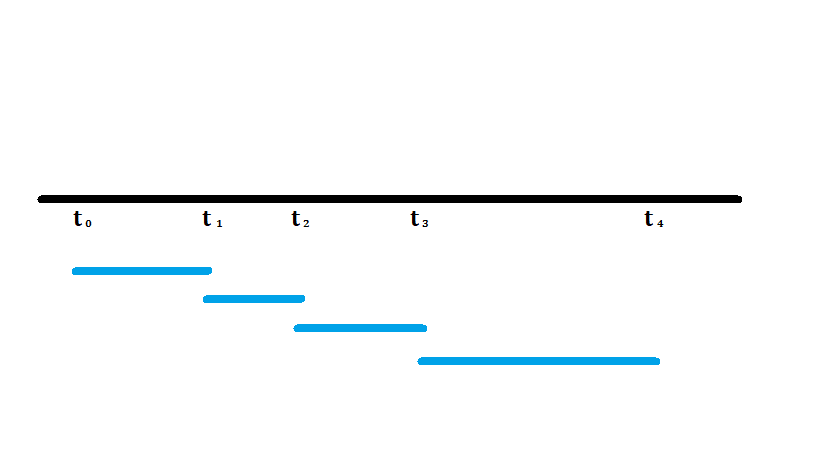
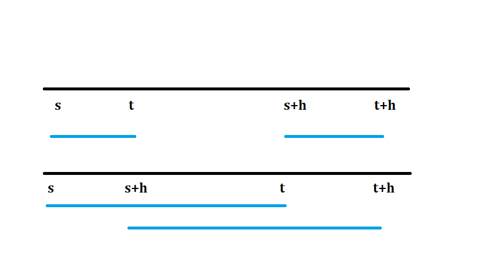
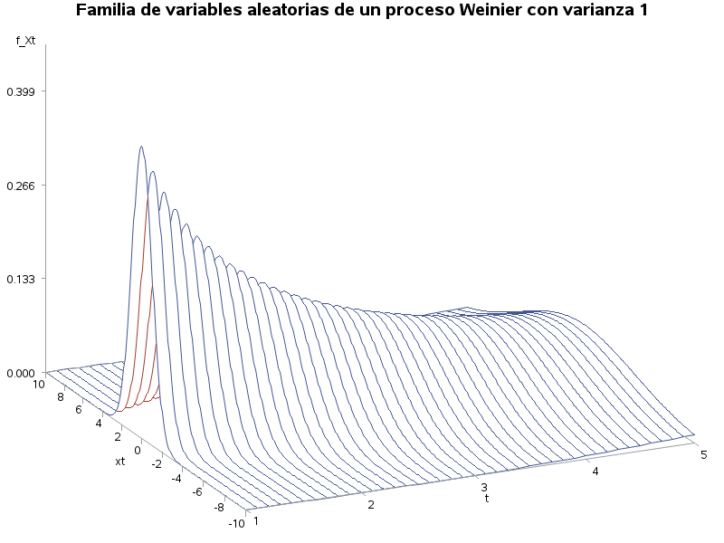

En esta sección se estudiará a los procesos estocásticos, los cuales pueden ser considerados una generalización de una muestra aleatoria.

El estudio de procesos estocásticos requiere el uso de varios conceptos de probabilidad, por que se recomienda leer la página de [Introducción a la probabilidad](probabilidad.md).

## Introducción

Un proceso estocástico (o probabilístico) puede considerarse una generalización de una muestra aleatoria, en el sentido de que las variables aleatorias __no son necesariamente independientes__ y su distrbución podría cambiar.

!!! note "Proceso estocástico"
    Un _proceso estocástico_, denotado por $\lbrace X(t) : t \in T \rbrace$ o por $\lbrace X_t : t \ge 0 \rbrace$, es una colección de variables aleatorias _indizadas_ con valores en un conjunto $T$, en donde $T$ es un conjunto a lo más numerable o un intervalo de números reales en $[0,\infty)$.

De la definición anterior se entiende que las variables _dependerán_ del parámetro $t$ (usualmente el tiempo) y están ordenadas. Además el conjunto $T$ puede ser discreto o continuo. Si el conjunto de índices $T$ es discreto, se le conoce como _proceso estocástico de tiempo discreto_ mientras que si $T$ es continuo, se le conoce como _proceso estocástico de tiempo coninuo_. Las variables aleatorias $X_t$ pueden tomar tanto valores continuos o valores discretos.

Note que si se fija un punto $t$, se tiene $X_t$ una variable aleatoria. Una _realización_ del proceso $X(t)$, es decir si se observa la variable aleatoria, se le conoce como _camino muestral_ y se entiende como el estado del proceso en el tiempo $t$ (Ross, 1996).

### Definiciones

!!! note "Proceso completamente especificado"
    Se dice que un proceso estocástico $\lbrace X(t) : t \in T \rbrace$ está completamente especificado si para cualquier valor del tiempo $t_1<t_2<\dots<t_n$ con $n \in \mathbb{N}$, la distribución conjunta de $(X_{t_1},X_{t_2},\cdots,X_{t_n})$ es conocida.

De la definición anterior se entiende que es difícil conocer el comportamiento de un proceso estocástico, ya que en general es complicado hallar las distribuciones conjuntas, por lo que en ocasiones se deben imponer ciertas condiciones para su estudio.

!!! note "Procesos con incrementos independientes"
    Se dice que un proceso estocástico $\lbrace X_t : t \ge 0 \rbrace$ tiene _incrementos independientes_ si dados $t_0,t_1,t2,\dots,t_n$ las variables aleatorias $X_{t_1}-X_{t_0},X_{t_2}-X_{t_1},\dots,X_{t_n}-X_{t_{n-1}}$ son independientes.

La definición anterior nos asegura que _la diferencia de 2 variables aleatorias_ será independiente de cualquier otra diferencia de 2 variables aleatoria, siempre y cuando sus intervalos no se translapen.

!!! note "Procesos con incrementos estacionarios"
    Se dice que el proceso $\lbrace X_t : t \in T \rbrace$ tiene _incrementos estacionarios_ si para $s<t$ la distribución de $X_t-X_s$ es la misma que $X_{t+h}-X_{s+h}$, para toda $h > 0$ y $s+h,t+h \in T$.

La definición anterior nos indica que la distribución de la diferencia entre cualesquiera 2 diferencias de variables aleatorias de igual longitud es la misma, no importa en qué parte del proceso hayan sido tomadas, sin embargo, esto __no necesariamente implica que sean independiantes__.

El siguiente ejemplo muestra un proceso con incrementos independientes.

!!! note "Proceso de Weiner"
    Se dice que el proceso $\lbrace W_t:t \ge 0 \rbrace$ es un _Proceso de Weiner_ si satisface las siguientes condiciones:

    a)    $W_0 = 0$ (El proceso comienza en cero).

    b)    Tiene incrementos independientes.

    c)    $W_t-W_s \sim N(0,C)$ para $0<s<t$.

!!! note "Movimiento Browniano"
    Este proceso también recibe el nombre de _movimiento browniano_ debido a que el biólogo R. Brown en 1827 observó que algunas partículas en el agua exhibían movimientos irregulares (Karlin & Taylor, 1975).

Un resultado interesante de este proceso es que los incrementos son independientes y estacionarios y su varianza depende de $t$. Es decir:

\(W_{t-s}=W_{t-s}-W_0 \sim N(0,\sigma^2(t-s))\)

es igual es distribución que $W_t-W_s$, donde $\sigma^2$ es la varianza del proceso en el tiempo 1.

??? example "Varianza del incremento del proceso de Weiner"
    Para calcular la varianza de los incrementos, se puede proceder con la fórmula de la varianza, teniendo en cuenta que la esperanza de las diferencias es cero.

    \(
    \begin{align*}
    \mathbb{V}(W_t-W_s) &= \mathbb{E}\left( (W_t-W_s)^2\right)\\
    &=\mathbb{E}\left( W_t^2 -2 W_t W_s +W_s^2\right)\\
    &=\mathbb{E}(W_t^2)-2\mathbb{E}(W_t W_s)+\mathbb{E}(W_s^2)
    \end{align*}
    \)

    Para calcular $\mathbb{E}(W_t W_s)$, se puede realizar un "truco" expresando $W_t = (W_t -W_s) + W_s$ y $W_s = W_s-W_0$, por lo que

    \(
    \begin{align*}
    \mathbb{E}( W_s W_t) &= \mathbb{E}( (W_s-W_0) ((W_t -W_s) + W_s))\\
    &=\mathbb{E}((W_s-W_0)(W_t-W_s)+W_s^2)\\
    &=\mathbb{E}((W_s-W_0)(W_t-W_s))+\mathbb{E}(W_s^2)\\
    &=\mathbb{E}((W_s-W_0))\mathbb{E}((W_t-W_s))+\mathbb{E}(W_s^2)\\
    &=\mathbb{E}(W_s^2)
    \end{align*}
    \)

    Entonces, la varianza del los incrementos es

    \(
    \begin{align*}
    \mathbb{V}(W_t-W_s) &= \mathbb{E}(W_t^2)-2\mathbb{E}(W_s^2)+\mathbb{E}(W_s^2)\\
    &= \mathbb{E}(W_t^2)-\mathbb{E}(W_s^2)\\
    &= \mathbb{V}(W_t)-\mathbb{V}(W_s)
    \end{align*}
    \)

    Ahora supóngase que $s=1$ y $t>1$ y $\mathbb{V}(W_1)=\sigma^2$. Entonces necesariamente la varianza en el tiempo será $t-1$ será la constante $\sigma^2$ por la diferencia de $t-1$. Por lo tanto $\mathbb{V}(W_t-W_s)=\sigma^2(t-s)$ es una función lineal que depende de $t$ y $s$.

La siguiente figura muestra como sería un proceso Wienier con $\sigma^2=1$. Note que cada línea representaría una variable aleatoria $W_t$.

Elaboración propia usando SAS &reg; OnDemand for Academics.

Finalmente se presenta una definición que nos ayudará a comprender la complejidad de los procesos estocásticos.

!!! note "Proceso estrictamente estacionario"
    Se dice que un proceso estocástico $\lbrace X_t:t \in T \rbrace$ es un _proceso estrictamente estacionario_ de orden $k$ si $(X_{t_1},X_{t_2},\dots,X_{t_k})$ tiene la misma distribución que $(X_{t_1+h},X_{t_2+h},\dots,X_{t_k+h})$ para $h \in T$.

La condición anterior es muy fuerte de cumplir para la mayoría de los procesos estocásticos. Note que una __muestra aleatoria__ puede ser considerado un proceso estrictamente estacionario si $T=\mathbb{N}$.

## Características de los procesos

Como se había mencionado anteriormente, en general es complicado conocer la distribución conjunta de un proceso estocástico, por lo que en ocasiones deben emplearse otras formas para conocer su describir su comportamiento.

Para ello se emplearán las funciones del valor medio y de núcleo de covarianza, las cuales serán algo equivalente a la media y la varianza de variables aleatorias.

### Función del valor medio

!!! note "Función del valor medio"
    La función del valor medio, denotada por $m(t)$, se define como

    \(m(t)=\mathbb{E}(X_t),t \ge 0\)

    si dicha esperanza existe y es una función del tiempo $t$.

La función del valor medio es muy útil para caracterizar un proceso ya que nos da una idea de como se comporta el proceso. Funciona de manera similar a la media de una variable aleatoria.

??? example "Función del valor medio del proceso Weinier"
    De la definción del proceso Weinier, se puede comprobar que $m(t)=\mathbb{E}(W_t)=0, t \ge 0$. Esto implica que la función del valor medio del proceso es constante y se entiende que es un proceso que _oscila_ alrededor del cero.

### Función del núcleo de covarianza

!!! note "Función del núcleo de covarianza"
    La función del núcleo de covarianza, denotada por $k(s,t)$, se define como

    \(k(s,t)=Cov(X_s,X_t),0<s<t\)
    
    si dicha covarianza existe.

Al igual que la función del valor medio, la función del núcleo de covarianzanos permite conocer el comportamiento del proceso por medio de la covarianza entre $X_t$ y $X_s$ y nos da idea de cómo cambia la relación de dichas variables aleatorias a través del tiempo.

??? example "Función del núcleo de covarianza del proceso Weinier"
    Se debe conocer la covarianza entre $W_t$ y $W_s$ suponiendo $0<s<t$.

    \(
    \begin{align*}
    k(s,t)&=Cov(W_s,W_t)\\
    &=Cov(W_s,(W_t-W_s)+W_s)\\
    &=Cov(W_s,(W_t-W_s))+Cov(W_s,W_s)\\
    &=\mathbb{V}(W_s)\\
    &=\sigma^2 s
    \end{align*}
    \)

    En general, para cualquier $s, t \in \mathbb{R}^+$, la función de núcleo de covarianza de un proceso Weinier puede expresarse como 

    \(k(s,t)=\sigma^2 min(s,t)\)

    Lo cual implica que no importa la distancia entre $s$ y $t$, la covarianza siempre será constante :scream:.

El estudio de la función de núcleo de covarianza también nos ayuda a conocer como será su comportamiento del proceso a través del tiempo, esto es, si la función de núcleo de covarianza cambia a través del tiempo.

!!! note "Procesos de covarianza estacionaria"
    Se dice que el proceso $\lbrace X_t:t \ge 0 \rbrace$ es de covarianza estacionaria si $K(s,t)=K(t-s)$ para $0<s<t$ es una función que depende de $s$ y $t$.

### Procesos ergódicos

La idea de ergocidad de procesos estocásticos es muy parecida a las propiedades de convergencia de la media en muestras aleatorias, pero para ello se requiere desarrollar idea de límites de variables aleatorias.

Debido a la complejidad de las demostraciones de diversos teoremas, estas serán omitida pero pueden encontrarse por ejemplo en (Parzen, 1999).

!!! note "Proceso ergódico discreto"
    Supóngase que se tiene un proceso estocástico $\lbrace X_n:n \in \mathbb{N} \rbrace$ con parámetro de tiempo $n$ discreto. Se dice que $\lbrace X_n:n \in \mathbb{N} \rbrace$ es ergódico si las medias muestrales $M_n = 1/n \sum_{i=1}^{n} X_i$ pueden ser usadas para aproximar la función del valor medio.

## Convergencia de variables aleatorias

### La integral de un proceso con tiempo continuo

### La derivada de un proceso con tiempo continuo

## Procesos normales

## Procesos contadores

## Bibliografía

Parzen, E. (1999). Stochastic processes. SIAM.

Ross, S. M. (1996). __Stochastic Processes__ (Second Edition). John Wiley & Sons.

Karlin, S., & Taylor, H. (1975). __A first course in stochastic processes__ (Second Edition). Academic Press.

> Muchas de las ideas fueron tomadas del curso _Procesos estocásticos_ impartido por el Dr. José Villaseñor en Primavera del 2022 en el Colegio de Postgraduados, Campus Montecillo.
