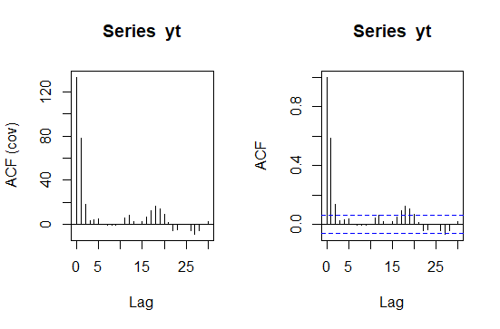

Las series de tiempo es una de la metodologías estadísticas más aplicada debido a que usualmente se tiene información histórica que se desea estudiar y se usan en diversos campos del conocimiento, por ejemplo en economía. Sin embargo actualmente es común encontrar aplicaciones en prácticamente cualquier área.

Uno de los principales usos de las series de tiempo, es hacer *pronósticos de valores futuros* de la variable de interés, usando la información disponible.

Imagen de [geralt](https://pixabay.com/es/users/geralt-9301/) en [pixabay](https://pixabay.com/).

## Introducción

En series de tiempo, es muy importante conocer el tipo de información que se está utilizando, debido a que los datos suelen tener comportamientos complejos, por lo que conviene tener la mayor información del fenómeno que se está estudiando.

A continuación se describirán algunos métodos que describen el problema.

### Herramientas básicas de exploración de series de tiempo

#### Gráfica de series de tiempo

La principal herramienta que se usará será una gráfica de series de tiempo.

Esta consiste en graficar en el eje $X$ el tiempo y en el eje $Y$ las observaciones de la serie.

Esta gráfica nos permitirá ver el comportamiento del fenómeno a través del tiempo e identificar visualmente algunos de sus componentes con el fin de elegir el método más adecuado.

Ejemplo de una gráfica de serie de tiempo. Elaboración propia usando SAS &reg; OnDemand for Academics. Los datos provienen del dataset `sashelp.orsales`.

#### Estadísticas descriptivas

Las estadísticas descriptivas son de gran autilidad para conocer la distribución de la serie. Valores como la media, mediana, desviación estándar, mínimo o máximo, nos ayudarían a tener una idea del comportamiento de la serie.

Tambíen es recomendable realizar algunos gráficos que nos permitan visualizar su distribución tales como histogramas o diagrama de caja y bigotes (boxplot). En algunos casos, estos gráficos incluso podrían identificar si hay o no dos poblaciones.

#### Descomposición y suavizamiento de una serie de tiempo

La series de tiempo pueden exhibir distintos patrones y existen varios métodos para obtener sus componentes (tendecia, ciclo, estacionalidad y componentes irregulares); examinar dichos componentes puede ser útil para enternder la naturaleza del problema y pueden ser de gran ayuda a la hora de elegir un modelo.

Ejemplo de la descomposición de la serie de tiempo de C02 de R. Elaboración propia usando la función `decompose()` del software R.

Para más detalles vea el [capítulo 3](https://otexts.com/fpp3/decomposition.html) de Hyndman & Athanasopoulos (2022).

## Modelos de series de tiempo

En esta sección se dará una introducción más formal que nos permitirá estudiar más a fondo las series de tiempo.

### Definiciones

!!! note "Definición"
    Una serie de tiempo $Y_t$, es una secuencia de valores numéricos indexados por una variable, generalmente tiempo $t$.

Las series de tiempo pueden ser consideradas un caso particular de los procesos estocásticos en donde el parámetro o índice $t$ es discreto. Para una revisión más completa de estos conceptos, visite la sección [Procesos estocásticos](procesos_estocasticos.md).

Las series de tiempo pueden ser continuas o discretas. Comunmente en ciencias sociales o economía, las series de tiempo estan medidas en intervalos de tiempo regulares, ya sea de manera anual, trimestral, mensual o diaria, por lo que los índices $t$ toman valores $1,2,\dots,T$.

Un concepto muy importante en el estudio de las series de tiempo es la *estacionariedad* (tambien puede revisarse la sección [introducción a los procesos estocásticos](procesos_estocasticos.md#definiciones)).

!!! note "Serie de tiempo estacionaria"
    Se dice que una serie de tiempo, denotada $X_t$ es *estrictamente estacionaria* si la distribución conjunta de $(X_{t_1},X_{t_2},\dots,X_{t_k})$ tiene la misma distribución que $(X_{t_1+h},X_{t_2+h},\dots,X_{t_k+h})$ para $t_1,t_2,\dots,t_k,h \in \mathbb{N}$.

Un ejemplo de una serie de tiempo estacionaria estrictamente estacionaria sería una muestra aleatoria. Obsérvese que esta definición implica que la distribución es invariante en el tiempo. De acuerdo con (Tsay, 2010), esta es una condición muy fuerte y es dificil de verificarla empíricamente, por lo que a menudo se asume una condición más débil.

!!! note "Serie de tiempo débilmente estacionaria"
    Se dice que una serie de tiempo $X_t$ es *débilmente estacionaria* si sus primeros dos momentos son finitos y la media $E(X)_t=\mu$ es constante y $Cov(X_t,X_{t+h})=\gamma (h)$ solo depende de $h$, para $h \in \mathbb{N}$.

!!! tip "Serie de tiempo estacionaria"
    Nos referiremos a una serie de tiempo *estacionaria* a aquella que sea *débilmente estacionaria*.

En términos prácticos, la gráfica de series de tiempo debería fluctuar alrededor de una constante y su variabilidad debería mantenerse más o menos estable a través del tiempo.

La autocovarianza entre $Y_t$ y $Y_{t+h}$ mide el grado de asociación lineal entre $Y_t$ y $Y_{t+h}$ con la misma serie pero *rezagada* $h$ periodos y se expresa como

\(
Cov(Y_t,Y_{t+h})=E(Y_t,Y_{t+h})
\)

La correlación o *función de autocorrelación* (FAC) entre $Y_t$ y $Y_{t+h}$ también mide el grado de dependencia lineal de $Y_t$ con la misma serie pero *rezagada* $h$ periodos pero este valor se encuentra entre -1 y 1 y se expresa como

\(
\rho_{h}=\frac{Cov(Y_t,Y_{t+h})}{V(Y_t)}=\frac{\gamma (h)}{\gamma_0}
\)

Note que $\rho_0=1$. La función de autocorrelación es la más usada debido a que es preferible usar cantidades entre 0 y 1. Si la serie $Y_t$ es estacionaria, entonces la covarianza $\lim_{h \to \infty} \gamma_h = 0$ y la autocorrelación $\lim_{h \to \infty} \rho_h = 0$.

En la práctica se usa la *función de correlación muestral* (FACM) definida como:

\(
\hat{\rho}_{h}=\frac{\sum_{t=1}^{T-h}(y_t-\bar{y})(y_{t+h}-\bar{y})}{\sum_{t=1}^{T}(y_t-\bar{y})^2}
\)

A continuación se presenta un tipo de serie de tiempo o proceso que cumple con esta característica.

### Series de tiempo de ruido blanco

!!! note "Proceso de ruido blanco"
    Sean $\lbrace a_t \rbrace$ una sucesión de variables aleatorias independientes e idénticamente distribuidas con media 0 y varianza $\sigma^2_{a}$ finita. Si la distribución de $\lbrace a_t \rbrace$ es normal, entonces la serie se llama *ruido blanco gaussiano*.

!!! tip "Ruido blanco"
    Nos referiremos a una serie de tiempo de *ruido blanco* a aquella que sea *ruido blanco gaussiana*.

La siguiente imagen ilustra una realización de un proceso de ruido blanco $a_t$ con varianza $\sigma^2_{a} = 16$. Note que los valores se encuentran en un intervalo alrededor de cero y no presenta ningún patrón extraño, por lo que este proceso es un **proceso estacionario**.

Elaboración propia. Gráfico realizado con el software R.

### Serie de tiempo lineal

!!! note "Serie de tiempo lineal"
    Se dice que una serie de tiempo $Y_t$ es lineal si puede expresarse como

    \(
    \begin{align*}
    Y_t & = \mu + \sum_{i=0}^{\infty}\psi_i a_{t-i}\\
    & = \mu + a_t + \psi_1 a_{t-1} +\psi_2 a_{t-2} + \dots
    \end{align*}
    \)

    donde $\psi_0 = 1$ y $\mu$ es la media de la serie y ${a_t}$ es una serie de ruido blanco.

De la definición anterior, se entiende que una serie de tiempo lineal puede expresarse como una suma infinita ponderada de ruido, cuyos valores presentes y pasados afectan a la serie.

Note que $E(Y_t) = \mu$ y $V(Y_t) = V(\sum_{i=0}^{\infty}\psi_i a_{t-i}) = \sigma^2_{a}\sum_{i=0}^{\infty}\psi^2_i$ y si la serie $Y_t$ es estacionaria, necesariamente $\sum_{i=0}^{\infty}\psi^2_i < \infty$, por lo que una condición necesaria y suficiente para que la varianza de $Y_t$ sea finita es que $\lim_{i \to \infty}\psi_i^2 = 0$.

Por otro lado, la covarianza entre $Y_t$ y $Y_{t+h}$ con $h \in \mathbb{N}$ puede expresarse como:

\(
\gamma_h =\sigma^2_{a} \sum_{i=0}^{\infty}\psi_i \psi_{i+h}
\)

??? example "Serie de tiempo lineal"
    Suponga que se tiene una serie de tiempo $a_t$ de ruido blanco con varianza $\sigma^2_{a}=25$ y sea $\mu=50$ una constante. Se definen los pesos $\psi_1 = 2, \psi_2=0.5,\psi_3=0.1$ (todos los demas son iguales a cero). Entonces se define la serie de tiempo lineal como $Y_t = 50 + a_t + 2 a_{t-1} + 0.5 a_{t-2} + 0.1 a_{t-3}$. La siguiente gráfica representa una *realización* del proceso

    

    Elaboración propia usando el software R.

    Note que esta serie es estacionaria ya que se cumple con la restricción de que la suma de los pesos al cuadrado (5.26) es finita.

    La media o valor esperado $E(Y_t)$ de esta serie es 50 (el promedio de la realización es 50.83), mientras que la varianza $V(Y_t)$ es 131.5 (la varianza estimada fue de 133.02).Las autocovarianzas serían $\gamma_1=76.25,\gamma_2 =17.5$ y $\gamma_3 = 2.5$.

    La siguiente gráfica muestra del lado derecho las autocorrelaciones estimadas, mientras que del lado derecho se muestran las covarianzas estimadas.

    

    Elaboración propia usando la función `acf()` del software R.

    Las funciones de autocovarianza y autocorrelación muestrales muestran valores muy cercanos a los esperados, sin embargo a partir de los rezagos 10 se aprecian valores que debieran ser cero; esto se debe a que la FACM es una *estimación de los valores observados*, por lo que se debe tener cuidado al interpretar la FACM.

## Modelos ARIMA

Una forma de modelar series de tiempo es usando los modelos ARIMA o *Autorregresivos Integrados de Medias Móviles* tambien conocidos como modelos Box-Jenkins. Para una referencia completa y detallada vea (Box et al., 2016).

Primero se introducirán los modelos Autorregresivos (AR), Medias móviles (MA) y los Autorregresivos de medias móviles (ARMA). Posteriormente se introducirá el concepto de raíz unitaria y modelos integrados (ARIMA), así como los modelos estacionales (SARIMA).

La estimación de parámetros se discutirá de forma muy general y finalmente se mencionará la validación de supuestos y cómo realizar predicciones.

### Modelos autorregresivos

El modelo autorregresivo es muy util para modelar muchos fenómenos, sobre todo relacionados con economía y finanzas ya que típicamente el valor actual *dependerá* de sus valores anteriores. Este modelo se puede expresar de la siguiente forma:

\(
Y_t = \phi_0 + \phi_1 Y_{t-1} + a_t
\)

donde $a_t$ es un término de error de ruido blanco con varianza $\sigma^2 _a$ y $\phi_0$, $\phi_1$ son parámetros del modelo. A este modelo se le conoce como modelo autorregresivo de orden 1 o AR(1).

Note que este modelo es muy parecido a un modelo de regresión lineal simple, con la diferencia de que la variable explicativa es **ella misma pero un periodo anterior**.

??? example "Derivación de la media y varianza de un proceso AR(1)"

    Si se asume que el proceso AR(1) es estacionario, es decir tiene media constante $E(Y_t) = E(Y_{t-1}) = \mu$, entonces 
    
    \(
    \begin{align*}
    \mu &= E(Y_t) \\
    &=E(\phi_0 + \phi_1 Y_{t-1} + a_t) \\
    &=\phi_0 + \phi_1 E(Y_{t-1}) + E(a_t)\\
    &=\phi_0 + \phi_1 \mu
    \end{align*}
    \)
    
    donde $\mu$ es el nivel de la serie. 
    
    Note que, bajo el supuesto de estacionriedad el nivel de la serie $\mu$ puede representarse como $\mu = \frac{\phi_0}{1-\phi_1}$ y por lo tanto $\phi_1$ **no puede ser igual a 1**. También puede notarse que $\phi_0 =\mu(1-\phi_1)$, por lo que $\phi_0 = 0$ si $\mu = 0$, en otras palabras, el término $\phi_0$ no aparecerá en el modelo únicamente si el nivel de la serie es cero.

    Nuevamente asumiendo el supuesto de estacionariedad, la varianza $Var(Y_t) = Var(Y_{t-1}) = \gamma_0$ es constante y la covarianza $Cov(Y_t,Y_{t+h}) = \gamma (h)$ no depende de $t$, sino únicamente de la distancia $h$ entre ellas.
    
    Es común que trabajar con las series centradas, es decir $Z_t = Y_t - \mu$ y por lo tanto únicamente se trabaja con el modelo $Z_t = \phi_1 Z_{t-1} + a_t$. La varianza de la serie centrada puede expresarse como
    
    \(
    \begin{align*}
    \gamma_0 & = Var(Z_t)\\
    & = E(Z_t^2)\\
    &= E(\phi_1^2 Z^2_{t-1}+a^2_t)\\
    &= \phi_1^2E(Z^2_{t-1}) + E(a^2_t)\\
    &= \phi_1^2 Var(Z_{t-1}) + Var(a_t)\\
    &= \phi_1^2 Var(Z_t) + \sigma^2_a
    \end{align*}    
    \)

    Por lo tanto si la serie es estacionaria se obtiene $\gamma_0 = \frac{\sigma^2 _a}{1-\phi^2_1}$ y necesariamente $\phi^2_1 < 1$ ó $-1 < \phi_1 < 1$.

Usando esta expresión, se puede calcular la covarianza de $Z_t$ y $Z_{t-h}$.

\(
\begin{align*}
Cov(Z_t,Z_{t-h}) &= E(Z_t Z_{t-h})\\
&=  E(Z_t ( \phi_1 Z_{t-h-1} + a_{t-h}) )\\
&= E(\phi_1 Z_t Z_{t-h-1} + Z_t a_{t-h})\\
&= E(\phi_1 Z_t Z_{t-h-1}) + E( Z_t a_{t-h})\\
&= \phi_1 E(Z_t Z_{t-h-1}) + E( Z_t a_{t-h})\\
&= \phi_1 \gamma(h-1)
\end{align*}
\)

## Bibliografía

Box, G., Jenkins, G., Reinsel, G., & Ljung, G. (2016). Time Series Analysis: Forecasting and Control. John Wiley & Sons.

Hyndman, R., & Athanasopoulos, G. (2022). Forecasting: Principles and Practice (3rd ed). OTexts. https://Otexts.com/fpp3/

Tsay, R. (2010). Analysis of Financial Time Series (Third Edition). John Wiley & Sons.

> Muchas de las ideas fueron tomadas del curso *Series de tiempo* impartido por la Dra. Martha Elva Ramírez en Primavera del 2022 en el Colegio de Postgraduados, Campus Montecillo.
