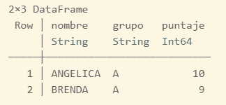
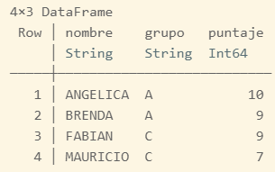

# Manejo de bases con Julia

En esta página se aprenderá a importar archivos en Julia y trabajar con ellos.

También se conocerá cómo hacer filtros y otro tipo de operacione sobre las bases.

## Lectura de datos

En Julia existen diversos paquetes que nos permiten importar y leer datos de archivos externos. En esta sección nos enfocaremos a la creación de conjuntos de datos.

### Creación de datos

Para manipular conjuntos de datos, se puede usar el paquete [DataFrames](https://dataframes.juliadata.org/stable/).

!!! caution "Instalar el paquete"
    No olvide instalar el paquete `DataFrames`, de otro modo se obtendrá un error.

Por ejemplo, para crear el siguiente conjunto de datos

nombre   |grupo        |puntaje
---------|-------------|-------
ANGELICA  |A           |10
BRENDA    |A           |9
LILIANA   |B            |8
MARCO     |B            |8
FABIAN    |C            |9
MAURICIO  |C            |7

se puede escribir en la consola el siguiente comando:

````julia
using DataFrames
datos = DataFrame(nombre =["ANGELICA","BRENDA","LILIANA","MARCO","FABIAN","MAURICIO"],
    grupo = ["A","A","B","B","C","C"],
    puntaje = [10,9,8,8,9,7]);
print(datos)
````

Este código crea un objeto llamado _datos_ que es de tipo _DataFrame_. La forma de definir su contenido es mediante _constructores_ que en este caso son las columnas, aunque pueden ser vectores definidos previamente.

Para visualizar el objeto, se puede usar el comando `print()`. El resultado se muestra a continuación.


### Leyendo un archivo CSV

Para leer un archivo csv, recomienda el uso de los paquetes _CSV_ y _DataFrames_.

El siguiente código muestra cómo importar un archivo csv a un objeto `DataFrame`.

````julia
using CSV, DataFrames
mi_csv = CSV.read("C:\\Users\\Usuario\\census.csv",DataFrame)
summary(mi_csv)
````

La primer línea carga los paquetes instalados previamente, para poder usar todas sus funciones y métodos. En la segunda, se usa la función `CSV.read()` especificándole el nombre de archivo y la función _sink_, en este caso será `DataFrame`, asignándolo al objeto _mi_csv_. Debido a que el archivo es grande se sugiere ver las dimensiones del dataframe usando la función `summary()`.

## Manejo de datos

En esta sección nos enfocaremos en el manejo de bases, tales como conocer las propiedades de las bases, acceder a los elementos de la base, entre otros.

## Explorando la base

Para saber la dimensión de un objeto **DataFrame** se puede usar la función `summary()`.

También es posible conocer los primeros y últimos renglones de una base con la función `first()` y `last()`. Por ejemplo, para obtener los primeros 3 y últimos 3 se puede usar este código.

````julia
first(datos,3)
last(datos,3)
````

### Accediendo a los datos

Como ya vimos anteriormente, las bases en Julia se guardan en un objeto **DataFrame**.

Para poder acceder a las variables, se pueden usar los corchetes cuadrados de la forma `[renglon,columna]`, por ejemplo

````julia
datos[:,"grupo"]
datos[!,2]
datos[1:3,:]
datos[[1,3,5],[1,3]]

````

!!! note "Seleccionar todos los renglones"
    Se puede usar `!` en lugar de  `:` para indicar que se deben seleccionar todos los elementos. No puede ir vacío.

Para elegir un elemento de un dataframe se puede usar la función `getindex()`, por ejemplo el siguiente código obtendrá del dataframe _datos_ el tercer registro de la columna _nombre_.

````julia
getindex(datos,3,"nombre")
````

## Filtrado de datos

Para realizar un filtrado, se puede usar la notación `.` para acceder a las propiedades de un dataframe y usar los nombres de variables.

El siguiente código muestra cómo obtener una filtro del dataframe _datos_, eligiendo a los alumnos que pertenecen al grupo _A_.

````julia
datos2 = datos[datos.grupo .== "A",:]
print(datos2)
````

!!! caution "Comparación"
    Note que se usa un punto antes de los operadores de comparación.

El resultado se muestra a continuación:



Tambien se puede usar la función `in` para elegir más de un valor.

````julia
datos2 = datos[in(["A","C"]).(datos.grupo) ,:]
print(datos2)
````



Para saber más del filtrado de datos, vea la [documentación](https://dataframes.juliadata.org/stable/man/working_with_dataframes/#Taking-a-Subset).

## Creando nuevas variables

Para crear nuevas variable, se puede usar la notación `.` para crear en un dataframe el nuevo nombre de la variable.

El siguiente código muestra como crear una nueva variable llamada _nota_ usando una función condicional.

````julia
datos.nota = ifelse.(datos.puntaje .< 9, "Suficiente", "Excelente")
print(datos)
````

Note que se usa la notación `.<` para expresar que se quiere hacer la comparación por elemento. El resultado se muestra a continuación.


