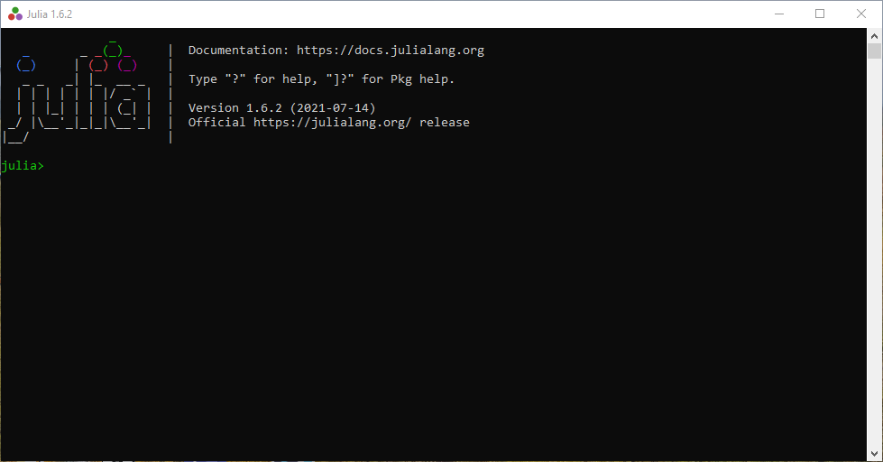

# Inicio

Julia es un poderoso lenguaje de programación enfocado en la potencia y velocidad. Es de código abierto y de libre uso. Visite la [página oficial de Julia](https://julialang.org/) para mayor información.

Al iniciar Julia se muestra una pantalla en que es la línea de comandos de Julia conocida como **Julia REPL**.



Esta permite la entrada y evalua los comandos al instante.

Una vez en la consola se pueden entrar a distintos modos, tal como el modo de ayuda escribiendo `?` o el modo comando de sistema con `;` o el modo paquetes escribiendo `]`. Se puede salir de dichos modos con la tecla de borrar o con **Ctrl+c**.

Julia también puede ejecutarse en entornos gráficos, por ejemplo Jypiter Notebooks o VS Code.

## Directorio de trabajo

Cuando se inicia una sesión de trabajo en Julia, es importante conocer en dónde se encuentra el directorio de trabajo.

Para conocer en dónde se encuentra el directorio de trabajo, basta con escribir en la consola la siguiente función.

````julia
pwd()
````

!!! tip "Función similar"
    También es posible conocer el actual directorio con la fonción `homedir()`.

El resultado será desplegado en pantalla con el directorio en donde se encuentra actualmente el directorio de trabajo.

Para cambiar el actual directorio de trabajo, se puede usar la función

````julia
cd("dir")
````

Por ejemplo, si se desea cambiar a la carpeta **Documentos**, se puede especificar usando la instrucción `cd("C:\\Users\\user\\Documentos")`.

## Variables

Julia tiene varios tipos de variables, por ejemplo tipo numérico (entero y flotante) booleano o caracter. Para conocer todos los tipos de variables que existen, consulte la [documentación](https://docs.julialang.org/en/v1/manual/integers-and-floating-point-numbers/).

Se puede definir una variable usando el operador de asignación `=` como se muestra en el siguiente ejemplo.

````julia
x = 1
y = 1.25
z = x + y
a = "abc"
si = true
````

Para saber de que tipo es, se puede usar la función `typeof()`, el resultado se muestra

````julia
typeof(x)
````

> Int64

## Vectores

La forma de definir vectores es mediante el uso de corchetes cuadrados `[]`, por ejemplo:

````julia
a = [1,2,3]
b = [2,4,5]
````

!!! danger "No confundir con tuplas"
    La forma de definir una tupla es mediante un paréntesis `()`.

Al igual que otros lenguajes de programación, la forma de acceder a sus elementos es mediante el operador `[]` y también con `:` se puede definir una secuencia.

````julia
a[2]
b[1:2]
````

### Operadores aritméticos

Julia soporta diversos operadores aritméticos, la siguiente tabla muestra los principales operadores.

Expresión|Nombre|Descripción
----|------|------
`x + y`|suma|realiza adición
`x - y`|resta|realiza substracción
`x * y`|producto|realiza multiplicación
`x / y`|división|realiza división
`x ÷ y`|división entera|similar a `x/y`, pero truncado a un entero
`x \ y`|división inversa|equivalente a `y/x`
`x ^ y`|potencia|eleva `x` a la potencia `y`
`x % y`|resto|equivalente to `rem(x,y)`

Para una mayor referencia visita la sección [operadores aritméticos](https://docs.julialang.org/en/v1/manual/mathematical-operations/#Arithmetic-Operators).

## Control de flujo

Julia posee estructuras para control de flujo. Se puede realizar un ciclo usando el siguiente código

````julia
for x in 1:10
    println(x)
end
````

!!! Nota
    La función `print()` imprimiría los valores consecutivamente sin espacio, mientras que `println()` los imprime en una línea nueva.

Se debe tomar en cuenta que la palabra `for` debe cerrarse con un  `end` para delimitar el bloque.

Para usar el ciclo while, se usa el siguiente código

````julia
x = 0
while x <= 5 
    println(x)
    x = x + 1
end
````

!!! danger "Ciclo infinito"
    No olvides aumentar el contador con el fin de que se cumpla la condición, de otro modo se entraría en un ciclo infinito.

## Funciones

Para definir una función, se usa la palabra `function` seguido del nombre de la función y entre paréntesis los argumentos.

Se debe especificar la paabra clave `return`, de otro modo retornaría el último valor calculado.

La función termina con un `end` e inmediatamente se compila.

````julia
function signo(x)
    if x < 0 resp = "Negativo"
    elseif x > 0 resp = "Positivo"
        else resp = "Es Cero"
    end
    return resp
end
````

una vez compilada, se puede usar.

````julia
signo(-5)
````

El resultado sería el siguiente

> "Negativo"

## Paquetes

Julia tiene un gestor de paquetes en el cual se pueden descargar miles de ellos.

Para acceder a ellos basta con entrar al modo paquete y escribir en la consola. Por ejemplo, para instalar el paquete _DataFrames_ usaremos el siguiente comando

````julia
add DataFrames
````

alternativamente, desde la consola REPL podemos escribir

````julia
import Pkg
Pkg.add("DataFrames")
````

Para comenzar a usarlo, escribimos desde la consola

````julia
using DataFrames
````
