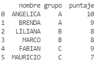
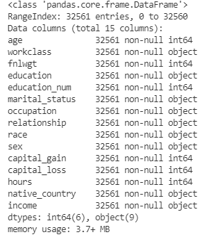
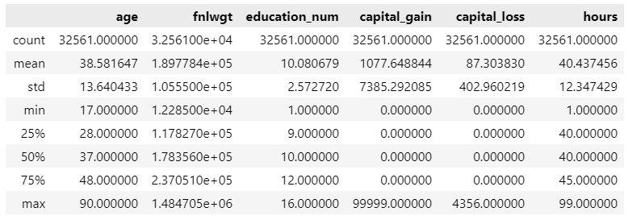
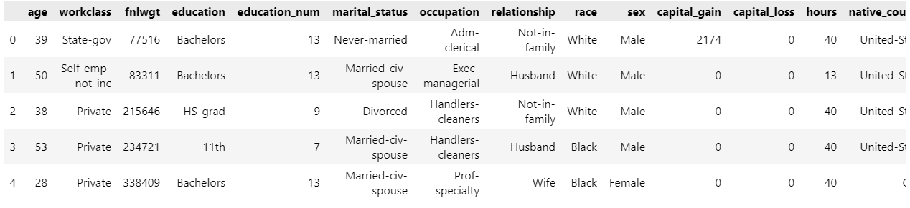
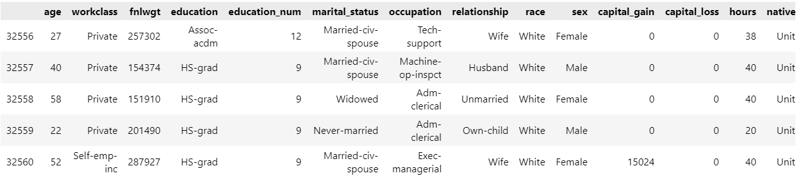
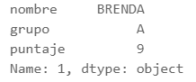
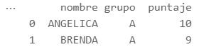
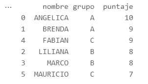
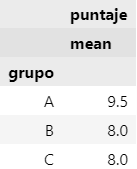

# Introducción

En esta sección aprenderemos acerca de cómo leer datos en python, así como el manejo de datos con python.

Para manejar datos en python se usan librerías especiales. En particular se usará la librería *pandas* para realizar estas operaciones.

El primer paso es llamar las librerías que se utilizarán en la sesión.

````python
import pandas as pd
import numpy as np
import os
````

La librería __pandas__ es la que nos permite manejar objetos de tipo _dataframe_ que es la estructura de datos usada en python para almacenar la información. La librería __numpy__ nos permitirá crear arreglos y manipularlos de forma más fácil. La librería __os__ nos ayudará a usar funciones y otras utilidades del sistema operativo.

Los códigos mostrados se realizaron en un cuaderno interactivo de python (archivo ipynb) usando Visual Studio Code.

Para una referencia completa, visite la [documentación de pandas](https://pandas.pydata.org/pandas-docs/stable/index.html).

## Creando un objeto DataFrame

La forma más sencilla de crear un *dataframe* es mediante la definición de un diccionario con las listas definidas y posteriormente se usa la función `DataFrame` del paquete _pandas_ para crear un objeto `DataFrame` en donde se almacenará la información. El objeto creado hereda las claves del diccionario y los valores se escriben en el dataset.

Para introducir datos de manera manual, se puede usar la siguiente sintaxis:

````python
import pandas as pd

nombres = ["ANGELICA","BRENDA","LILIANA","MARCO","FABIAN","MAURICIO"]
gpo = ["A","A","B","B","C","C"]
puntajes = [10,9,8,8,9,7]

dic = {"nombre":nombres,"grupo":gpo,"puntaje":puntajes}

mi_base = pd.DataFrame(dic)
print(mi_base)
````

La siguiente imagen muestra el dataframe definido.



Note que el objeto creado es un objeto especial. Si escribimos en la consola el comando `type(mi_base)`, obtenemos la siguiente información.

> pandas.core.frame.DataFrame

Como tal, este objeto va a tener diversos métodos para manipularlo o conocer sus propiedades. Consulte la [referencia de DataFrame](https://www.w3schools.com/python/pandas/pandas_ref_dataframe.asp) para saber más de sus propiedades.

## Lectura de archivos externos

Para leer archivos externos, por ejemplo de tipo csv, se usa la función `read_csv` de la librería _pandas_ para leer los datos.

El siguiente código muestra cómo leer un archivo que está almacenado en la misma carpeta del directorio de trabajo.

````python
import pandas as pd

datos = pd.read_csv("census.csv")
````

Como puede observarse, `datos` es un objeto **DataFrame** que se define gracias a la función `read_csv()` de pandas. En este caso, el archivo estaba en la misma carpeta que el directorio de trabajo.

Para conocer cual es el directorio de trabajo, se puede usar el siguiente comando:

````
root=os.getcwd()
print(root)
````

El resultado devolverá la ruta del directorio de trabajo, por ejemplo:

> 'c:\\Users\\Usuario\\Documents\\proyectos\\python\\src'

Para modificar el directorio de trabajo, se puede usar el siguiente código:

````python
os.chdir("C:\\Users\\Usuario\\Documents\\proyectos\\python\\datos")
````

Por lo que solo basta copiar los archivos a esta carpeta para poder importarlos sin problema.

Si el archivo se encuentra almacenado en la web, únicamente se debe escribir la dirección entre comillas dentro de la función `read_csv()` y automáticamente será leido y almacenado en un objeto **DataFrame**.

El siguiente código ejemplifica su uso:

````python
import pandas as pa

covid = pa.read_csv("https://covid.ourworldindata.org/data/owid-covid-data.csv")

covid.info()
````

## Exploración de la base

Se puede obtener información de un objeto **DataFrame** usando el siguiente comando.

````python
datos.info()
````

La siguiente imagen muestra el resultado obtenido de la consola.



Para ver un análisis descriptivo de las variables numéricas datos se puede usar el método `describe`.

````python
datos.describe()
````

El resultado se muestra a continuación



!!! caution "Métodos sin argumentos"
    Note que los métodos anteriores no requieren ningún argumento, porlo que solo se ponen los paréntesis vacíos.

Para visualizar los primeros 5 datos se puede usar este código

````python
datos.head(n=5)
````

La siguiente imagen muestra las primeras 5 observaciones



De manera similar, los últimos 5 registros se pueden ver con este código

````python
datos.tail(n=5)
````

La siguiente imagen muestra las últimas 5 observaciones



!!! tip "Argumentos opcionales"
    Algunos métodos no requieren argumentos, mientras que en otros son opcionales. Los métodos `head()` y `tail()` tienen un valor predeterminado de 5.

Al igual que otros lenguajes de programación, es posible acceder a los elementos de un dataframe. Para ello se puede hacer uso del método `iloc`.

El siguiente código muestra cómo acceder al segundo renglón de un dataframe y el resultado que se obtiene.

````python
mi_base.iloc[1,]
````

El resultado se muestra a continuación



!!! caution "Método sin paréntesis"
    Note que el método `iloc` __no__ usa paréntesis.

## Transformación y manipulación de un dataframe

Al igual que en otros lenguajes de programación, es posible modifcar las tablas en python a través de los métodos de los objetos *dataframe* proporcionados por el paquete **pandas**.

En esta sección se abordarán temas acerca de como manipular y transformar bases que estén almacenadas en un objeto *dataframe*, tales como realizar filtros, unir tablas, agrupar datos, entre otras operaciones.

### Filtrado de base

Para filtrar una base, se puede usar el método `query()` para filtrar una base usando condicionales. A diferencia de otros métodos, se requiere de una expresión entrecomillada con una expresión lógica a evaluarse.

El siguiente ejemplo muestra cómo seleccionar a alumnos del grupo A.

````python
filtro = mi_base.query('grupo == "A"')
print(filtro)
````

El resultado se muestra a continuación



Para saber más, consulte la [documentación del método](https://pandas.pydata.org/pandas-docs/stable/user_guide/indexing.html#the-query-method) `query()`.

### Ordenando una base

Para ordenar una base, se usa el método `sort.values()` en donde se le pasa una lista con los nombres de las variables a ordenar.

El siguiente código muestra su uso. Note que el método requiere al menos el argumento `by` y se pide que guarde la base ordenada en un nuevo objeto `dataframe`.

````python
base_ord = mi_base.sort_values(by=["nombre"])
print(datos_ord)
````

La siguiente imagen muestra el resultado, note que la base se ha guardado en un nuevo objeto.



Para más información acerca del método `sort.values()` consulte la [documentación](https://pandas.pydata.org/pandas-docs/stable/user_guide/basics.html#by-values) del método `sort_values`.

### Datos agrupados

En el paquete `pandas` también se incluye un método para crear datos agrupados por una o más variables.

El siguiente código muestra su uso

````python
mi_base_agrupada = mi_base.groupby(by=["grupo"])
````

!!! caution "objeto retornado"
    El método `groupby` regresa un objeto `DataFrameGroupBy`, por lo que no podría ser visualizado. Este objeto se suele utilizar para realizar agregados por cada grupo.

Los datos agrupados son útiles para obtener estadísticas descriptivas por grupos. El siguiente ejemplo ejemplifica su uso mediante el método `aggregate()`.

````python
mi_base_agrupada.aggregate(["mean"])
````



Para más información visite la [documentación](https://pandas.pydata.org/pandas-docs/stable/user_guide/groupby.html) del método `groupby` y cómo realizar agregados.
