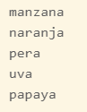

# Introducción

Este es un tutorial rápido sobre el programa enfocado principalmente al manejo de datos y temas relacionados con ciencias de datos.

Python es un lenguaje que se emplea mucho en diversas áreas, sin embargo recientemente se ha vuelto muy popular en las áreas de ciencias de datos.

Por esa razón hoy en día es prácticamente indispensable tener conocimientos en el programa.


Iconos diseñados por [Freepik](https://www.freepik.com) from [Flaticon](https://www.flaticon.es/)

## Instalación e interfaces gráficas

El sitio oficial de Python es [python.org](https://www.python.org/), sin embargo se recomienda instalar **Anaconda**, una distribución de Python que contiene muchos módulos y software adicional para trabajar con Python.

!!! note "Descarga"
     Usted puede descargar el software gratuitamente. Visite la página de [Anaconda](https://www.anaconda.com/distribution/) para más información.

Python corre desde la consola de windows (cmd o powershell), aunque puede ser llamada desde **Anaconda Prompt** o **Anaconda Powershell Prompt**.

**Spyder** es otra interfaz gráfica destinada a desarrollar código eficientemente, ya que cuenta con varias opciones de configuración y ventanas con varias funciones. Esta interfaz gráfica ya viene incluida en Anaconda.

Python tiene unos cuadernos interactivos para correr código al instante llamados **Jupyter Notebooks**, este software se instala junto con Anaconda y permite ejecutar no sólo código de python, sino que tiene plugins llamados _kernel_ que permiten ejecutar código de otros lenguajes.

También es posible usar python en [Visual Studio Code](https://code.visualstudio.com/), usando la [extensión de Python](https://marketplace.visualstudio.com/items?itemName=ms-python.python). Cuando un código de es ejecutado, se abre una consola que ejecuta el código directamente en VSC. El uso del depurador también es una característica importante que se puede usar. También es posible crear, editar y ejecutar los cuadernos de Python desde VSC.

## Objetos

Al ser Python un lenguaje orientado a objetos, es necesario conocer sus objetos y algunas de sus propiedades.

### Variables

Las variables son objetos que permiten almacenar un valor.

Se pueden declarar usando el operador  `=`, por ejemplo

````python
x = 5
y = 2.15
a = "hola"
````

Para conocer el tipo de variable, se usa la función `type`, por ejemplo

````python
type(x)
type(y)
type(a)
````

La siguiente tabla muestra algunos de los tipos de datos que existen.

Ejemplo |Tipo|
--------|---------|
x = "Hola Mundo!" |str |
x = 20 |int |
x = 20.5 |float |
x = 1j |complex |
x = True |bool|

Los objetos tienen métodos, por ejemplo, los objetos tipo _str_ tienen métodos que los convierten en mayúsculas, por ejemplo

````python
a.upper()
````

### Listas

Uno de los principales objetos en python son las listas. Las listas permiten guardar varios valores en una sola variable, además sus elementos están ordenados y pueden ser intercambiables. Una lista puede ser vista como un arreglo que permite valores duplicados.

Por ejemplo para crear una lista se puede declarar de la siguiente forma:

````python
mi_lista = ["manzana","naranja","pera","uva"]
print(mi_lista)
````

El resultado que se obtiene es el siguiente:

> ['manzana', 'naranja', 'pera', 'uva']

!!! caution "Índices"
     A diferencia de otros lenguajes de programación, el primer elemento de un objeto es el 0 y no el 1.

Para acceder a un elemento de una lista, se puede usar `[]` con el índice del elemento, también se puede definir un rango con `:`.

````python
mi_lista[0]
mi_lista[:1]
mi_lista[2:]
````

Para agregar un nuevo elemento a una lista, se puede usar el método *append*.

````python
mi_lista.append("fresa")
mi_lista
````

El resultado es el siguiente:

> ['manzana', 'naranja', 'pera', 'uva', 'fresa']

Para una referencia completa acerca de las lista consulte [Listas de Python](https://www.w3schools.com/python/python_lists.asp).

### Diccionarios

Otro tipo de arreglo que existe en python son los diccionarios.

Los diccionarios son un arreglo conformado por pares de **claves** y **valores**. Los elementos de un diccionario están dentro de llaves `{}` separados por comas, y se usa dos puntos para asignar el valor a la clave. El siguiente ejemplo muestra un diccionario.

````python
dic = {
  "nombre": "Juan",
  "apellido": "Pérez",
  "edad": 30
}
````

Los valores pueden ser una lista, por ejemplo:

````python
sexo = ["M","F","M"]
dic = {
  "nombre": ["Juan","María","José"],
  "apellido": ["Pérez","Martínez","Pérez"],
  "edad": [30,50,45],
  "genero":sexo
}
````

El resultado se muestra a continuación.


!!! danger "Claves únicas"
     Los diccionarios no permiten tener claves duplicadas, si se agrega una clave ya existente, se mantendrá la más reciente. Las claves funcionan como el nombre de variable en una tabla.

Es posible acceder a los elementos de un diccionario mediante sus claves, por ejemplo, para saber el nombre, se puede escribir

````python
dic["nombre"]
````

Para agregar nuevas claves, simplemente se agrega la nueva clave al diccionario con los valores deseados, por ejemplo

````python
dic["ocupacion"] = ["Contador","Gerente","Profesor"]
dic
````


Para una referencia completa acerca de los diccionarios consulte [Diccionario de Python](https://www.w3schools.com/python/python_dictionaries.asp).

## Ciclos

Los ciclos en python permiten iterar en cualquier secuencia, por ejemplo una cadena, una lista o un diccionario.

El siguiente ejemplo muestra el funcionamiento de un ciclo sobre una lista.

````python
frutas = ["manzana","naranja","pera","uva","papaya"]
for x in frutas:
  print(x)
````

Note que `x` toma el valor de cada elemento de la lista y en cada iteración se imprime su valor. El ciclo termina cuando ya no hay elementos en la lista. El resultado de muestra a continuación:



Visite [ciclos en python](https://www.w3schools.com/python/python_for_loops.asp) para saber más acerca de cómo funcionan los ciclos.

## Paquetes

La mayoría de los paquetes usados en ciencia de datos, son instalados mediante uando se instala Anaconda, por lo que solo es necesario llamar los paquetes necesarios.

Por ejemplo, para usar las librerías __pandas__ y __numpy__ y otra librería adicional llamada __os__ se puede ejecutar el siguiente código.

````python
import pandas as pd
import numpy as np
import os
````

!!! Nota
    En ocasiones es preferible usar nombres más cortos para referirnos a
    los nombres de las librerías. Por ejemplo, a `pandas` le llamaremos `pd` y `np` para referirnos a `numpy`.

si solo se desea llamar una función , se puede ejecutar el siguiente código.

````python
from pandas import read_csv
````

Sin embargo, se puede instalar paquetes adicionales desde la consola con los siguientes comandos:

````c
pip install paquete
````
