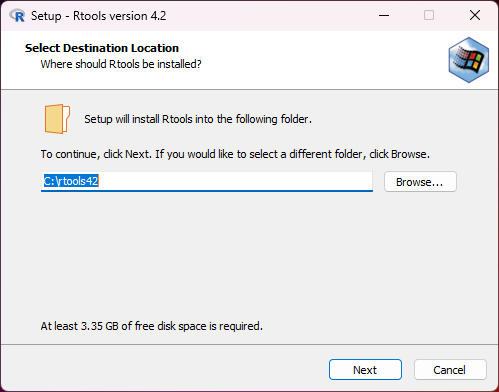
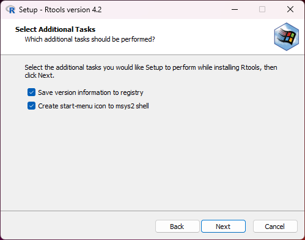
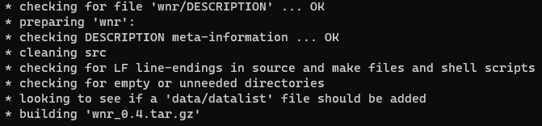

# Introducción

En esta lección se aprenderá a usar R para ajustar distintos modelos predictivos más comunes, tales como modelo de regresión lineal simple y múltiple, así como el modelo ANOVA y regresión logística.

Para los modelos lineales, se usará la función `lm()` que nos permitirá ajustar modelos ANOVA y de regresión lineal. Para el caso de la regresión logística, se usará la función `glm()` del paquete **MASS**.

## Gráficos

En R se disponen de diversas funciones para realizar gráficos genéricos.

Funciones como `plot()`, `scatter()`, `lines()`, `histogram()`, `boxplot()` o `points()` nos permiten generar gráficos de gran calidad con muchas opciones para personalizar los gráficos.

También la librería `ggplot2` realiza gráficos más modernos y altamente personalizables, actualmente la gente prefiere éstos a los anteriores.

Para saber más a cerca de los gráficos ggplot, visite su [sitio oficial](https://ggplot2.tidyverse.org/).

## Modelo ANOVA

Los datos que se usarán en este ejemplo fueron descargados de este [sitio](https://www.kaggle.com/spscientist/students-performance-in-exams).

El objetivo del estudio es **ver si hay efecto de tomar el curso de preparación en las calificaciones de matemáticas**. En otras palabras, se pretende hacer la siguiente prueba de hipótesis:

$$H_0:\mu_1 = \mu_2 $$

contra la altenativa:

$$H_a:\mu_1 \ne \mu_2$$

Antes de ajustar un modelo ANOVA es importante realizar un análisis exploratorio de los datos.

El siguiente código realiza un gráfico boxplot, tambien conocido como de caja y bigotes.

````r
library(ggplot2)
ggplot(datos,aes(test.preparation.course,math.score))+geom_boxplot()
````


La gráfica sugiere que quienes completaron el curso obtuvieron un promedio más alto en su calificación de matemáticas de quienes no. Sin embargo la diferencia no es tan clara por que ambos grupos tienen mucha variabilidad, por lo que el modelo ANOVA nos permitirá decidir.

### Ajuste de un modelo ANOVA

El ajuste del modelo se realiza de la siguiente manera.

````r
modelo = lm(math.score~test.preparation.course,data=datos)
summary(modelo)
````

R ajusta el modelo $math.score = \beta_0 + \beta_1*test.preparation.course$ y lo almacena en un objeto `lm`, para poder ver los resultados, se debe usar la función `summary()` para poder visualizar los resultados.


Se puede apreciar que se rechaza la hipótesis nula de igualdad de medias, debido a que el p-value es muy pequeño. Eso indicaría que si hay diferencia de calificaciones de matemáticas entre quienes tomaron el curso y quienes no.

Si se observa los valores de los parámetros estimados, se puede ver que el intercepto es de 69.69 y el valor de $\beta_1$ para la categoría "none" es -5.6. Ambos estimaciones son **estadísticamente distintos de cero** de acuerdo al p-value. Debido a que solo hay 2 categorías, R únicamente estima la diferencia con respecto a la categoría "completed". En este caso, el valor del intercepto representa la media de calificaciones de quienes completaron el curso.

El valor de R-cuadrado bajo y un error estándar de los residuales alto, sugiere que este modelo no puede explicar toda la variabilidad de la las calificaciones, por lo que se debería agregar otra variable explicativa.

Una forma de obtener las medias estimadas de ambos grupos es usando la función `LSD.test()` del paquete *agricolae*. La opción `console=TRUE` despliega la información en la consola.

````r
library(agricolae)
medias=LSD.test(modelo,"test.preparation.course",console=TRUE)
````


### Predicción de un modelo ANOVA

R contiene funciones para realizar una predicción usando un nuevo conjunto de datos. El siguiente ejemplo muestra una predicción de la media para ambos grupos.

````r
nuevos = data.frame("test.preparation.course"=c("none","completed"))
predict(modelo,newdata=nuevos,interval="confidence")
````

En el ejemplo anterior se crea un nuevo dataframe llamado "nuevos" con los valores para los grupos que se desean estimar las medias. La función `predict()` realizará la estimación de valores puntuales como de los intervalos de confianza. La opción `newdata=` nos permite elegir los valores para los cuales se desea hacer la inferencia y la opción `interval="confidence"` especifica el tippo de predicción.


Note que los valores coinciden con los obtenidos por la función `LSD.test()`.

Si ahora se quiere realizar una predicción para una observación en particular, se puede especificar la opción `interval="prediction"`.

````r
nuevos = data.frame("test.preparation.course"=c("none","completed"))
predict(modelo,newdata=nuevos,interval="prediction")
````


Los intervalos de confianza para los valores individuales son muy grandes, por lo que no serían consideradas buenas debido a que inclusive se translapan.

## Creación de paquetes en R

Hasta el momento se ha considerado únicamente instalar y cargar paquetes que están disponibles en el CRAN, sin embargo, los usuarios pueden crear su propios paquetes e incluso subirlos a diversos repositorios si así lo desean.

!!! caution "Mantenimiento de los paquetes"
    La creación, mantenimiento y corrección de errores es responsabilidad del creador del paquete, por lo que se debe ser muy cuidadoso del contenido de paquetes de terceros.

En esta sección se abordará el tema de la instalación de paquetes de fórma fácil.

### Introducción a la creación de paquetes

En esta subsección, se describirá de forma general la forma de crear paquetes de R. Para detalles consulte el documento [Writting R Extensions](https://cran.r-project.org/doc/manuals/R-exts.html).

En Windows, se debe descargar el software adicional [Rtools](https://cran.r-project.org/bin/windows/Rtools/) con el fin poder compilar los paquetes. A continuación se proporcionan instrucciones para la instalación.

1. Descargar el [instalador de Rtools](https://cran.r-project.org/bin/windows/Rtools/rtools42/rtools.html), procurando tener la versión más actualizada (versión 4.2).
2. Seguir las instrucciones del asistente de instalación.

Las siguientes imágenes ilustran los pasos para la instalación de Rtools (se recomienda aceptar las opciones de configuración tal y como están).






Es necesario tener instalado Latex para la construcción de la documentación.

### Estructura del paquete

Se recomienda usar una carpeta la cual será la base del paquete.

Una forma sencilla de crear la estructura del paquete es con la función `package.skeleton`. La estructura básica de un paquete se muestra a continuación.


Los archivos `DESCRIPTION` y `NAMESPACE` son los metadatos del paquete. El primero debe ser llenado indicando datos que identifique al paquete, tal como el nombre del paquete, descripción, autor, entre otras cosas, mientra que el segundo contendrá las funciones que serán visibles al usuario, así como las funciones utilizadas de otros paquetes o si se debe registrar un archivo compilado.

La funciones o métodos de R, deben de ir en específicamente en la subcarpeta `R`, mientra que la carpeta `man` deberá contener únicamente la documentación en formato `Rd` y la carpeta `data` deberá contener archivos `RData` o `rda`.

Para ver un ejemplo más concreto, se puede en github el paquete [wnr](https://github.com/FranciscoAriel/wnr).

### Compilación del paquete

Una vez que se tengan los archivos necesarios para el paquete, se procerá a la construcción del mismo ubicándose en una carpeta _un nivel anterior_ usando la siguiente sintaxis.

````bash
R CMD build pkg
````

donde `pkg` es el directorio que contiene la estructura del paquete.

!!! caution "Comando no reconocido en Windows"
    En Windows es posible que no se reconozca el comando `R CMD`.

    Para solucionar ese problema, en el bloc de notas (o cualquier otro editor de texto) se puede crear el archivo `compilar.bat` que contenga _la ruta completa de R_ y las instrucciones, por ejemplo:

    ````txt
    "C:\Program Files\R\R-4.2.2\bin\x64\R" CMD build pkg
    ````

    Por lo que simplemente se debe correr el archivo `compilar.bat` desde la linea de comandos (cmd o powershell)

    === "CMD"
        
        ````cmd
        compilar.bat
        ````
    
    === "PowerShell"

        ````cmd
        .\compilar.bat
        ````

El resultado de la compilación será un archivo con extensión `.tar.gz` que tendrá toda la información del paquete comprimida respetando los directorios originales.

En la siguiente imagen se muestra el mensaje resultante de la compilación del paquete `wnr`.


