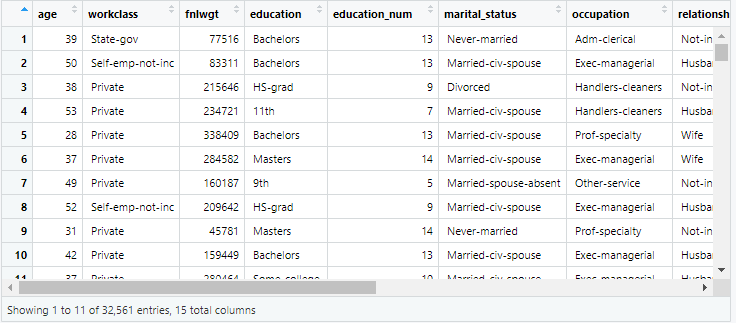

# Introducción

En esta sección se aprenderá la forma de leer y manejar datos en R, ya sea usando las funciones o usando filtros para obtener la información deseada.

## Lectura de datos

R tiene objetos dedicados al manejo de datos, por ejemplo el objeto `data.frame`, aunque tambien pueden usarse otros paquetes para el mismo fin.

En esta sección se mostrará la forma de crear datasets y leer archivos externos en R.

### Lectura de datos externos en R

R tiene muchos paquetes que permiten leer una gran cantidad de tipos de archivos externos. El tipo de archivos más común es el archivo delimitado por comas o CSV.

El siguiente código muestra como leer un archivo externo.

````r
census <- read.csv("C:/Users/Usuario/census.csv")
````

El resultado se muestra a continuación.



!!! note "Asistente de importación"
    RStudio cuenta un asistente de importación que nos permite visualizar los datos que se van a importar o seleccionar el tipo de dato.

### Leer archivos de excel

Para leer archivos es formato de Excel, se puede hacer uso de la librería `readxl` y la función `read_excel`.

El siguiente código muestra su uso:

````r
library(readxl)
census <- read_excel("census.xlsx")
````

Para más información visite [readxl](https://readxl.tidyverse.org/).

### Importar datos otros softwares

El paquete *haven* permite leer y escribir bases de diversos archivos.

El siguiente código muestra como importar un archivo de **SAS &reg; software**.

````r
library(haven)
customer <- read_sas("customer.sas7bdat", NULL)
````

Para más información visite [haven](https://haven.tidyverse.org/).

## Manipulación de datos

En esta sección se abordará el tema de manejo y manipulación de bases en R.

Para ello es necesario conocer un poco acerca de la base con la que se estará trabajando.

Posteriormente se conocerán las distintas formas de filtrar datos y realizar otro tipo de operaciones.

### Exploración de datos

Una forma de saber el tipo de datos que se ha importado es mediante el comando `class()`, este comando nos devolverá el nombre de la estructura correspondiente en R.

Para conocer la dimensión del objeto, se puede usar el comando `dim()`.

!!! tip "Dimensiones"
    Otra forma de saber las dimensiones de una base es mediante los comandos `nrow()` y `ncol()`.

Si se desea conocer un resumen con estadísticas descriptivas, se puede usar el comando `summary`.

Los siguientes códigos ilustran los comandos previos:

```` r
class(census)
dim(census)
summary(census)
````

### Filtrado de datos

Para realizar un filtrado de datos en R, se pueden usar los vectores lógicos, de esta forma, aquellas observaciones que cumplan con la condición, serán las observaciones elegidas.

Por ejemplo, el siguiente código muestra cómo elegir a los alumnos que pertenecen al grupo A

````r
filtro = datos$grupo=="A"
grupo_A = datos[filtro,]
````

Esto también se puede hacer en una sola operación, pasándole directamente la expresión.

````r
grupo_A = datos[datos$grupo=="A",]
````

El siguiente cuadro muestra los operadores lógicos que existen en R
