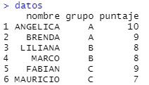

# Introducción

En esta sección se aprenderá la forma de leer y manejar datos en R, ya sea usando las funciones

## Lectura de datos

R tiene objetos dedicados al manejo de datos, por ejemplo el objeto `data.frame`, aunque tambien pueden usarse otros paquetes para el mismo fin.

En esta sección se mostrará la forma de crear datasets y leer archivos externos en R.

### Creación de datasets de forma manual

Una manera fácil de crear conjunto de datos es mediante la función `data.frame` pasándole vectores como argumentos. Por ejemplo, el siguiente código muestra cómo construir un conjunto de datos.

````r
datos = data.frame(nombre =c("ANGELICA","BRENDA","LILIANA","MARCO","FABIAN","MAURICIO"),
                  grupo = c("A","A","B","B","C","C"),
                  puntaje = c(10,9,8,8,9,7))
````

El resultado es el siguiente.



### Lectura de datos externos en R

R tiene muchos paquetes que permiten leer una gran cantidad de tipos de archivos externos. El tipo de archivos más común es el archivo delimitado por comas o CSV.

El siguiente código muestra como leer un archivo externo.

````r
census <- read.csv("C:/Users/Usuario/census.csv")
````

El resultado se muestra a continuación.


!!! note "Asistente de importación"
    RStudio cuenta un asistente de importación que nos permite visualizar los datos que se van a importar o seleccionar el tipo de dato.

### Leer archivos de excel

Para leer archivos es formato de Excel, se puede hacer uso de la librería `readxl` y la función `read_excel`.

El siguiente código muestra su uso:

````r
library(readxl)
census <- read_excel("census.xlsx")
````

Para más información visite [readxl](https://readxl.tidyverse.org/).

### Importar datos otros softwares

El paquete *haven* permite leer y escribir bases de diversos archivos.

El siguiente código muestra como importar un archivo de **SAS &reg; software**.

````r
library(haven)
customer <- read_sas("customer.sas7bdat", NULL)
````

Para más información visite [haven](https://haven.tidyverse.org/).

## Exploración de datos