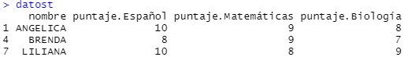
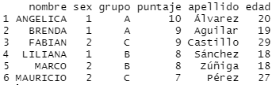

# Introducción

En esta sección se aprenderá la forma de leer y manejar datos en R, ya sea usando las funciones o usando filtros para obtener la información deseada.

## Lectura de datos

R tiene objetos dedicados al manejo de datos, por ejemplo el objeto `data.frame`, aunque tambien pueden usarse otros paquetes para el mismo fin.

En esta sección se mostrará la forma de crear datasets y leer archivos externos en R.

### Lectura de datos externos en R

R tiene muchos paquetes que permiten leer una gran cantidad de tipos de archivos externos. El tipo de archivos más común es el archivo delimitado por comas o CSV.

El siguiente código muestra como leer un archivo externo.

````r
census <- read.csv("C:/Users/Usuario/census.csv")
````

El resultado se muestra a continuación.


!!! note "Asistente de importación"
    RStudio cuenta un asistente de importación que nos permite visualizar los datos que se van a importar o seleccionar el tipo de dato.

### Leer archivos de excel

Para leer archivos es formato de Excel, se puede hacer uso de la librería `readxl` y la función `read_excel`.

El siguiente código muestra su uso:

````r
library(readxl)
census <- read_excel("census.xlsx")
````

Para más información visite [readxl](https://readxl.tidyverse.org/).

### Importar datos otros softwares

El paquete *haven* permite leer y escribir bases de diversos archivos.

El siguiente código muestra como importar un archivo de **SAS &reg; software**.

````r
library(haven)
customer <- read_sas("customer.sas7bdat", NULL)
````

Para más información visite [haven](https://haven.tidyverse.org/).

## Manipulación de datos

En esta sección se abordará el tema de manejo y manipulación de bases en R.

Para ello es necesario conocer un poco acerca de la base con la que se estará trabajando.

Posteriormente se conocerán las distintas formas de filtrar datos y realizar otro tipo de operaciones.

### Exploración de datos

Una forma de saber el tipo de datos que se ha importado es mediante el comando `class()`, este comando nos devolverá el nombre de la estructura correspondiente en R.

Para conocer la dimensión del objeto, se puede usar el comando `dim()`.

!!! tip "Dimensiones"
    Otra forma de saber las dimensiones de una base es mediante los comandos `nrow()` y `ncol()`.

Si se desea conocer un resumen con estadísticas descriptivas, se puede usar el comando `summary`.

Los siguientes códigos ilustran los comandos previos:

```` r
class(census)
dim(census)
summary(census)
````

Para conocer el nombre de las variables de un dataset, se puede usar el comando `names()`, por ejemplo

````r
names(census)
````

Es posible referirse a los nombres de las variables usando el comando `attach`, es decir

````r
attach(census)
````

!!! caution "Cuidado con los nombres iguales"
    Si dos o más variables tienen el mismo nombre, se usará la variable de la nueva base.

### Filtrado de datos

Para realizar un filtrado de datos en R, se pueden usar los vectores lógicos, de esta forma, aquellas observaciones que cumplan con la condición, serán las observaciones elegidas.

Por ejemplo, el siguiente código muestra cómo elegir a los alumnos que pertenecen al grupo A

````r
filtro = datos$grupo=="A"
grupo_A = datos[filtro,]
````

Esto también se puede hacer en una sola operación, pasándole directamente la expresión.

````r
grupo_A = datos[datos$grupo=="A",]
````

El siguiente cuadro muestra los operadores lógicos que existen en R

Operador|Nombre|Ejemplo
--------|------|-------
`==`    |Igual a|`x == "A"`
`<`     |Menor que|`x < 5`
`>`     |Mayor que|`x > 5`
`<=`     |Menor o igual a|`x <= 5`
`>=`     |Mayor o igual a|`x >= 5`
`!=`    |No es igual a|`x != "A"`

Adicionalmente existe el operador `%in%` que nos ayuda a seleccionar varios valores que estén en un vector, por ejemplo para seleccionar alumnos que pertenezcan al grupo "A" o "C", se puede usar el siguiente código:

````r
filtro = datos$grupo %in% c("A","C")
datos[filtro,]
````

Para más información consulte la ayuda con el comando `?match`.

### Recodificación de variables

Si se desea recodificar variables, se puede usar la función `ifelse()` para crear una nueva variable en un dataframe.

Por ejemplo, supóngase que la base *datos* contiene la variable *sexo* con el valor 1 para mujeres y el 2 para hombre, se puede crear la variable *genero* que tenga el valor "F" para mujeres y "M" para hombres, como se muestra en el siguiente código.

````r
datos$genero= ifelse(datos$sexo==1,"F","M")
````

Si se tienen más de 2 categorías, se pueden anexar dentro de la función otra función `ifelse()` en el tercer argumento, por ejemplo:

````r
datos$Calificacion = ifelse(datos$puntaje>=9,"Excelente",
    ifelse(datos$puntaje==8,"Bueno","Suficiente"))
````

Para más información, vea la ayuda con el comando `?ifelse`.

### Transformación de bases

En ocasiones es necesario ordenar los datos que están agrupados en _formato largo_ o en _formato amplio_. Estos datos se usan usualmente cuando se tiene información de individuos a lo largo del tiempo.

Considere la siguiente tabla que está en formato largo.

nombre|materia|puntaje
------|-------|-------|
ANGELICA|     Español|      10
ANGELICA| Matemáticas|       9
ANGELICA|    Biología|       8
BRENDA|     Español|       8
BRENDA| Matemáticas|       9
BRENDA|    Biología|       7
LILIANA|     Español|      10
LILIANA| Matemáticas|       8
LILIANA|    Biología|       9

Si se desea transformar esta base en formato amplio, se puede usar el siguiente código.

````r
datost = reshape(datos,direction = "wide",idvar = "nombre",timevar = "materia")
````

La función `reshape()` transforma el dataset *datos* a un formato amplio, esto se logra con la instrucción `direction = "wide"`. El individuo que se considerado es `idvar = "nombre"`. Finalmente la variable que será convertida a variable será `timevar = "materia"`.

El resultado se muestra a continuación.



Para conocer más sobre la función escriba el comando `?reshape`.

### Uniones de bases

Cuando se tiene información en 2 o más bases, es posible unirlas mediante una variable llave.

datos:

nombre| sex| grupo| puntaje|
------|----|------|--------|
ANGELICA|   1|     A|      10
BRENDA|   1|     A|       9
LILIANA|   1|     B|       8
MARCO|   2|     B|       8
FABIAN|   2|     C|       9
MAURICIO|   2|     C|       7

info:

nombre| apellido| edad
------|---------|----
ANGELICA|  Álvarez|   20
BRENDA|  Aguilar|   19
LILIANA|  Sánchez|   18
MARCO|   Zúñiga|   18
FABIAN| Castillo|   29
MAURICIO|    Pérez|   27

Para ejecutar esto en R, se puede usar la función `merge()`. Esta función requiere como argumentos, las base a unir así como especificar el nombre de la llave. El siguiente ejemplo muestra cómo unir las 2 tablas usando la variable *nombre* como llave.

````r
datos2 = merge(datos,info,by = "nombre")
````

El resultado se muestra a continuación.



Para más información use el comando `?merge` para conocer cómo realizar otro tipo de uniones.
