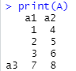

# Introducción a R

Este es un tutorial básico sobre el programa. Visite la página de [R](https://www.r-project.org/) para más información.

R es un lenguaje de programación para cómputo estadístico. Tiene una gran cantidad de funciones que permiten ejecutar análisis estadísticos tradicionales, tales como regresión y modelos lineales, prebas estadísticas, clasificación análisis de series de tiempo, entre otros.

Una ventaja de R es que es altamente extensible a traves de paquetes que cualquier persona puede crear y aportar.

R es un software libre y es ampliamente usado en el ámbito académico e incluso en algunas empresas.

## Objetos de R

R es un lenguaje de programación que usa objetos. Estos objetos tienen identidad, atributos y propiedades.

Tambien puede considerarse como un intérprete, es decir que espera acciones del usuario. Cuando el usuario ejecuta comandos, R los ejecuta línea por línea.

Los **comandos** o **expresiones** más comunes son las asignaciones, es decir se asigna un valor a una variables. Cada comando suele escribirse en una sola línea o terminar con punto y coma.

R es un lenguaje sensible a mayúsculas y minúsculas, esto es un factor a tomar en cuenta para evitar errores.

!!! tip "Interaz gráfica"
    R tiene una interfaz gráfica para crear código de forma más amigable. Visite [R Studio](https://rstudio.com/) para más información.

Cuando se inicia una sesión, se asigna un espacio de trabajo (workspace) en memoria y un directorio de trabajo (working directory).

El espacio de trabajo sirve para almacenar objetos creados, tales como vectores, funciones entre otros.

Para conocer el directorio de trabajo puede escribir en consola:

````r
getwd()
````

Para cambiar use la función `setwd("dir")`, donde *dir* es el nuevo directorio.

!!! caution "Barras verticales"
    R no reconoce una sola barra `/` en los directorios de windows. Use doble barra  `//` o una barra invertida `\`.

### Vectores

Un vector es un objeto con uno o más elementos. Puede contener elementos numéricos o caracteres.

Se pueden crear vectores con la función `c()`, por ejemplo:

````r
x = c(2,1,5)
z = c("ABC","AEI","XYZ")
````

Los vectores permiten algunas operaciones, las más comunes son la suma `+`, resta `-`,  multiplicación `*`, división. `/` y potencia `^`, así como valores booleanos.

````r
y = m*x+n
xy = x > y
````

!!! Note "Operación entre vectores"
    Las operaciones entre vectores son elemento a elemento. Si los elementos no tuvieran el mismo tamaño, el de menor tamaño se recicla (repite sus elementos) hasta tener el mismo número de elementos.

Por ejemplo, la operación `nx = n + x` dará como resultado:

> [1]  7  6 10

Los vectores tienen una dimensión y para conocerla se puede usar la función `length()`. Por ejemplo `length(x)` nos daría como resultado:

> [1] 3

ya que sus elementos son:

> [1] 2 1 5

También se puede acceder a sus elementos mediante el operador `[]`, por ejemplo para conocer el segundo elemento de _x_ se puede usar `x[2]` y el resultado es:

> [1] 1

Para acceder a más de un elemento, es posible apuntar a la posición del elemento, por ejemplo `x[c(1,2)]` o `x[1:2]`.

En ambos, el resultado sería:

> [1] 2 1

El operador `:` sirve para indicar una secuencia consecutiva. Por ejemplo `i = 1:10` crearía un vector de 10 elementos del 1 al 10, esto es útil para crear sucesiones o índices.

Para crear secuencias más complejas se puede usar la función `seq()`.

Por ejemplo con `seq(from = 1,to = 10,by = 1)` se crea una secuencia del 1 al 10 incrementando el valor en 1 y se obtiene el mismo resultado que con `1:10`.

Otra forma de crear un vector es mediante la función `rep()`. Por ejemplo la siguiente expresion:

````r
u = rep(x = x,each = 2,times = 3)
````

Crea un el vector _u_ que contiene cada elemento del vector _x_ 2 veces y esta secuencia se recrea 3 veces.

> [1] 2 2 1 1 5 5 2 2 1 1 5 5 2 2 1 1 5 5

#### Nombres de vector

Una propiedad de los vectores es que sus elementos pueden tener un nombre.

Se puede usar la función `names()` para consultar o asignar nombres a un vector. El siguiente código asignará nombres a los elementos del vector `a1`.

````r
nombres <- c("uno","dos","tres")
names(a1)<-nombres
````

Los nombres también pueden ser usados para acceder a los elementos de un vector, por ejemplo para acceder al segundo elemento, se puede usar su nombre correspondiente, es decir `a1["dos"]`.

#### Escalares

Un escalar es un vector con un solo elemento.

Se pueden crear escalares con el símbolo de asignación `<-` o `=`.

````r
n <- 5
m = n + 1
a = "Hola mundo!"
````

Los escalares son útiles para guardar algún valor. Pueden ser considerados como una variable.

También puede haber escalares lógicos o booleanos, por ejemplo si se construye `nm = n>m` su valor sería:

> [1] FALSE

### Matrices

Una matriz es una arreglo de dos dimensiones (renglones y columnas) que contiene valores, especialmente numéricos. Tiene _n_ renglones y _p_ columnas, es decir tiene _np_ elementos.

Para crea una matriz, se usa la función `matrix()` cuya sintaxis es la siguiente:

> matrix(**data** = objeto, **nrow** = valor, **ncol** = valor _<, **byrow** = FALSE>_)

donde **data** representa un vector o una expresión, **nrow** el número de renglones que se desean, **ncol** el número de columnas y el argumento opcional **byrow** indica si se deberían llenar por columnas.

Si se ejecuta el siguiente comando:

````r
A1 = matrix(data = u)
````

el resultado sería una matriz de 18 renglones y una columna.

Si se desea una matriz de otra dimensión se puede usar este código.

````r
A1 = matrix(data = u,nrow = 6,byrow = TRUE)
````

También pueden crearse matrices a partir de vectores, mediante las funciones `cbind()` y `rbind()`. La primera permite concatenar columas y la segunda concatena renglones, por ejemplo

```r
a1 = c(1,2,3)
a2 = c(4,5,6)
a3 = c(7,8)
A = rbind(cbind(a1,a2),a3)
```

El resultado es el siguiente:



#### Dimensiones

Para conocer el tamaño o dimensiones de una matriz se puede usar la función `dim()`

````r
dim(A)
````

Note que se desplegará en la consola el resultado mostrando la dimensión.

> 2 4

Para conocer el número de renglones y columnas por separado se pueden usar las funciones `nrow()` y `ncol()`.

````r
nrow(A)
ncol(A)
````

Esto es importante ya que como se verá más adelante, nos permitirá hacer operaciones entre matrices.

#### Elementos de una matriz

Para acceder a los elementos de una matriz, podemos referirnos por medio de su posición `[row,column]`, por ejemplo para acceder al elemento ubicado en el renglón 1 de la columna 1 se usa:

````r
A[1,1]
````

También se puede usar el número de elemento, empezando de izquierda a derecha por columna, en este caso `A[1]`.

Para obtener todo el renglón o toda la columna, únicamente se escribe el elemento que se quiere obtener, pero se debe dejar la coma, por ejemplo

````r
A[1,]
A[,2]
````

Traerían el primer renglón y la segunda columna respectivamente.

Al igual que en el caso de los vectores para trae un rango específico se puede usar el operador `:` o un vector indicando los elemento deseados.

````r
A[1:2,2]
A[c(1,3),1]
````

#### Nombres de una matriz

De la misma forma que los vectores, las matrices pueden tener nombres en sus elementos.

Además se puede consultar y asignar un nombre a sus columnas y renglones usando las funciones `colnames()` y `rownames()`.

De la misma forma, se pueden usar estos nombre para acceder a sus elementos.

#### Operaciones

Al igual que los vectores, se pueden hacer operaciones entre matrices.

El siguiente cuadro resume las operaciones disponibles

Nombre|Operador|Ejemplo|Nota
------|--------|-------|----
Suma  |`+`     |`A + B`|Las matrices deben tener la misma dimensión
Resta |`-`     |`A - B`|Las matrices deben tener la misma dimensión
Multiplicación (Elemento a elemento)|`*`|`A * B`|Las matrices deben tener la misma dimensión
División (Elemento a elemento)|`/`|`A / B`|Las matrices deben tener la misma dimensión
Potencia|`^`|`A ^ B`|Las matrices deben tener la misma dimensión

Adicional a esto, se puede hacer la _multiplicación de matrices_ usando el operador `%*%`.

Para poder realizar esta operación, las matrices deben ser **conformables**, es decir, el número de columnas de A, debe ser iguales al número de renglones de B y el resultado será una matriz de dimensiones iguales al número de renglones de A y el mismo número de columnas de B.

### Data Frames

### Listas

## Paquetes

R dispone de miles de paquetes que pueden descargarse libremente para enriquecerse son nuevas características. Estos paquetes están almacenados en el [CRAN](https://cran.r-project.org/) y pueden instalarse fácilmente desde la consola con el siguiente comando

````r
install.packages()
````

Por ejemplo, si se desea instalar el paquete _ggplot2_ se puede usar el siguiente comando.

````r
install.packages("ggplot2")
````

R almacenará los archivos en la carpeta personal llamada biblioteca del usuario o _User library_. Frecuentemente al instalar un paquete R descarga otros paquetes relacionados llamados dependencias que sirven para que las funciones del paquete trabajen adecuadamente.

Sin embargo, aún no podrá usarse debido a que es necesario cargarla mediante el comando `library()`, por ejemplo, para cargar el paquete _ggplot2_ se debe ejecutar

````r
library(ggplot2)
````

Con esto, todas las funciones y objetos del paquete estarán definidos y listos para usarse.

## Ayuda

R dispone de un comando especial para obtener ayuda desde la consola. Por ejemplo para buscar ayuda sobre matrices, se puede escribir desde la consola el comando

````r
?matrix
````

o bien con

````r
help(topic = "matrix")
````

y con eso se abrirá un documento de ayuda.

Para realizar una búsqueda más general simplemente se deben escribir doble signo de interrogación.

````r
??matrix
````

El sistema de ayuda nos mostrará los términos relacionados en todos los paquetes que encuentre.

También se puede obtener ayuda acerca de una paquete en específico, por ejemplo

````r
help(package = "ggplot2")
````

y con ello se obtendrá la documentación del paquete en específico.
