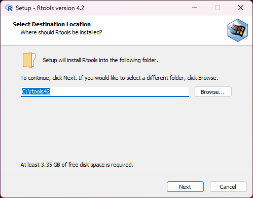
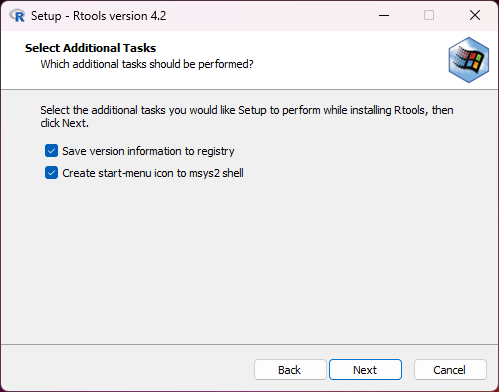
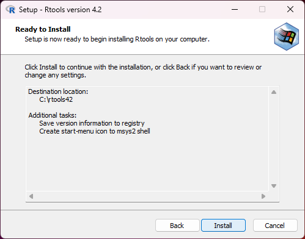
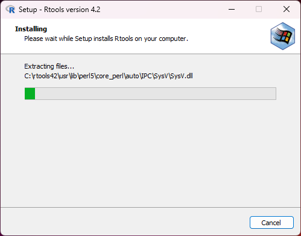
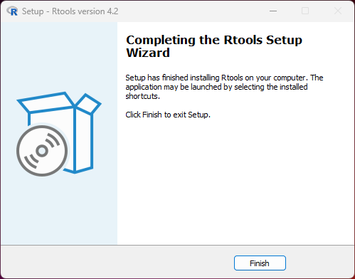
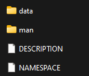
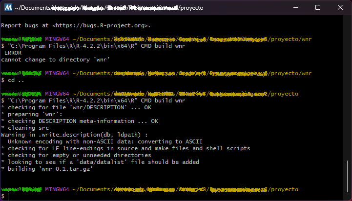
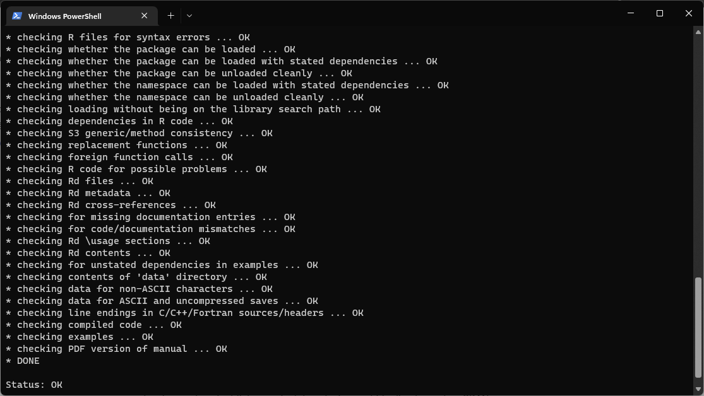
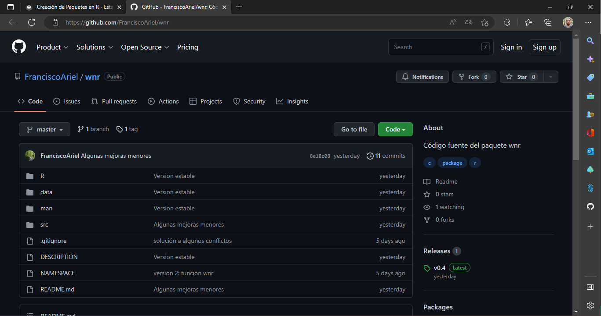

## Introducción

Hasta el momento se ha considerado únicamente instalar y cargar paquetes que están disponibles en el CRAN, sin embargo, los usuarios pueden crear su propios paquetes e incluso subirlos a diversos repositorios si así lo desean.

!!! caution "Mantenimiento de los paquetes"
    La creación, mantenimiento y corrección de errores es responsabilidad del creador del paquete, por lo que se debe ser muy cuidadoso del contenido de paquetes de terceros.

En esta sección se abordará el tema de la instalación de paquetes de fórma fácil.

## Requisitos preeliminares

En esta subsección, se describirá de forma general la forma de crear paquetes de R. Para detalles consulte el documento [Writting R Extensions](https://cran.r-project.org/doc/manuals/R-exts.html).

En Windows, se debe descargar el software adicional [Rtools](https://cran.r-project.org/bin/windows/Rtools/) con el fin poder compilar los paquetes. A continuación se proporcionan instrucciones para la instalación.

1. Descargar el [instalador de Rtools](https://cran.r-project.org/bin/windows/Rtools/rtools42/rtools.html), procurando tener la versión más actualizada (versión 4.2).
2. Seguir las instrucciones del asistente de instalación.

Las siguientes imágenes ilustran los pasos para la instalación de Rtools (se recomienda aceptar las opciones de configuración tal y como están).











Es necesario tener instalado Latex para la construcción de la documentación.

### Estructura del paquete

Se recomienda usar una carpeta la cual será la base del paquete.

Una forma sencilla de crear la estructura del paquete es con la función `package.skeleton`. La estructura básica de un paquete se muestra a continuación.



Los archivos `DESCRIPTION` y `NAMESPACE` son los metadatos del paquete. El primero debe ser llenado indicando datos que identifique al paquete, tal como el nombre del paquete, descripción, autor, entre otras cosas, mientra que el segundo contendrá las funciones que serán visibles al usuario, así como las funciones utilizadas de otros paquetes o si se debe registrar un archivo compilado.

La funciones o métodos de R, deben de ir en específicamente en la subcarpeta `R`, mientra que la carpeta `man` deberá contener únicamente la documentación en formato `Rd` y la carpeta `data` deberá contener archivos `RData` o `rda`.

Para ver un ejemplo más concreto, se puede en github el paquete [wnr](https://github.com/FranciscoAriel/wnr).

## Construcción del paquete

Una vez que se tengan los archivos necesarios para el paquete, se procerá a la construcción del mismo ubicándose en una carpeta _un nivel anterior_ usando la siguiente sintaxis.

````bash
R CMD build pkg
````

donde `pkg` es el directorio que contiene la estructura del paquete.

!!! caution "Comando no reconocido en Windows"
    En Windows es posible que no se reconozca el comando `R CMD`.

    Para solucionar ese problema, en el bloc de notas (o cualquier otro editor de texto) se puede crear el archivo `compilar.bat` que contenga _la ruta completa de R_ y las instrucciones, por ejemplo:

    ````txt
    "C:\Program Files\R\R-4.2.2\bin\x64\R" CMD build pkg
    ````

    Por lo que simplemente se debe correr el archivo `compilar.bat` desde la linea de comandos (cmd o powershell)

    === "CMD"
        
        ````cmd
        compilar.bat
        ````
    
    === "PowerShell"

        ````cmd
        .\compilar.bat
        ````

El resultado de la compilación será un archivo con extensión `.tar.gz` que tendrá toda la información del paquete comprimida respetando los directorios originales.

En la siguiente imagen se muestra el mensaje resultante de la compilación del paquete `wnr`.



## Revisión del paquete

Una vez construido el paquete, se debe revisar con el fin de que se cumplan todos los requerimientos del mismo, tales como documentación, validación de funciones, carga de dependencias, entre otros.

Para revisar el paquete, se debe ejecutar el comando:

````bash
R CMD check pkg.tar.gz
````

Se realizará una revisión exahustiva de todos los componentes del paquete y si todo está correcto, el paquete estará listo para instalar o incluso subirlo directamente a CRAN.

La siguiente imagen muestra un ejemplo en donde se obtuvo una revisión exitosa.



## Compilación e instalación

Para instalar el paquete, se debe ejecutar el siguiente comando.

````bash
R CMD install pkg.tar.gz
````

con esto se creara un archivo binario "instalable" para el sistema operativo correspondiente.

Otra forma de distribuir el paquete sin necesidad de enviarlo al CRAN, es crear un repositorio en github o alguna otra plataforma.

La siguiente imagen muestra como ejemplo el paquete `wnr`



Posteriormente, se puede instalar usando el paquete `devtools`.

El siguiente ejemplo muestra cómo instalar el paquete `wnr` desde github.

````r
library(devtools)
install_github(repo = "FranciscoAriel/wnr")
````
