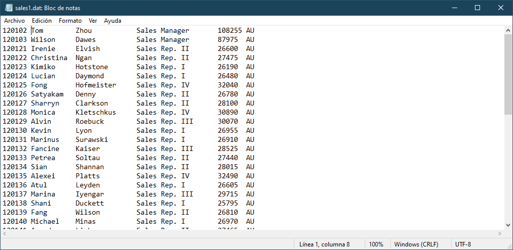
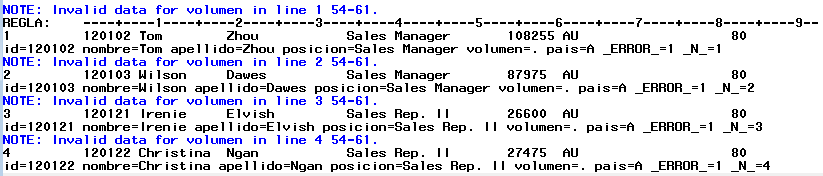
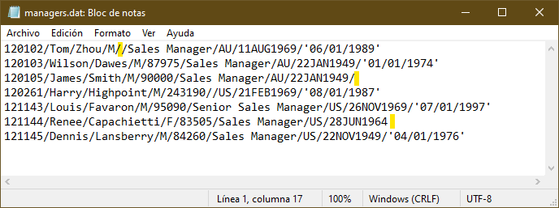
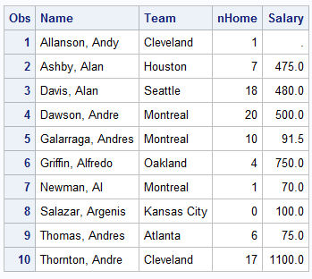
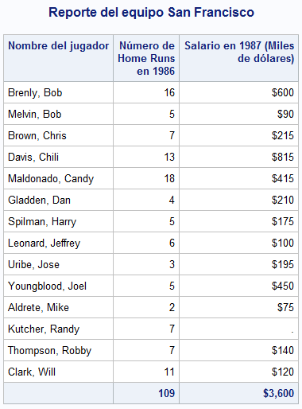
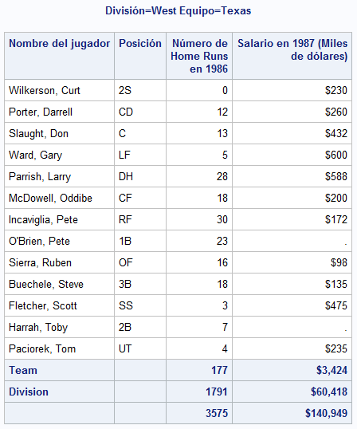
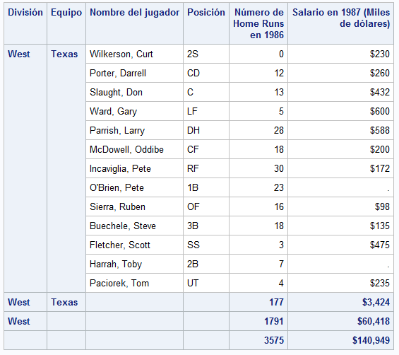

En esta sección se presentan temas para comenzar con la lectura y procesamiento de datos, así como la creación de reportes y agregados que permitan tner una idea general de los datos que se están trabajando.

## Lectura de datos

Los dataset son el insumo principal para analisis de datos en SAS, por ello iniciaremos con una rápida exploración.

La creación de un dataset inicia con un bloque `DATA` y termina con un `RUN`.

### Introducción de valores de forma manual

La forma más fácil de crear un dataset, es con el uso de la sentencia `INPUT` y `DATALINES` con el fin de introducir valores manualmente. Estos datos fueron copiados y pegados directamente de una hoja de excel.

El siguiente ejemplo muestra como introducir datos manualmente.

````sas
DATA EMPLEADOS(LABEL = "Registro de empleados nuevos");
    ATTRIB
        NOMBRE LENGTH = $16 LABEL = "Nombre"
        APELLIDO LENGTH = $12 LABEL = "Apellido"
        ID LABEL = "ID empleado"
        GENERO LENGTH = $1. LABEL = "Género"
        FNAC INFORMAT = DDMMYY10. FORMAT = DATE10. LABEL = "Fecha de nacimiento"
    ;
    INPUT NOMBRE -- FNAC;
    DATALINES;
    Bill Cuddy 11171 M 16/10/1986
    Susan Krasowski 17023 F 09/07/1959
    Andreas Rennie 26148 M 18/07/1934
    Lauren Krasowski 46966 F 24/10/1986
    Lauren Marx 54655 F 18/08/1969
    Tommy Mcdonald 70046 M 20/01/1959
    Colin Byarley 70059 M 20/01/1934
    Lera Knott 70079 F 11/07/1986
    Wilma Yeargan 70100 F 23/06/1984
    Patrick Leach 70108 M 14/04/1939
    Portia Reynoso 70165 F 11/02/1964
    Soberina Berent 70187 F 27/09/1986
    Angel Borwick 70201 F 19/12/1969
    Alex Santinello 70210 M 22/04/1986
    Kenan Talarr 70221 M 10/02/1964
    ;
RUN;
````

La sentencia `DATA` especifica el nombre del dataset y entre parentesis están las opciones del dataset, en este caso el dataset *empleados* tendrá una etiqueta para identificarlo.

Es recomendable especificar las propiedades de las variables a crear mediante la sentencia `ATTRIB` en donde se especifican sus propiedades. Nótese que para el caso de las variables de tipo caracter se hace uso de la opción `LENGTH =` seguido del signo de pesos para indicar que es de tipo caracter y la longitud deseada. Para el caso de variables numéricas, se debe especificar al menos un atributo, en este caso se recomienda especificar el atributo `LABEL =`. En el caso de la variable *fnac* los datos estan almacenados en formato de fecha (ddmmyyyy) por lo que se usa el informato `ddmmyy10.` para que lo reconozca como fehca de sas, pero se desea visualizar con el formato de fecha (ddmmmyyyy).

La sentencia `INPUT` sirve para indicar el nombre de las variables del dataset. Se puede poner el símbolo `$` para indicar que la variable es de tipo caracter. Sin embargo en este caso, como ya se han declarado las variables se puede usar una lista, es decir, solo poner el nombre de la primer variable declarada seguido de dos guiones `--` y el nombre de la última.

La sentencia `DATALINES` indica el inicio de los datos y finaliza con un punto y coma.

Con la sentencia `RUN` se cierra el bloque de instrucciones y comienza a ejecutar el proceso.

### Lectura de datos desde un archivo externo

SAS puede leer datos de archivos de texto almacenados en distintos formatos, por ejemplo de ancho fijo o delimitados. Para acceder a ellos es necesario usar la referencia para a puntar a ellos, algo similar a la declaración de las librerías.

Se puede hacer mediante la sentencia `FILENAME`:

> **FILENAME** *fileref* '*nombre-archivo*';

donde *fileref* es un nombre sas que hará referencia a un archivo y *nombre-archivo* es el nombre de un archivo físico externo que incluye tanto la ruta como el nombre con su extensión.

Por ejemplo la siguiente sentencia asigna con el nombre *archivo* al archivo "datos" almacenados en formato .dat que estan en la carpeta proyectos.

````sas
FILENAME archivo "C:\Users\Usuario\Documents\Proyectos\datos.dat";
````

También será necesario usar la sentencia `INFILE`. Esta sentencia le da las espeficicaciones a SAS sobre cómo leer archivos externos. Para una mayor referencia consulte la [sentencia INPUT](https://documentation.sas.com/doc/en/pgmsascdc/9.4_3.5/lestmtsref/n1rill4udj0tfun1fvce3j401plo.htm).

#### Lectura de un archivo de ancho fijo

En ocasiones se tienen los datos almacenados en formato de texto pero los datos estan alineados de tal forma que es posible saber en que posición inicia cada variable.



El ejemplo anterior muestra un ejemplo de un archivo de texto de ancho fijo, obsérvese que el id comienza en la columna 1 mientras que el nombre inicia en la columna 8.

El siguiente código muestra cómo leer datos de un archivo de ancho fijo.

````sas
DATA VENTAS;
INFILE ARCHIVO;
INPUT ID 1 - 7 NOMBRE $ 8 - 18 APELLIDO $ 19-33 POSICION $ 34 - 53 VOLUMEN 54 - 60 PAIS $ 61-62;
RUN;
````

La diferencia con ejemplos anteriores es la sentencia `INFILE`. Esta sentencia especifica que se va leer un archivo externo y se usa junto con la sentencia `INPUT`.

En la sentencia `INPUT` se declaran las variables que va a contener el dataset **VENTAS**. SAS leerá el archivo línea por línea y almacenará los valores que encuentre en la variable declarada según la posición indicada, por ejemplo los valores que encuentre de la línea 1 a la 7 se guardarán en la variable *ID*, mientras que los valores de la columna 8 a la 18 se almacenarán en la variable *NOMBRE*, nótese que después de *NOMBRE* hay un signo de pesos, esto es para indicar que la variable es de tipo caracter.

!!! danger "Cuidado con las posiciones de columna"
    Se debe ser muy cuidadoso al especificar la posición de las columnas para no mezclar los valores.
    En el ejemplo anterior, si se hubiera declarado `VOLUMEN 54 - 61`, SAS hubiera considerado la columna 61 y nos mostraría un mensaje en el log:
    
    Debido a que la columna 61 contiene a la letra A, SAS estaría almacenando una cadena en una variable numérica, por lo que lo que nos mostraría el error y finalmente le asignaría un valor missing a *volumen*.

Una forma alternativa de declarar las variables en la sentencia sería usar el siguiente código:

````sas
DATA VENTAS;
INFILE ARCHIVO;
INPUT ID NOMBRE $10. APELLIDO $ 19-33 POSICION $ 34 - 53 VOLUMEN PAIS $3.;
RUN;
````

Note que en la sentencia `INPUT` se declaran a las variables de tipo caracter de dos formas: por posición (ejemplo `APELLIDO $ 19-33`) y por formato (ejemplo `NOMBRE $10.`).

Para una mayor referencia consulte [leyendo datos en bruto](https://support.sas.com/documentation/cdl/en/lrcon/62955/HTML/default/viewer.htm#a003209907.htm#:~:text=The%20INPUT%20statement%20reads%20raw%20data%20from%20instream,styles%20of%20input%20in%20a%20single%20INPUT%20statement.) en la documentación de SAS.

#### Lectura de un archivo de texto delimitado

El delimitador predeterminado es un espacio en blanco. Sin embargo, los archivos de texto delimitados por otros caracteres (por ejemplo una coma, tabulador, o símbolos especiales) tambien pueden ser leídos por SAS. Para especificar el tipo de delimitador, se utiliza la opción `DLM =` en la sentencia `INFILE`.

Considere el siguiente archivo de texto. Puede notarse que está delimitado por el caracter "/" y además tiene datos perdidos (resaltados en amarillo). De hecho, los valores perdidos al final de la línea podrían hacer que SAS terminara antes de leer los datos.



El siguiente código puede ser usado para leer esos datos.

````sas
DATA gerentes;
    INFILE ARCHIVO DLM = "/" DSD TRUNCOVER;
    ATTRIB
        id label = "ID gerente"
        nombre LENGTH = $12 LABEL = "Nombre"
        apellido LENGTH = $18 LABEL = "Apellido"
        genero LENGTH = $2 LABEL = "Género"
        ventas LABEL = "Ventas totales"
        posicion LENGTH = $18 LABEL = "Posición"
        pais LENGTH = $2 LABEL = "País" 
        fnac INFORMAT = date12. FORMAT = ddmmyy10. LABEL = "Fecha de nacimiento"
        fingreso INFORMAT = anydtdte12. FORMAT = ddmmyy10. LABEL = "Fecha de ingreso"
    ;
    INPUT id -- fingreso;
RUN;
````

La opción `DSD` es útil cuando hay un valor faltante en datos delimitados, de otra forma SAS no reconocería dos delimitadores juntos y no leería los datos correctamente. 

La opción `MISSOVER` evita que SAS salte a una nueva linea cuando no encuentra valores válidos y asigna valores faltantes a las variables que no encuentre. `TRUNCOVER` funciona de manera similar a `MISSOVER` pero la diferencia radica en que asignaría los valores que encuentre pasando el fin de línea.


#### Leyendo archivos desde web

Un ejemplo para descargar datos de covid se encuentran en el siguiente programa de sas: [datos_covid_web.sas](src/datos_covid_web.sas).

### Usando un procedimiento para leer datos externos

## Creación de reportes

SAS es una herramienta muy útil para crear reportes de datos, algunos de ellos se pueden personalizar o adaptarlos a distintas necesidades.

### Reportes básicos

El reporte más simple que se puede crear, es mostrar el conjunto de datos usando el procedimiento `PROC PRINT`.

Sin embargo, para datasets muy grandes, esto no sería una buena opción debido a que SAS gastaría muchos recursos en imprimir toda la tabla. Se pueden usar ciertas configuraciones para que SAS solo procece cierta cantidad de observaciones de un dataset.

La primera de ellas es mediante las *opciones generales*, la cual afectaría a todos los procedimientos durante la sesión o mediante las *opciones de dataset* la cual solo aplica durante ese procedimiento. Para una referencia completa sobre las opciones generales, visite el [diccionario de opciones del sistema](https://documentation.sas.com/doc/es/pgmsascdc/9.4_3.5/lesysoptsref/p1tmgku1vq7pwqn1iqioeflxgec1.htm) y para las opciones de dataset vea el [diccionario de opciones de datasets](https://documentation.sas.com/doc/es/pgmsascdc/9.4_3.5/ledsoptsref/p1pczmnhbq4axpn1l15s9mk6mobp.htm).

El siguiente ejemplo muestra las primeras diez observaciones del conjunto de datos de baseball, pero solo pedimos que muestre ciertas variables.

````sas
PROC PRINT DATA = SASHELP.BASEBALL(OBS=10);
    VAR NAME TEAM NHOME SALARY;
RUN;
````

Produce el siguiente resultado



### Un reporte con seleccionando casos con total

**PROC PRINT** tambien tiene diversas sentencias para hacer reportes más completos o específicos.

````sas
TITLE "Reporte del equipo San Francisco";
PROC PRINT DATA = SASHELP.BASEBALL NOOBS;
    VAR NAME NHOME SALARY;
    WHERE TEAM EQ "San Francisco";
    FORMAT SALARY DOLLAR12.;
    LABEL 
        NAME = "Nombre del jugador"
        NHOME = "Número de Home Runs en 1986"
        SALARY = "Salario en 1987 (Miles de dólares)"
    ;
    SUM NHOME SALARY;
RUN;
TITLE;
````

El anterior ejemplo muestra un reporte que incluye el nombre de todos los jugadores del equipo *San Francisco*, número de home run ysu salario; al final del reporte se presenta el gran total de estas variables. En este ejemplo se modificaron las etiquetas y los formatos, pero sólo para el reporte mediante las sentencias `LABEL` y `FORMAT` y se seleccionaron las observaciones que cumplieran cierto criterio.

La opción `NOOBS` en la sentencia `DATA` pide no imprimir el número de observación del dataset y con la opción `LABEL` se mostrarán las etiquetas de las variables.

La sentencia `VAR` especifica las variables a mostrar.

La sentencia `WHERE` selecciona las observaciones que cumplan la condición de que el equipo sea igual a *San Francisco*.

La sentencia `FORMAT` le asigna a la variable **SALARY** el formato `DOLLAR12.`.

`LABEL` especifica las etiquetas de las variables en el reporte. En caso de que las variables del dataset ya tengan etiquetas, estas etiquetas definidas prevalecen en el reporte.

La sentencia `SUM` es la que especifica las variables que mostrarán el gran total. Finalmente se agrega la opción `TITLE` para que se le ponga un título al reporte y se vuelve a llamar al final para que vuelva a su valor inicial.



### Reporte con subtotales

Es posible mostrar los reportes con subtotales por grupos de variables.

!!! warning "Datos agrupados"
    Los datos se deberían ordenar por la variables que se desee hacer el agrupamiento para evitar posibles errores en los cálculos. SAS considera valores iguales de la variable de agrupamiento como un bloque. Si SAS encontrara una observación con un valor que ya procesó, se generará un error.

Se puede usar el procedimiento SORT para ordenar una dataset por las variables que se deseen y posteriormente realizar el reporte.

````sas
PROC SORT DATA = SASHELP.BASEBALL OUT = BASEBALL;
    BY DIVISION TEAM;
RUN;

PROC PRINT DATA = BASEBALL NOOBS LABEL;
    VAR NAME POSITION NHOME SALARY;
    FORMAT SALARY DOLLAR12.;
    LABEL DIVISION = "División"
    NAME = "Nombre del jugador"
    TEAM = "Equipo"
    POSITION = "Posición"
    NHOME = "Número de Home Runs en 1986"
    SALARY = "Salario en 1987 (Miles de dólares)"
    ;
    SUM NHOME SALARY;
    BY DIVISION TEAM;
RUN;
````

El procedimiento SORT especifica que se ordene por las variables *division* y luego por *team* y se pide que se guarde una copia temporal, con el fin de no modificar el dataset original.

En el procedimiento **PRINT** se usa la sentencia `BY` para que crear el reporte por combinaciones de valores de *division* y *team*.



La imagen anterior muestra el ultimo grupo de variables (División = West y Equipo = Texas). Nótese que este grupo contiene los subtotales tanto de las variables *team* y *division* así como el gran total. Cada grupo contiene como título el valor de las variables *division* y *team*.

!!! tip
    Se pueden agregar en la sentencia `PROC PRINT` las opciones `SUMLABEL =` y `GRANDTOTAL_LABEL =` para personalizar las etiquetas de subtotales y el gran total.

Si se desea mostrar un reporte con otro estilo resaltando las variables de agrupamiento, se puede agregar la sentencia.

`ID DIVISION TEAM;`

El resultado es el siguente.

