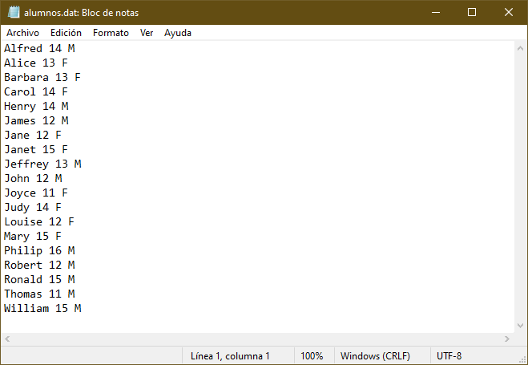
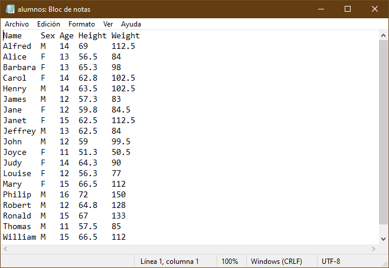
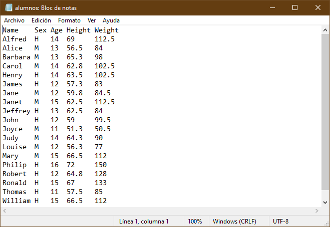

# Lectura de datos

En esta sección se presentan temas para comenzar con la lectura y procesamiento de datos. Se explorarán distintas formas de leer y escribir datos de distintas fuentes y formatos de archivo.

## Creando datasets

Los dataset son el insumo principal para analisis de datos en SAS, por ello iniciaremos con una rápida exploración.

La creación de un dataset inicia con un bloque `DATA` y termina con un `RUN`.

En esta sección se mostrarán las principales formas de crear datasets:

- Introducción de forma manual
- Leyendo un archivo de texto externo
- El uso de PROC IMPORT

Se mostrarán las ideas y algunos ejemplos.

### Introducción de valores de forma manual

La forma más fácil de crear un dataset, es con el uso de la sentencia `INPUT` y `DATALINES` con el fin de introducir valores manualmente. Estos datos fueron copiados y pegados directamente de una hoja de excel.

El siguiente ejemplo muestra como introducir datos manualmente.

````sas
DATA EMPLEADOS(LABEL = "Registro de empleados nuevos");
    ATTRIB
        NOMBRE LENGTH = $16 LABEL = "Nombre"
        APELLIDO LENGTH = $12 LABEL = "Apellido"
        ID LABEL = "ID empleado"
        GENERO LENGTH = $1. LABEL = "Género"
        FNAC INFORMAT = DDMMYY10. FORMAT = DATE10. LABEL = "Fecha de nacimiento"
    ;
    INPUT NOMBRE -- FNAC;
    DATALINES;
    Bill Cuddy 11171 M 16/10/1986
    Susan Krasowski 17023 F 09/07/1959
    Andreas Rennie 26148 M 18/07/1934
    Lauren Krasowski 46966 F 24/10/1986
    Lauren Marx 54655 F 18/08/1969
    Tommy Mcdonald 70046 M 20/01/1959
    Colin Byarley 70059 M 20/01/1934
    Lera Knott 70079 F 11/07/1986
    Wilma Yeargan 70100 F 23/06/1984
    Patrick Leach 70108 M 14/04/1939
    Portia Reynoso 70165 F 11/02/1964
    Soberina Berent 70187 F 27/09/1986
    Angel Borwick 70201 F 19/12/1969
    Alex Santinello 70210 M 22/04/1986
    Kenan Talarr 70221 M 10/02/1964
    ;
RUN;
````

La sentencia `DATA` especifica el nombre del dataset y entre parentesis están las opciones del dataset, en este caso el dataset *empleados* tendrá una etiqueta para identificarlo.

Es recomendable especificar las propiedades de las variables a crear mediante la sentencia `ATTRIB` en donde se especifican sus propiedades.

!!! info "Declaración de variables"
    Otra forma de declarar variables es mediante las sentencias `LENGTH` y `FORMAT`. Consulte la documentación para más información.

Nótese que para el caso de las variables de tipo caracter se hace uso de la opción `LENGTH =` seguido del signo de pesos para indicar que es de tipo caracter y la longitud deseada. Para el caso de variables numéricas, se debe especificar al menos un atributo, en este caso se recomienda especificar el atributo `LABEL =`. En el caso de la variable *fnac* los datos estan almacenados en formato de fecha (ddmmyyyy) por lo que se usa el informato `ddmmyy10.` para que lo reconozca como fehca de sas, pero se desea visualizar con el formato de fecha (ddmmmyyyy).

La sentencia `INPUT` sirve para indicar el nombre de las variables del dataset. Se puede poner el símbolo `$` para indicar que la variable es de tipo caracter. Sin embargo en este caso, como ya se han declarado las variables se puede usar una lista, es decir, solo poner el nombre de la primer variable declarada seguido de dos guiones `--` y el nombre de la última.

La sentencia `DATALINES` indica el inicio de los datos y finaliza con un punto y coma.

Con la sentencia `RUN` se cierra el bloque de instrucciones y comienza a ejecutar el proceso.

### Lectura de datos desde un archivo externo

SAS puede leer datos de archivos de texto almacenados en distintos formatos, por ejemplo de ancho fijo o delimitados. Para acceder a ellos es necesario usar la referencia para apuntar a ellos, algo similar a la declaración de las librerías.

Se puede hacer mediante la sentencia `FILENAME`:

> **FILENAME** *fileref* '*nombre-archivo*';

donde *fileref* es un nombre sas que hará referencia a un archivo y *nombre-archivo* es el nombre de un archivo físico externo que incluye tanto la ruta como el nombre con su extensión.

Por ejemplo la siguiente sentencia asigna con el nombre *archivo* al archivo "datos" almacenados en formato .dat que están en la carpeta proyectos.

````sas
FILENAME archivo "C:\Users\Usuario\Documents\Proyectos\datos.dat";
````

También será necesario usar la sentencia `INFILE`. Esta sentencia le da las espeficicaciones a SAS sobre cómo leer archivos externos. Para una mayor referencia consulte la [sentencia INPUT](https://documentation.sas.com/doc/en/pgmsascdc/9.4_3.5/lestmtsref/n1rill4udj0tfun1fvce3j401plo.htm).

#### Lectura de un archivo de ancho fijo

En ocasiones se tienen los datos almacenados en formato de texto pero los datos estan alineados de tal forma que es posible saber en que posición inicia cada variable.


El ejemplo anterior muestra un ejemplo de un archivo de texto de ancho fijo, obsérvese que el id comienza en la columna 1 mientras que el nombre inicia en la columna 8.

El siguiente código muestra cómo leer datos de un archivo de ancho fijo.

````sas
DATA VENTAS;
INFILE ARCHIVO;
INPUT ID 1 - 7 NOMBRE $ 8 - 18 APELLIDO $ 19-33 POSICION $ 34 - 53 VOLUMEN 54 - 60 PAIS $ 61-62;
RUN;
````

La diferencia con ejemplos anteriores es la sentencia `INFILE`. Esta sentencia especifica que se va leer un archivo externo y se usa junto con la sentencia `INPUT`.

En la sentencia `INPUT` se declaran las variables que va a contener el dataset **VENTAS**. SAS leerá el archivo línea por línea y almacenará los valores que encuentre en la variable declarada según la posición indicada, por ejemplo los valores que encuentre de la línea 1 a la 7 se guardarán en la variable *ID*, mientras que los valores de la columna 8 a la 18 se almacenarán en la variable *NOMBRE*, nótese que después de *NOMBRE* hay un signo de pesos, esto es para indicar que la variable es de tipo caracter.

!!! danger "Cuidado con las posiciones de columna"
    Se debe ser muy cuidadoso al especificar la posición de las columnas para no mezclar los valores.
    En el ejemplo anterior, si se hubiera declarado `VOLUMEN 54 - 61`, SAS hubiera considerado la columna 61 y nos mostraría un mensaje en el log:
    
    Debido a que la columna 61 contiene a la letra A, SAS estaría almacenando una cadena en una variable numérica, por lo que lo que nos mostraría el error y finalmente le asignaría un valor missing a *volumen*.

Una forma alternativa de declarar las variables en la sentencia sería usar el siguiente código:

````sas
DATA VENTAS;
INFILE ARCHIVO;
INPUT ID NOMBRE $10. APELLIDO $ 19-33 POSICION $ 34 - 53 VOLUMEN PAIS $3.;
RUN;
````

Note que en la sentencia `INPUT` se declaran a las variables de tipo caracter de dos formas: por posición (ejemplo `APELLIDO $ 19-33`) y por formato (ejemplo `NOMBRE $10.`).

Para una mayor referencia consulte [leyendo datos en bruto](https://support.sas.com/documentation/cdl/en/lrcon/62955/HTML/default/viewer.htm#a003209907.htm#:~:text=The%20INPUT%20statement%20reads%20raw%20data%20from%20instream,styles%20of%20input%20in%20a%20single%20INPUT%20statement.) en la documentación de SAS.

#### Lectura de un archivo de texto delimitado

El delimitador predeterminado es un espacio en blanco. Sin embargo, los archivos de texto delimitados por otros caracteres (por ejemplo una coma, tabulador, o símbolos especiales) tambien pueden ser leídos por SAS. Para especificar el tipo de delimitador, se utiliza la opción `DLM =` en la sentencia `INFILE`.

Considere el siguiente archivo de texto. Puede notarse que está delimitado por el caracter "/" y además tiene datos perdidos (resaltados en amarillo). De hecho, los valores perdidos al final de la línea podrían hacer que SAS terminara antes de leer los datos.


El siguiente código puede ser usado para leer esos datos.

````sas
DATA gerentes;
    INFILE ARCHIVO DLM = "/" DSD TRUNCOVER;
    ATTRIB
        id label = "ID gerente"
        nombre LENGTH = $12 LABEL = "Nombre"
        apellido LENGTH = $18 LABEL = "Apellido"
        genero LENGTH = $2 LABEL = "Género"
        ventas LABEL = "Ventas totales"
        posicion LENGTH = $18 LABEL = "Posición"
        pais LENGTH = $2 LABEL = "País" 
        fnac INFORMAT = date12. FORMAT = ddmmyy10. LABEL = "Fecha de nacimiento"
        fingreso INFORMAT = anydtdte12. FORMAT = ddmmyy10. LABEL = "Fecha de ingreso"
    ;
    INPUT id -- fingreso;
RUN;
````

La opción `DSD` es útil cuando hay un valor faltante en datos delimitados, de otra forma SAS no reconocería dos delimitadores juntos y no leería los datos correctamente.

La opción `MISSOVER` evita que SAS salte a una nueva linea cuando no encuentra valores válidos y asigna valores faltantes a las variables que no encuentre. `TRUNCOVER` funciona de manera similar a `MISSOVER` pero la diferencia radica en que asignaría los valores que encuentre pasando el fin de línea.

#### Leyendo archivos desde web

Para leer datos desde internet (usualmente en formato csv) se debe especificar el nombre del archivo con la sentencia FILENAME con la opción `URL`.

> **FILENAME** *fileref* URL '*nombre-archivo*' *< opciones-url >*;

Un ejemplo para descargar datos de covid se encuentran en el siguiente programa de sas: [datos_covid_web.sas](src/datos_covid_web.sas).

Consulte la documentación de la sentencia `FILENAME` con el [método de acceso URL](https://documentation.sas.com/doc/es/pgmsascdc/9.4_3.5/lestmtsglobal/p103pi2vrzn6qhn1e8alrs01jrb7.htm) para más información.

#### Selección de observaciones

Es posible seleccionar las observaciones que se quieren escribir en un dataset, sobre todo aquellas que _cumplan ciertas condiciones_. Al igual que otros lenguajes de programación SAS tiene expresiones lógicas que evalúan cierta condición.

La sintaxis es la siguiente:

> IF _expresión_;

Esta sentencia nos permite continuar procesando aquellas observaciones que cumplen la condición, generalmente de comparación.

Una expresión puede ser el nombre de una varible y puede contener algún operador lógico y un operando. Pueden conectarse mediante conectores lógicos, comunmente llamados booleanos.

La siguiente tabla resume algunos operadores lógicos y conectores.

Símbolo                   |Descripción|Ejemplo|
--------------------------|-----------|-------|
`=` o `EQ`                |IGUAL A    |`sex EQ "F"`
`^=` o `¬=` o `~=` o `NE` |NO IGUAL A |`sex NE "F"`
`>` o `GT`                |MAYOR QUE  |`age GT 13`
`<` o `LT`                |MENOR QUE  |`age LT 13`
`>=` o `GE`               |MAYOR O IGUAL A|`age GE 14`
`<=` o `LE`               |MENOR QUE O IGUAL A|`age LE 14`
`IN`                      |(ESTÁ) EN   |`age in (12 14 15)` o `sex in ("F" "M")`
`&` o `AND`               |Y          | `sex EQ "F" AND age GT 13`
`!` o `OR` o              |O          |`sex EQ "F" OR age GT 13`
`~` o `^` o `¬` o `NOT`   |NO         |`NOT(sex EQ "F" OR age GT 13)`

Por ejemplo el siguiente código solo contendría a empleados de Australia.

````sas
DATA VENTAS_AU;
    INFILE ARCHIVO;
    IF PAIS EQ "AU";
    INPUT ID 1 - 7 NOMBRE $ 8 - 18 APELLIDO $ 19-33 POSICION $ 34 - 53 VOLUMEN 54 - 60 PAIS $ 61-62;
RUN;
````

Para elegir observaciones que no sean nulas, se puede usar la siguiente sentencia.

````sas
DATA VENTAS_AU;
    INFILE ARCHIVO;
    IF VOLUMEN;
    INPUT ID 1 - 7 NOMBRE $ 8 - 18 APELLIDO $ 19-33 POSICION $ 34 - 53 VOLUMEN 54 - 60 PAIS $ 61-62;
RUN;
````

### Usando un procedimiento para leer datos externos

La forma más fácil de leer archivos externos es mediante el procedimiento **IMPORT**.

> **PROC IMPORT** DATAFILE = "filename" OUT = dataset;

Este procedimiento no solo lee archivos de texto, sino tambien de Excel, SPSS, Stata e incluso tablas de Access. Para una mayor referencia vea el [procedimiento IMPORT](https://documentation.sas.com/doc/es/pgmsascdc/9.4_3.5/proc/n1qn5sclnu2l9dn1w61ifw8wqhts.htm).

El siguiente código leerá un archivo en formato excel.

````sas
PROC IMPORT OUT = WORK.censo 
            DATAFILE = "C:\Users\Usuario\census.xlsx" 
            DBMS = XLSX REPLACE;
RUN;
````

Nótese que se ha especificado la opción `DBMS = XLSX` para que sas utilice los parámetros correspondientes para leer un archivo de excel. La opción `REPLACE` reemplazaría el dataset que tuviera el mismo nombre, de otro modo SAS mostraría un error y no crearía el dataset.

El siguiente código muestra cómo leer un archivo en formato csv.

````sas
PROC IMPORT OUT = WORK.census 
            DATAFILE = "C:\Users\Usuario\census.csv" 
            DBMS = CSV REPLACE;
     GETNAMES = YES;
     DATAROW = 2; 
RUN;
````

En el caso de archivos csv, hay dos sentencias adicionales, la sentencia `GETNAMES = YES` indica si los nombres de las variables se encuentran al inicio del archivo de texto, mientras que la sentencia `DATAROW = 2` indica que los valores incian en el renglón 2.

## Escritura a un archivo externo

SAS tambien puede ser utlizado para escribir archivos externos. En esta sección se mostrará como crear archivos de texto, asi como escribir mensaje del log a archivos externos.

### Escritura de un archivo delimitado

El siguiente código muestra como crear un archivo de texto.

````sas
FILENAME archivo "C:\Users\Usuario\alumnos.dat";
    DATA _NULL_;
    FILE archivo;
    SET sashelp.class;
    PUT name age sex;
RUN;
````

Como se puede ver, se ha referenciado con la sentencia `FILENAME` el archivo con el nombre que en el que se desea escribir.

Nótese que en la sentencia `DATA` se ha especificado `_NULL_`, una palabra reservada para pedir que no cree ningún dataset.

La sentencia `FILE` da las especificaciones para escribir los archivos de texto. Es muy similar a la sentencia `INFILE`, para mayor referencia consulte la [sentencia FILE](https://documentation.sas.com/doc/es/pgmsascdc/9.4_3.5/lestmtsref/n15o12lpyoe4gfn1y1vcp6xs6966.htm).

Finalmente, la sentencia `PUT` indica lo que se va a escribir en el archivo externo, en este caso se especifican la variables de interés. Para una mayor referencia consulte la [sentencia PUT](https://documentation.sas.com/doc/es/pgmsascdc/9.4_3.5/lestmtsref/n1spe7nmkmi7ywn175002rof97fv.htm).

!!! tip "Archivos delimitados por un caracter"
    SAS crea archivos delimitados por un espacio en blanco. Para crear un archivo delimitado por otro caracter (por ejemplo una coma) se puede usar la opción `DLM =`. Tambien se puede modificar la extensión del archivo con la sentencia `FILENAME`.

El resultado sería el siguiente.



### Escritura de un archivo de texto de ancho fijo

Para crear un archivo de texto de ancho fijo, se puede especificar las posiciones en las que se escribiran las observaciones.

````sas
FILENAME archivo "C:\Users\Usuario\alumnos.txt";
DATA _NULL_;
    FILE archivo;
    SET sashelp.class;
    PUT name $8. sex 10-12 age 2. height 16-20 weight 22-25;
RUN;
````

Nótese que se han especificado los formatos de las variables y las columnas en las que se desea escribir el archivo, es algo muy similar cuando se leían los archivos con la sentencia `INPUT`.

#### Crear archivos con encabezados

Debido a que sas escribe directamente al archivo, es un poco complicado especificarle que en el renglón 1 escriba el nombre de las variables.

Sin embargo, el siguiente código logra especificar el nombre de los archivos en la primer línea.

````sas
FILENAME archivo "C:\Users\Usuario\alumnos.txt";
DATA _NULL_;
    FILE archivo;
    IF _n_ EQ 1 THEN PUT "name " "sex " "age " "height " "weight ";
    SET sashelp.class;
    PUT name -- weight;
RUN;
````

Esto se logra escribiendo la sentencia `PUT` justo al inicio e inmediatamente despues se carga el dataset que se quiere escribir.

Las sentencias de la línea 4 se estudiarán en la siguente [sección](#creacion-y-manipulacion-de-datos)

#### Leer y modificar archivos de texto

Es posible manipular archivos de texto mediante SAS. para ellos es necesario leerlos y volver a escribir sobre ellos.



El siguiente código muestra como actualizar ciertas variables.

````sas
FILENAME ARCHIVO "C:\Users\Usuario\alumnos.txt";
DATA _NULL_;
   INFILE archivo SHAREBUFFERS  FIRSTOBS = 2 TRUNCOVER;
   ATTRIB
    sex LENGTH = $1
    sex2 LENGTH = $1;
   INPUT sex $ 9; 
   IF sex = "F" THEN sex2 = "M";
   IF sex = "M" THEN sex2 = "H";
   FILE archivo TRUNCOVER PAD;
   PUT sex2 9 ;
RUN;
````

Note que se la sentencia `LIBNAME` apunta al mismo archivo que se está usando en las sentencias `INFILE` y `FILE`.

La opción `SHAREBUFFERS` es útil para actualizar un archivo externo y solo actualiza ciertos campos. Esta opción se usa junto con las sentencias `INFILE`, `FILE` y `PUT`.

La variable *sex2* se usa para guardar el valor que se va a escribir en el archivo cuando *sex* toma cierto valor.

!!! error "Cuidado con las longitudes"
    Se debe tener cuidado cuando se actualiza un archivo de texto. Se debe procurar que la variable que se lee como la que se escribe tengan la misma longitud, de otro modo pueden haber resultados inesperados.

El resultado se muestra a continuación



### Escritura de datos con el procedimiento EXPORT

Así como es posible leer datos de forma externa con un procedimiento, tambien hay uno para escribir datos a archivos externos. La sintaxis es muy similar.

> **PROC EXPORT** OUTFILE = “filename” DATA = dataset;

El siguiente código muestra la forma de escribir un dataset a un archivo csv.

````sas
PROC EXPORT DATA= SASHELP.Class 
            OUTFILE= "C:\Users\Usuario\alumnos.csv" 
            DBMS = CSV REPLACE;
RUN;
````

Para mayores referencias consulte el [procedimiento EXPORT](https://documentation.sas.com/doc/en/pgmsascdc/9.4_3.5/proc/n045uxf7ll2p5on1ly4at3vpd47e.htm).
