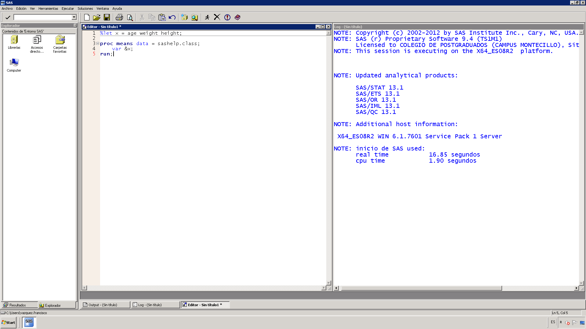

Esta es un tutorial rápido sobre el programa.

## Instalación

Consulte el sitio web de [sas](https://www.sas.com) para más detalles.

!!! info "SAS University Edition"
    SAS no es software libre ni es gratuito, sin embargo usted puede descargar el software gratuitamente.
    Visite [SAS University edition](https://www.sas.com/en_us/software/university-edition.html) para más información.

## Interfaces gráficas

### SAS Base

Es la interfaz gráfica clásica de SAS. Contiene una verntana lateral con una lista de librerías, mientras que hay una ventana principal de mensajes (log) y otra para escribir código.



### SAS Enterprise Guide

### SAS Studio

## Conceptos básicos

### Datasets

SAS almacena los datos en tablas llamadas datasets, los cuales son archivos que se almacenan en carpetas (librerías) de la computadora.

SAS maneja dos tipos de datos: numéricos y caracter. Los dataset permiten almacenar un tipo de dato en cada variable.

Para crear un dataset, se utiliza un bloque de instrucciones comunmente llamado paso DATA. El paso DATA inicia con la sentencia DATA seguido del nombre del dataset y termina con la palabra clave RUN.

Por ejemplo el siguiente código crea un dataset con 1 observación y tres variables (2 numéricas y otra caracter).

````sas
data ejemplo;
    format fecha date.;
    fecha = today();
    input x grupo $;
    datalines;
    12.5 azul
    ;
run;
````

La primer sentencia define el nombre del dataset.

La segunda le asigna un formato de fecha a la variable fecha.

En la tercer sentencia se define una variable numérica mediante una función, la cual obtiene la fecha de hoy (número de días transcurridos desde el 1 de enero de 1960).

En la siguiente sentencia se declaran 2 variables, la segunda se define como caracter al agregarle el signo `$`.

La sentencia `datalines` le dice al programa que se introducirán valores de manera manual (cada renglón representa la primera observación y cada variable está separada por un espacio). El punto y coma dicta el fin de la introducción de datos.

Finalmente la palabra RUN define el fin del paso DATA.

Un dataset consiste de dos partes:

- Una porción descriptora
- Una porción de datos

La porción de datos es una colección de datos arreglados en una tabla rectangular. Cada renglón o observación representa mediciones de un individuo.

La porción descriptora de un dataset contiene información del descriptor, por ejemplo, el nombre, fecha y hora de creación, número de observaciones y número de variables.

La porción descriptora tambien contiene información de los atributos de cada variable en el dataset. Los atributos contienen información como el nombre de la variable, el tipo, longitud, formato, informato y etiqueta.

### Librerías

Las librerías o bibliotecas son rutas donde se almacenan los datasets.

!!! Librería
    Una librería de SAS es una colección de archivos de SAS. Es el nivel más alto de organización para la información dentro de SAS.
    En el sistema operativo Windows o UNIX, una librería es típicamente un grupo de archivos de SAS en el mismo folder o directorio.

Si no se define una librería, sas define una librería temporal llamada WORK, la cual eliminará todos los datasets al finalizar la sesión.

Para definir una librería, se puede asignar una librería a un ruta de la forma `libname libref 'sas-library';`, donde _libref_ es el nombre de la librería (un nombre de sas de 1 a 8 caracteres que inicia con una letra o guión bajo y contiene solo letras, números o guión bajo) y _sas-library_ es la ruta donde se almacenarán los dataset, por ejemplo:

````sas
libname tareas "C:\Users\Default\Documents";
````

asignaría dicho directorio a la librería _tareas_.

Para referirse a un dataset almacenado en dicha librería, se utiliza el siguiente nombre `library.dataset`, por ejemplo `tareas.tabla`.

### Procedimientos y pasos DATA

SAS se compone de dos grandes bloques: el paso DATA para crear o modificar un dataset y paso PROC.

El bloque DATA sirve para leer o generar datos, mientras que el bloque PROC sirve para analizar dichos datos.

Por ejemplo, el siguiente código crea una copia de un dataset existente y posteriormente lo imprime en pantalla.

````sas
DATA clase;
    SET SASHELP.CLASS;
RUN;

PROC PRINT;
RUN;
````

### Macros y variables macro

Además de los pasos PROC y DATA, SAS tiene un lenguaje especial llamado lenguaje macro, el cual especie de procesador de instrucciones que compila y ejecuta.

Este lenguaje es muy útil para ejecutar tareas comunes o repetitivas

A diferencia de otros lenguajes de programación, SAS no permite definir variables de forma directa. Sin embargo, es posible definir _variables macro_, las cuales almacenan un valor ya sea un número o un texto. 
Dichas variables son evaluadas y pueden ser llamadas en cualquier procedimiento macro.

Hay tres formas de crear variables macro:

- Con la sentencia `%let`.
- Con la llamada `symput()`.
- con la sentencia `INTO` dentro de un procedimiento SQL.


Se usa la sentencia `%let macro-variable = <value>;` y para mandar llamar el valor de dicha variable maro se usa `&macro-variable`.

Por ejemplo si se desea definir ciertas variables a analizar, se puede crear la siguiente sentencia;

````sas
%let x = age weight height;

proc means data = sashelp.class;
    var &x;
run;
````

Para ver el valor de la variable macro, se puede usar la sentencia macro `%PUT <&macro-variable>`, por ejemplo:

````sas
%PUT &x;
````

y el resultado será

> age weight height

Para más información acerca de sentencias y variables macro visite la [documentación de SAS](https://documentation.sas.com/?cdcId=pgmsascdc&cdcVersion=9.4_3.5&docsetId=mcrolref&docsetTarget=titlepage.htm&locale=es).
