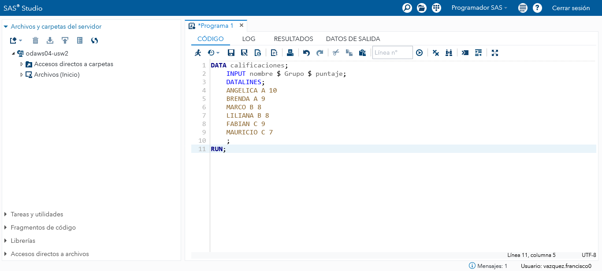
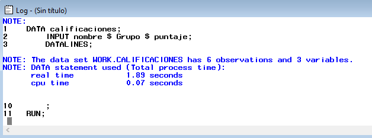
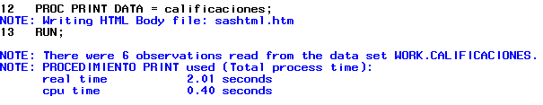
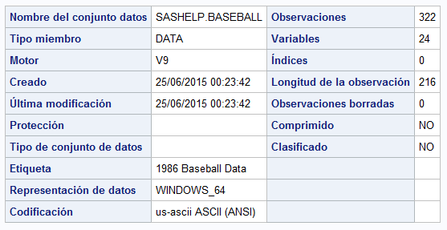
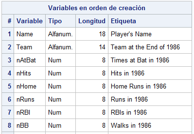

# Elementos esenciales

Este es un tutorial breve sobre el programa, se muestran los principales conceptos de SAS &reg; software.

En esta sección se aprenderán los principios sobre los cuales se basa SAS, así como algunas definiciones importantes como datasets o librerías.

Finalmente se muestran algunas pinceladas de lo que se puede hacer con SAS mediante el uso lenguaje más avanzado.

## Instalación e interfaces gráficas

Consulte el sitio web de [SAS Institute Inc.](https://www.sas.com) para más detalles.

!!! info "SAS &reg; OnDemand for Academics"
    SAS &reg; software no es libre ni de código abierto, sin embargo usted puede usarlo gratuitamente con fines de aprendizaje.
    Visite [SAS &reg; OnDemand for Academics](https://www.sas.com/en_us/software/on-demand-for-academics.html) para más información.

**SAS &reg; BASE** es la interfaz gráfica clásica de SAS. Contiene una verntana lateral con una lista de librerías, mientras que hay una ventana principal de mensajes (log) y otra para escribir código.


Esta interfaz fue de las primeras en desarrollarse y por ello ya no ha sido mejorada por lo que podría carecer de nuevas características.

Su principal ventaja es que gasta pocos recurso y es bastante rápida.

**SAS &reg; Enterprise Guide** es la interfaz gráfica más reciente y es constantemente mejorada. Esta versión tiene muchas características y además permite crear distintos perfiles de usuario.

Tiene un panel principal en el cual se muestra el flujo de trabajo. La idea básica es ir trabajando en pequeños programas y se conectan entre sí, con el fin de tener una visión más global de lo que se está realizando.

También puede usarse la interfaz de SAS &reg; Studio cuando se utiliza SAS &reg; OnDemand for Academics.



## Conceptos básicos

En esta sección se mostrarán los elementos básicos de SAS, tales como los bloques básico de programación (pasos DATA y PROC), conceptos como bibliotecas, datasets, entre otros.

### Procedimientos y pasos DATA

SAS se compone de dos grandes bloques: el paso DATA y el paso PROC.

El bloque DATA sirve para leer o generar datos, mientras que el bloque PROC generalmente sirve para analizar dichos datos, aunque hay muchos procedimientos.

Este sencillo ejemplo muestra el flujo general de los programas de sas. Primero se creará un dataset con el bloque de instrucciones DATA.

````sas
DATA calificaciones;
    INPUT nombre $ Grupo $ puntaje;
    DATALINES;
    ANGELICA A 10
    BRENDA A 9
    MARCO B 8
    LILIANA B 8
    FABIAN C 9
    MAURICIO C 7
    ;
RUN;
````

SAS no muestra directamente los resultados, en su lugar, se escribe un mensaje en la ventana de log.



Para visualizar el dataset creado, se debe ejecutar el siguiente código, que constituye el paso PROC:

````sas
PROC PRINT DATA = calificaciones;
RUN;
````

El resultado se muestra a continuación


Aunque se ha producido un resultado, nuevamente aparece un mensaje en la ventana del log:



En el log aparecen las instrucciones que se ejecutaron, seguido de un mensaje indicando que los resultados se estan escribiendo en un archivo html. Finalmente en el log se nos indica el número de observaciones leídas y el tiempo de ejecución del procedimiento.

Como puede verse, el log siempre está activo y registra todas las acciones ejecutadas. Posteriormente se verán como nos puede ayudar a encontrar errores y nos apoyará en la resolución de estos.

### Datasets

SAS almacena los datos en tablas llamadas datasets, los cuales son archivos que se almacenan en bibliotecas (library).

SAS maneja dos tipos de datos: numéricos y caracter. Los dataset permiten almacenar un tipo de dato en cada variable.

Para crear un dataset, se utiliza el bloque de instrucciones conocido como paso DATA. El paso DATA inicia con la sentencia DATA seguido del nombre del dataset y termina con la palabra clave RUN.

Por ejemplo el siguiente código crea un dataset con 1 observación y tres variables (2 numéricas y otra caracter).

````sas
DATA EJEMPLO;
    FORMAT FECHA DATE.;
    FECHA = TODAY();
    INPUT X GRUPO $;
    DATALINES;
    12.5 azul
    ;
RUN;
````

La primer sentencia define el nombre del dataset.

La segunda le asigna un formato de fecha a la variable fecha. Esto a se debe a que internamente SAS almacena el resultado como un valor numérico, pero quisieramos visualizarlo como una fecha.

En la tercer sentencia se define una variable numérica mediante una función, la cual obtiene la fecha de hoy (número de días transcurridos desde el 1 de enero de 1960).

En la siguiente sentencia se declaran 2 variables que sas va a recibir, la segunda se define como caracter al agregarle el signo `$`.

La sentencia `DATALINES` le dice al programa que se introducirán valores de manera manual (cada renglón representa la primera observación y cada variable está separada por un espacio). El punto y coma dicta el fin de la introducción de datos.

Finalmente la palabra RUN define el fin del paso DATA.

Un dataset consiste de dos partes:

- Una porción descriptora
- Una porción de datos

La porción de datos es una colección de datos arreglados en una tabla rectangular. Cada renglón o observación representa mediciones de un individuo.

La porción descriptora de un dataset contiene información del descriptor, por ejemplo, el nombre, fecha y hora de creación, número de observaciones y número de variables.

La porción descriptora tambien contiene información de los atributos de cada variable en el dataset. Los atributos contienen información como el nombre de la variable, el tipo, longitud, formato, informato y etiqueta.

El siguiente cuadro resume los atributos de las variables.

Atributo|Valor|Ejemplo|Requerido|Nota
------|-----|-------|---------|----
Nombre|Nombre SAS|_nombre_alumno2|Sí|Hasta 32 carácteres, iniciando con `_` o una letras, puede contener valores numéricos.
Tipo|*char* o *num*|num|Sí|Los valores perdidos (missing) para variables numéricas se representan con `.` o con `""` para caracter.
Longitud|Hasta 32,767 bytes para caracter, 8 para variables numéricas|8|Sí|Las variables numéricas se almacenan como valores de punto flotante en 8 bytes de longitud.
Formato|Nombre de formato|date10.|No|Consulte [Formatos de SAS](https://documentation.sas.com/doc/en/pgmsascdc/9.4_3.5/leforinforref/p1lukpidooq0mrn10r4l5p5dqa8x.htm) para una referencia completa
Informato|Nombre de Informato|dollar10.|No|Consulte [Informatos de SAS](https://documentation.sas.com/doc/en/pgmsascdc/9.4_3.5/leforinforref/n0by448wuki4dpn1xy00najk93iz.htm) para una referencia completa
Etiqueta|Una cadena de hasta 256 caracteres|"Segundo nombre del alumno"|No|Algunos procedimientos o reportes usan la etiqueta en lugar del nombre de la variable.

Es posible conocer las propiedades de un dataset usando el PROCEDIMIENTO CONTENTS para conocer la porción descriptora de un dataset.

El siguiente código nos muestra cómo saber las propiedades de un dataset almacenado en sas.

````sas
PROC CONTENTS DATA = SASHELP.HEART VARNUM;
RUN;
````

El resultado se muestra a continuación





### Librerías

Las librerías o bibliotecas son rutas donde se almacenan los datasets.

!!! Librería
    Una librería de SAS es una colección de archivos de SAS. Es el nivel más alto de organización para la información dentro de SAS.
    En el sistema operativo Windows o UNIX, una librería es típicamente un grupo de archivos de SAS en el mismo folder o directorio.

Si no se define una librería, sas define una librería temporal llamada WORK, la cual eliminará todos los datasets al finalizar la sesión.

Para definir una librería, se puede asignar una librería a un ruta de la forma:
 
 > **LIBNAME** *libref* '*sas-library*';
 
 donde _libref_ es el nombre de la librería (un nombre de sas de 1 a 8 caracteres que inicia con una letra o guión bajo y contiene solo letras, números o guión bajo) y _sas-library_ es la ruta donde se almacenarán los dataset, por ejemplo:

````sas
LIBNAME TAREAS "C:\Users\Default\Documents";
````

asignaría dicho directorio a la librería _TAREAS_.

Para referirse a un dataset almacenado en dicha librería, se utiliza el siguiente nombre `LIBRARY.DATASET`, por ejemplo `TAREAS.TABLA`.

### Macros y variables macro

Además de los pasos PROC y DATA, SAS tiene un lenguaje especial llamado lenguaje macro, el cual especie de procesador de instrucciones que compila y ejecuta.

Este lenguaje es muy útil para ejecutar tareas comunes o repetitivas

A diferencia de otros lenguajes de programación, SAS no permite definir variables de forma directa. Sin embargo, es posible definir _variables macro_, las cuales almacenan un valor ya sea un número o un texto. Dichas variables son evaluadas y pueden ser llamadas en cualquier procedimiento macro.

Hay tres formas de crear variables macro:

- Con la sentencia `%let`.
- Con la llamada `symput()`.
- con la sentencia `INTO` dentro de un procedimiento SQL.

Se usa la sentencia `%let macro-variable = <value>;` y para mandar llamar el valor de dicha variable maro se usa `&macro-variable`.

Por ejemplo si se desea definir ciertas variables a analizar, se puede crear la siguiente sentencia;

````sas
%let x = age weight height;

PROC MEANS DATA = SASHELP.CLASS;
    VAR &X;
RUN;
````

Para ver el valor de la variable macro, se puede usar la sentencia macro `%PUT <&macro-variable>`, por ejemplo:

````sas
%PUT &x;
````

y el resultado será

> age weight height

Para más información acerca de sentencias y variables macro visite la [documentación de SAS](https://documentation.sas.com/?cdcId=pgmsascdc&cdcVersion=9.4_3.5&docsetId=mcrolref&docsetTarget=titlepage.htm&locale=es).

## Consiguiendo ayuda

En internet existe muchos recursos para encontrar ayuda acerca de SAS.

Una de los mejores sitios para encontrar ayuda es en el foro de [sas communities](https://communities.sas.com/). También existe una versión en [español](https://communities.sas.com/t5/SAS-Spanish-Community/gh-p/sasspanish) enfocada en usuarios de México y Latinoamérica.

También hay un [blog](https://blogs.sas.com/content/) en donde se abordan distintos temas especializados tales como [gráficos](https://blogs.sas.com/content/author/robertallison/), [programación](https://blogs.sas.com/content/author/rickwicklin/), entre otros.

----

> SAS and all other SAS Institute Inc. product or service names are registered trademarks or trademarks of SAS Institute Inc. in the USA and other countries. &reg; indicates USA registration.
