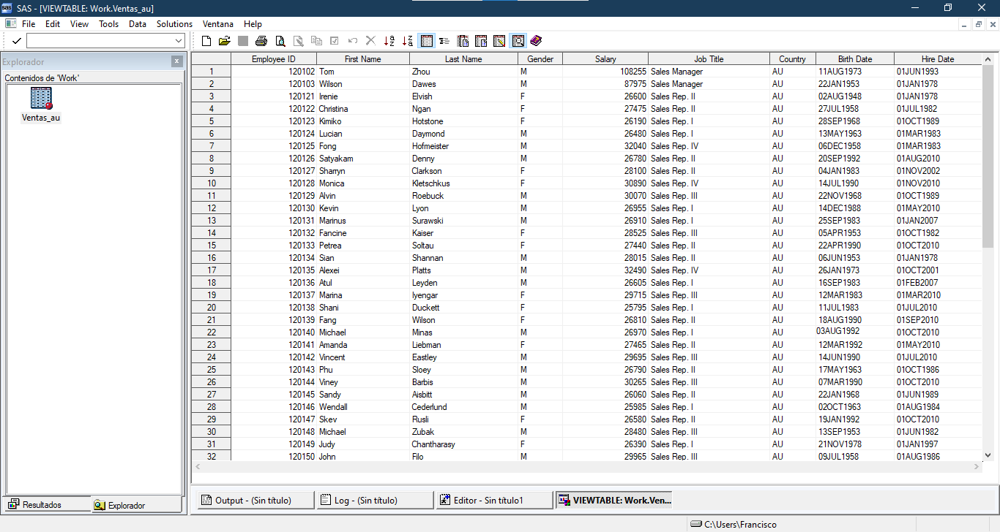
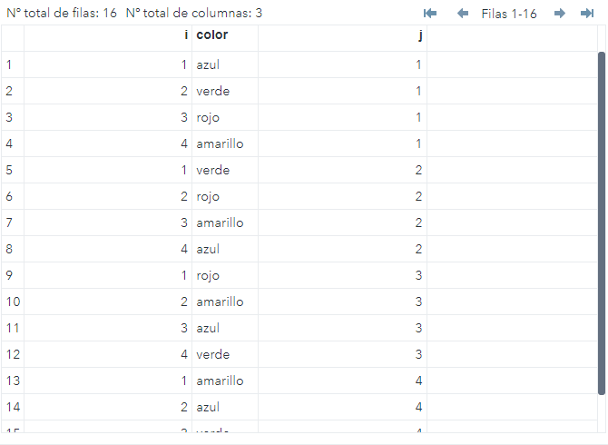
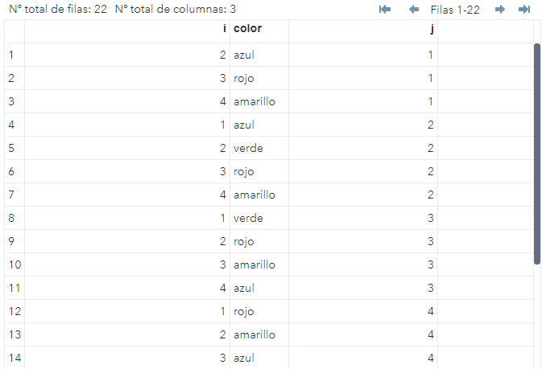
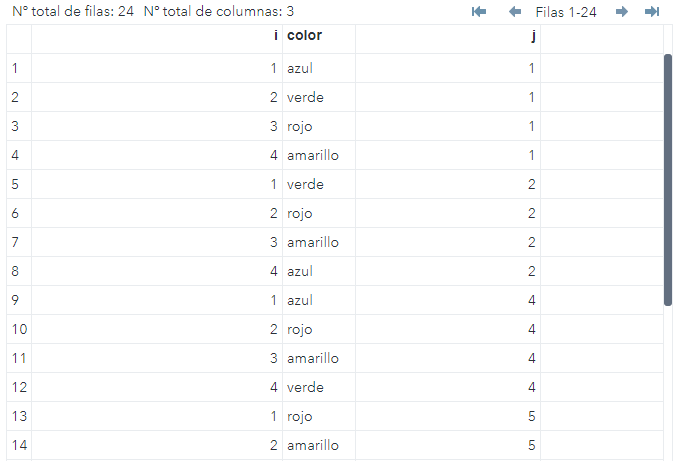
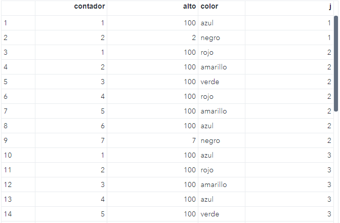

# Manejo de bases

En esta sección se presentan temas más profundos acerca del procesamiento de datos.
Se explorarán distintas formas de manejar bases mediante uso de variables, seleccionar observaciones así como el uso de ciclos y arreglos que nos permitan tener un mayor control de la información que se tenga.

Primero se verá la forma de crear variables con el fin de realizar cálculos posteriores, estas variables pueden ser usadas incluso para crear varios datasets, crear contadores o acumuladores, entre otras. También se conocerán técnicas de selección de observaciones con el fin de manipular mejor las bases.

Después se explorará un poco el tema del ordenamiento con el fin de crear ya sea grupos o realizar otras operciones como uniones, transposiciones entre otras.

Antes de continuar con temas mas complejos, es importante comprender de forma general el funcionamiento del paso DATA.

Para una explicación más detallada consulte [Cómo funciona el paso DATA](https://support.sas.com/documentation/cdl/en/basess/58133/HTML/default/viewer.htm#a001290590.htm).

El paso DATA tiene dos fases:

- Fase de compilación
- Fase de ejecución

A continuación se describir´n de forma breve estas fases.

Durante la fase de compilación, SAS revisa la sintaxis y si es correcta, se manda a código máquina en dondese procesa el código y se generan los siguientes objetos:

- **Memoria de entrada**. Es un lugar en la memoria donde SAS lee registros de un archivo de texto cuando el programa se ejecute.
- **Vector de datos del programa**. Es un lugar en la memoria donde SAS construye un conjunto de datos, una observación a la vez.
- **Porción descriptora**. Es la información general del dataset como el nombre de la base y los atributos de las variables a crear.

La memoria de entrada solo aplica en el caso en que se lean archivos externos. En este caso, los datos se leen de la memoria de entrada al vector de datos del programa.

El vector de datos del programa (VDP) es importante porque en éste se realizarían los cálculos de las sentencias de SAS o funciones. Contiene el nombre de todas las variables declaradas o inicializadas. Es como un paso intermedio entre lo que se lee y calcula con lo que se se escribe al dataset. Al inicio de cada iteración los valores en el VDP son iniciados con valor missing y son llenados según lea o ejecuten sentencias.

Durante la fase de compilación tambien se crean dos variables auxiliares en el VDP que no se escribirán en el dataset: `_N_` y `_ERROR_`. La primera cuenta el número de veces que el paso DATA itera y la segunda registra si hubo algún problema en la fase de ejecución.

Una vez concluída esta etapa, se procede a la siguiente fase.

En la fase de ejecución se realizan las siguientes acciones:

1. Se leen las observaciones del VDP.
2. Se ejecutan las sentencias (cálculo de variables).
3. Se escriben al dataset.
4. La variables en el VDP son reiniciadas y se colocan valores missing.

Debido a que es un procesos repetitivo, SAS realiza los pasos mencionados tantas veces como observaciones haya en el archivo externo o dataset leído.

El proceso termina cuando ya no hay registros que leer y en ese momento el dataset es cerrado y se concluye el paso DATA.

## Creando variables

Hasta ahora solo conocíamos las sentencias `ATTRIB`, `LENGTH` y `FORMAT` para declarar o iniciar variables. Otra forma de crearlas es mediante la asignación de variables de la siguiente forma:

> variable = *expresión sas*;

Esta sentencia se conoce como *sentencias de asignación*. Su función es evaluar y almacenar el resultado en alguna variable que está al lado izquierdo del signo `=`.

Una forma muy común de crear variables es mediante el uso de operadores matemáticos. La siguiente tabla muestra algunos de los operadores aritméticos en SAS. Para una referencia consulte [Operadores SAS en expresiones](https://documentation.sas.com/doc/en/lrcon/9.4/p00iah2thp63bmn1lt20esag14lh.htm#n1feyypdf6czp4n15pthf5lafmlf) y [Funciones SAS en expresiones](https://documentation.sas.com/doc/en/lrcon/9.4/p1fjvn4giid9e0n1v0wcn4ibwbzi.htm).

Símbolo|Descripción|Ejemplo|
-------|-----------|-------|
`+`    |Adición    |`fecha + 1`
`-`    |Sustracción|`fecha - 7`
`*`    |Multiplicación|`height * 2.54`
`/`    |División   |`suma / total`
`**`   |Exponenciación|`metros ** 2`

Considere las siguientes sentencias:

````sas
fecha = '10Jun20'd;
version = 1;
status = "ok";
altura = height * 2.54;
nombre2 = SUBSTR(name,1,3);
````

En esas sentencias se han creado las variables simplemente asignando un valor o una expresión SAS.

Las primeras tres sentencias crearían variables de tipo numérico; la expresión `'10Jun20'd` es interpretada por sas como un valor numérico.

La cuarta sentencia realiza una multiplicación de una variable por una constante.

Finalmente, la quinta aplica una función a una variable de tipo caracter que extraerá los 3 primeros caracteres de una cadena. Para conocer un poco más vea la [sección](#funciones-y-llamadas-a-rutinas).

A continuación se presentan algunas variables que serán muy útiles.

### Variables acumuladoras y contadoras

En SAS es posible crear una variable que sume o vaya acumulando.

Considere la siguiente tabla donde se representan la información de los empleados de una compañía. Se desea obtener un acumulado de las ventas de los empleados y un contador para tener en cuenta el número de empleados.



El siguiente código muestra la forma de crear el acumulador y el contador de forma muy básica.

````sas hl_lines="3 4"
DATA ventas_au2;
    SET ventas_au;
    contador = _N_;
    salario_acum + salary;
RUN;
````

La tercer línea guarda el número de veces que se ha iterado, es decir el número de registros leídos. Debido a que la variable `_N_` es temporal y no se escribe en el dataset, se guarda en la variable _contador_.

En la cuarta se muestra cómo acumular en la variable *salario_acum*, en cada iteración se le suma la variable *salary* a la variable *salario_acum*. Esta sentencia es conocida como [sentencia SUM](https://documentation.sas.com/doc/en/pgmsascdc/9.4_3.5/lestmtsref/n1dfiqj146yi2cn1maeju9wo7ijs.htm).

!!! error "Cuidado con el operador +"
    Se debe tener cuidado al usar el operador `+` debido a que si alguno de los operandos tiene un valor _missing_, el resultado sería _missing_. Se recomienda usar la [función SUM](https://documentation.sas.com/doc/en/pgmsascdc/9.4_3.5/lefunctionsref/n0zxive1z1ctqin12w06c85jfigd.htm) para evitar esos imprevistos.

Si se hubiese definido `salario_acum = salario_acum + salary`en la línea 4, el resultado en cada observacion nos resultaría un valor _missing_. Como se mencionó previamente, durante la fase de compilación los valores en el VDP se reinician a valor _missing_ causando que el resultado en dicha expresión sea _missing_.

Para evitar que eso ocurra, se puede usar la sentencia `RETAIN` con el fin de que SAS conserve el valor en cada iteración.

````sas
DATA ventas_au2;
    SET ventas_au;
    RETAIN salario_acum2 0;
    salario_acum2 = salario_acum2 + salary; 
RUN;
````

En la línea 3 se pide que SAS retenga la variable _salario_acum2_ en cada iteración y que su valor inicial sea 0. De esta manera se podría sumar de manera normal. Consulte la [sentencia RETAIN](https://documentation.sas.com/doc/en/pgmsascdc/9.4_3.5/lestmtsref/p0t2ac0tfzcgbjn112mu96hkgg9o.htm) para más información.

### Funciones y llamadas a rutinas

Ya habíamos mencionado que las funciones podían usarse para crear variables, sin embargo ahora se profundizará un poco más en su uso.

Las funciones permiten realizar cálculos y operaciones en ocasiones muy complejas, éstas pueden  requerir de cierta información o argumentos con el fin de traer el resultado. Generalmente son almacenadas en variables, aunque pudieran usarse como una expresión en una sentencia `WHERE` o `IF`. Su sintaxis es la siguiente:

> <_variable =_> funcion(<_argumento1,argumento2_,...,_argumenton_>);

Las llamadas a rutinas, en cambio en lugar de arrojar un resultado, realizan una acción u operacion. Su sintaxis es la siguiente:

> **CALL** rutina(<_argumento1,argumento2_,...,_argumenton_>);

Para más información acerca de las llamadas a rutinas y funciones consulte [Funciones SAS y rutinas](https://documentation.sas.com/doc/en/pgmsascdc/9.4_3.5/lefunctionsref/p0n609kcs3dmqfn1jrhi0fiitpwk.htm).

## Filtrado de datos

En ocasiones, se tiene una basta cantidad de datos y solo nos interesa un subconjunto de estos. Para eso se pueden elegir observaciones de un dataset con la sentencia `WHERE`.

!!! caution "WHERE vs IF"
    No debe confundirse la sentencia `WHERE` con `IF`. La sentencia `IF` trabaja con observaciones _después_ de ser leídas en el VDP, mietras que `WHERE` selecciona las observaciones _antes_ de pasar al VDP.

La sintaxis es la siguiente:

> WHERE _expresión_;

donde _expresión_ es una condición a evaluar, vea la sección [selección de observaciones](/site/sas/basico_sas/index.html#seleccion-de-observaciones) para una referencia de los operadores lógicos y booleanos. La siguiente tabla muestra expresiones válidas para la sentencia `WHERE`

Operador|Descripción|Ejemplo
--------|-----------|-------
`BETWEEN - AND`|Un rango inclusivo| `WHERE age BETWEEN 12 AND 15;`
`?` o `CONTAINS`|Una cadena de caracteres|`WHERE name ? "Ja";`
`IS NULL` o `IS MISSING`|Valores faltantes|`WHERE volumen IS NULL;`
`LIKE`|Combinación de patrones|`WHERE name LIKE "J%";`
`=*`|Suena como (Sólo palabras en inglés)|`WHERE name =* "jeims";`
`SAME - AND`|Agrega cláusulas a una sentencia `WHERE` existente|`WHERE sex = "F"; WHERE SAME AND age >= 13;`

En el siguiente ejemplo se muestra el filtrado usando la sentencia `WHERE` usando los datos de [covid](src/datos_covid_web.sas) para tener sólo la información de México.

````sas
DATA mexico;
    SET covid;
    WHERE iso_code EQ "MEX";
RUN;
````

El log muestra el siguiente mensaje:

> NOTE: There were 609 observations read from the data set WORK.COVID.
>
> WHERE iso_code='MEX'

Si se hubiese usado la sentencia `IF` en lugar de `WHERE` el resultado hubiera sido el siguiente:

> NOTE: There were 113406 observations read from the data set WORK.COVID.
>
> NOTE: The data set WORK.MEXICO has 609 observations and 60 variables.

El ejemplo anterior muestra las diferencias entre las sentencias `IF` y `WHERE`.

!!! tip "`WHERE` como opción de dataset"
     Es posible usar la opción `WHERE =` para filtrar observaciones para un dataset especificado, esto es útil cuando se leen más de un dataset. Vea la [documentación](https://documentation.sas.com/doc/en/pgmsascdc/9.4_3.5/ledsoptsref/p0ny9o8t8hc5zen1qn3ft9dhtsxx.htm) para más información.

### Sentencias condicionales

Anteriormente se había usado la sentencia `IF` para seleccionar variables, ahora se usará en conjunto con la palabra `THEN` con el fin de que realice una acción. Esta sentencia se conoce como sentencia **IF-ELSE**.

La sintaxis es la siguiente:

> IF _expresión_ THEN _acción1_; ELSE _acción2_;

El siguiente ejemplo muestra cómo crear una variable a partir de ciertos valores.

````sas
DATA clase;
    SET SASHELP.CLASS;
    LENGTH sexo $8;
    IF sex = "F" THEN sexo = "Mujer";
    ELSE sexo = "Hombre";
RUN;
````

Note que la sentencia `IF-ELSE` solo permite una acción a la vez. Para realizar más de una acción se debe usar el bloque `DO`. Consulte la [documentación](https://documentation.sas.com/doc/en/pgmsascdc/9.4_3.5/lestmtsref/n0el0y2a02ab1ln1pks3gbac1en3.htm) para más información.

````sas
DATA clase;
    SET SASHELP.CLASS;
    sexo = "Hombre";
    genero = "Masculino";
    IF sex = "F" THEN DO;
        sexo = "Mujer";
        genero = "Femenino";
    END;
RUN;
````

Estas sentencias pueden anidarse para formar sentencias más complejas, por ejemplo.

````sas
DATA clase;
   SET SASHELP.CLASS;
   LENGTH escuela $12.;
   IF age LE 12 THEN escuela = "Primaria";
      ELSE IF age GE 16 THEN escuela = "Preparatoria";
   ELSE escuela = "Secundaria";
RUN;
````

!!! caution "Cuidado con las estructuras anidadas"
    Se debe tener cuidado al usar sentencias anidadas ya que deben ser cerradas correctamente. De no ser así, se pueden cometer errores.

Otra forma de crear sentencias condicionales es mediante el uso de la sentencia `SELECT`. Consulte la [ayuda](https://documentation.sas.com/doc/en/pgmsascdc/9.4_3.5/lestmtsref/p09213s9jc2t99n1vx0omk2rh9ps.htm) para más información.

````sas
DATA clase;
   SET SASHELP.CLASS;
   LENGTH escuela $12.;
   SELECT;
      WHEN (age LE 12) escuela = "Primaria";
      WHEN (age GE 16) escuela = "Preparatoria";
      OTHERWISE escuela = "Secundaria";
   END;
RUN;
````

!!! note "No confundirse"
    Esta sentencia no debe confundirse con la sentencia [SELECT de SQL](https://documentation.sas.com/doc/en/pgmsascdc/9.4_3.5/sqlproc/p0hwg3z33gllron184mzdoqwpe3j.htm). Para hacer algo similar en SQL, revise este [ejemplo](https://vazquez-chavez-francisco-ariel.gitbook.io/notas/consultas-basicas#creacion-de-nuevas-columnas).

## Ciclos

Al igual que otros lenguajes de programación SAS dispone de sentencias de ciclo repetitivos. Estas sentencias son útiles para simulación de datos o para ingreso de datos repetitivos.

### DO iterativo

Es el equivalente al FOR de algunos programas

La sintaxis es la siguiente:

> DO _variable-índice_=_lista_;
> 
> _sentencias sas_;
>
> END;

donde _lista_ puede ser un rango de valores consecutivos (indicando inicio, fin e incremento) o una lista de valores. Consulte la [documentación](https://documentation.sas.com/doc/en/pgmsascdc/9.4_3.5/lestmtsref/p1cydk5fq0u4bfn1xfbjt7w1c7lu.htm) para una mayor referencia.

El siguiente ejemplo muestra su uso

````sas
DATA ejemplo;
    INPUT color :$8.;
    DO i = 1,3,5;
        j = _N_;
        OUTPUT;
    END;
    DATALINES;
    azul
    verde
    rojo
    amarillo
    ;
RUN;
````

El dataset anterior lee los datos señalados por la sentencia `INPUT`. En la primer iteración (es decir,cuando lee "azul") entra al ciclo DO y se escribe en el VDP el primer valor de la secuencia (i). La instrucción `OUTPUT` indica que se debe escribir ese valor al DATASET. Esto se repite para los valores restantes (3 y 5). Note que aún estamos en la primer iteración (es decir `_N_ = 1`).

Cuando se terminan los valores del ciclo DO, se lee la segunda observación del DATALINES y se repite lo mismo.

Esta estructura también es útil para leer datos consecutivos y hacer secuencias, por ejemplo

````sas hl_lines="2 6"
DATA colores;
    DO i = 1 to 4;
        INPUT color :$8. @@;
        j = _N_;
        OUTPUT;
    END;
    DATALINES;
    azul verde rojo amarillo
    verde rojo amarillo azul
    rojo amarillo azul verde
    amarillo azul verde rojo
    ;
RUN;
````



Note que derante la primer iteración (`_N_ = 1`) se inicia el ciclo `DO` con valores del 1 al 4. Una vez dentro del ciclo, SAS empezará a leer los 4 primeros valores del `DATALINES` y los escribirá al dataset. Esto se repetirá hasta que ya no haya observaciones por leer.

#### DO CONTINUE

SAS tiene una sentencia especial que permite, dentro de un ciclo, saltar al siguiente valor de la variable índice. Esto puede ser útil para prevenir que otras sentencias se ejecuten.

El siguiente ejemplo muestra su uso.

````sas hl_lines="5 6"
DATA colores;
    DO i = 1 to 4;
        INPUT color :$8. @@;
        j = _N_;
        IF color IN ("blanco" "negro") THEN CONTINUE;
        OUTPUT;
    END;
    DATALINES;
    negro azul rojo amarillo
    azul verde rojo amarillo
    verde rojo amarillo azul
    rojo amarillo azul verde
    blanco azul rojo amarillo
    amarillo azul verde rojo
    ;
RUN;
````

El código anterior evita que en el dataset se ingresen los colores blanco o negro, ya que al cumplirse la condición no se ejecuta la sentencia `OUTPUT;`.



Consulte la [ayuda de SAS](https://documentation.sas.com/doc/en/pgmsascdc/9.4_3.5/lestmtsref/n0vupy1vhs8gosn1tjd3zg8dtf76.htm) para más información acerca de la sentencia `CONTINUE`.

#### DO LEAVE

A diferencia de la sentencia `CONTINUE`, la sentencia `LEAVE` permite salir del ciclo `DO`.

El siguiente ejemplo muestra el uso de la sentencia `LEAVE`.

````sas hl_lines="11 14"
DATA colores;
    DO i = 1 to 4;
        INPUT color :$8. @@;
        j = _N_;
        IF color IN ("blanco" "negro") THEN LEAVE;
        OUTPUT;
    END;
    DATALINES;
    azul verde rojo amarillo
    verde rojo amarillo azul
    negro color1 color2 color3
    azul rojo amarillo verde
    rojo amarillo azul verde
    blanco color1 color2 color3
    azul rojo amarillo verde
    amarillo azul verde rojo
    ;
RUN;
````

En este caso, cuando se cumple la condición, sale del ciclo DO y esto implica que se lea la siguiente línea por lo que no se toma en cuenta los valores que hay en las líneas 11 y 14.



Consulte la sentencia [LEAVE](https://documentation.sas.com/doc/en/pgmsascdc/9.4_3.5/ds2ref/p1irdset32xggmn1c7dwqmthxvnd.htm) para más información.

### DO WHILE

La sentencia `DO WHILE` es un bloque de instrucciones que se ejecuta siempre que se esté cumpliendo la condición, dicha condición debe cumplirse **forzosamente** antes de entrar al ciclo, de otra forma no se ejecutará.

El siguiente ejemplo muestra el uso de la estructura *DO WHILE*

````sas hl_lines="2 3 4 9 10"
DATA colores;
    contador = 1;
    alto = 100;
    DO WHILE (contador < alto);
        INPUT color :$8. @@;
        j = _N_;
        IF color IN ("blanco" "negro") THEN alto = contador;
        OUTPUT;
        contador + 1;
    END;
    DATALINES;
    azul negro rojo amarillo
    verde rojo amarillo azul
    negro azul rojo amarillo
    azul verde rojo amarillo
    verde rojo amarillo azul
    rojo amarillo azul verde
    blanco azul rojo amarillo
    amarillo azul verde rojo
    ;
RUN;
````

En el código anterior, se define un contador con el valor de 1 y una variable de paro con el valor de 100. Al entrar al ciclo, se leen las líneas con la sentencia `INPUT`. Cuando el color es blanco o negro, se modifica el criterio de alto con el fin de salir del ciclo y con ello se pasa a la segunda iteración, reiniciándose tanto el contador (1) como el criterio de alto (100).



!!! danger "Condición de alto"
    Siempre es importante definir una expresión o condición de alto, de otra forma, se entraría en un ciclo infinito.

Para conocer más vea la [ayuda de SAS](https://documentation.sas.com/doc/en/pgmsascdc/9.4_3.5/lestmtsref/p1awxgleif5wlen1pja0nrn6yi6i.htm) sobre esta sentencia.

### DO UNTIL

A diferencia de las instrucciones anteriores, la sentencia `DO UNTIL` asegura que al menos se ejecuta una vez.

La expresión se evalúa al final de las sentencias del bloque. Si la expresión es verdadera, el ciclo ya no itera.

Usando el mismo código que en la sección anterior, se muestran los resultados:

````sas hl_lines="2 3 4 9 10"
DATA colores;
    contador = 0;
    alto = 100;
    DO UNTIL (contador >= alto);
        contador + 1;
        INPUT color :$8. @@;
        j = _N_;
        IF color IN ("blanco" "negro") THEN DO;
            contador = 0;
            alto = contador;
        END;
        OUTPUT;
    END;
    DATALINES;
    azul negro rojo amarillo
    blanco rojo amarillo azul
    negro azul rojo amarillo
    azul verde rojo blanco
    verde rojo amarillo azul
    rojo amarillo azul verde
    blanco azul rojo amarillo
    amarillo azul verde rojo
    ;
RUN;
````


Note que en la primer iteración se entra al ciclo y se escriben los valores al dataset. En el segundo valor leído (_negro_) se cumple la condición pero ya ha cambiado el valor de las variables _contador_ y _alto_ a cero y se salta a la siguiente iteración.

Con la nueva iteración se reinician los valores iniciales hasta que se cumpla la condición.

Para más información vea la sección [DO UNTIL](https://documentation.sas.com/doc/en/pgmsascdc/9.4_3.5/lestmtsref/p1021qt3a3n8m2n1vh11ggzhu57n.htm).

## Arreglos

Supóngase que se desea tener información de ventas acomodada en columnas, donde cada una represente un trimestre.

Una forma de introducir esta información es mediante el uso de arreglos o _arrays_. Los arreglos son una forma de crear variables de forma iterativa y pueden ser usadas dentro de un ciclo.

!!! danger "No confundir con otros lenguajes"
    A pesar de que tienen un nombre idéntico, los arreglos no son iguales a los objetos de otros lenguajes de programación.

## Manipulación y transformación de bases
