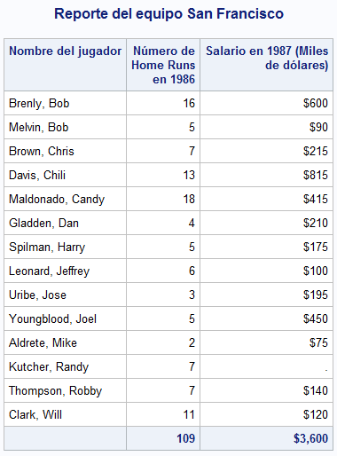
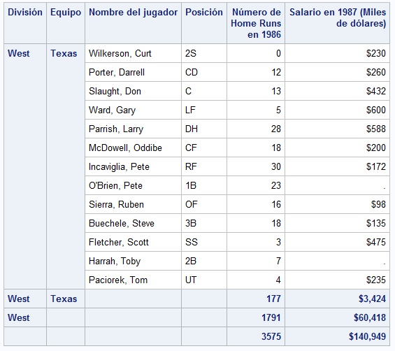

## Creación de reportes

SAS es una herramienta muy útil para crear reportes de datos, algunos de ellos se pueden personalizar o adaptarlos a distintas necesidades.

## Formatos

Anteriormente ya habíamos hablado de los formatos que están precargados en SAS. En esta ocasión se hablará de cómo hacer formatos personalizados para incluirlos en los reportes.

El procedimiento **FORMAT** permite crear formatos personalizados y usarlos en cualquier dataset o procedimiento. Los formatos son útiles, por ejemplo, cuando se tienen encuestas que están codificadas con valores numéricos, pero tienen una etiqueta. El siguiente ejemplo muestra cómo crear un formato que represente el sexo de una persona

````sas
PROC FORMAT;
FORMAT sexo
1 = "Femenino"
2 = "Masculino"
;
RUN;
````

## Reportes básicos

El reporte más simple que se puede crear, es mostrar el conjunto de datos usando el procedimiento `PROC PRINT`.

Sin embargo, para datasets muy grandes, esto no sería una buena opción debido a que SAS gastaría muchos recursos en imprimir toda la tabla. Se pueden usar ciertas configuraciones para que SAS solo procece cierta cantidad de observaciones de un dataset.

La primera de ellas es mediante las *opciones generales*, la cual afectaría a todos los procedimientos durante la sesión o mediante las *opciones de dataset* la cual solo aplica durante ese procedimiento. Para una referencia completa sobre las opciones generales, visite el [diccionario de opciones del sistema](https://documentation.sas.com/doc/es/pgmsascdc/9.4_3.5/lesysoptsref/p1tmgku1vq7pwqn1iqioeflxgec1.htm) y para las opciones de dataset vea el [diccionario de opciones de datasets](https://documentation.sas.com/doc/es/pgmsascdc/9.4_3.5/ledsoptsref/p1pczmnhbq4axpn1l15s9mk6mobp.htm).

El siguiente ejemplo muestra las primeras diez observaciones del conjunto de datos de baseball, pero solo pedimos que muestre ciertas variables.

````sas
PROC PRINT DATA = SASHELP.BASEBALL(OBS=10);
    VAR NAME TEAM NHOME SALARY;
RUN;
````

Produce el siguiente resultado


### Un reporte con seleccionando casos con total

**PROC PRINT** tambien tiene diversas sentencias para hacer reportes más completos o específicos.

````sas
TITLE "Reporte del equipo San Francisco";
PROC PRINT DATA = SASHELP.BASEBALL NOOBS;
    VAR NAME NHOME SALARY;
    WHERE TEAM EQ "San Francisco";
    FORMAT SALARY DOLLAR12.;
    LABEL 
        NAME = "Nombre del jugador"
        NHOME = "Número de Home Runs en 1986"
        SALARY = "Salario en 1987 (Miles de dólares)"
    ;
    SUM NHOME SALARY;
RUN;
TITLE;
````

El anterior ejemplo muestra un reporte que incluye el nombre de todos los jugadores del equipo *San Francisco*, número de home run ysu salario; al final del reporte se presenta el gran total de estas variables. En este ejemplo se modificaron las etiquetas y los formatos, pero sólo para el reporte mediante las sentencias `LABEL` y `FORMAT` y se seleccionaron las observaciones que cumplieran cierto criterio.

La opción `NOOBS` en la sentencia `DATA` pide no imprimir el número de observación del dataset y con la opción `LABEL` se mostrarán las etiquetas de las variables.

La sentencia `VAR` especifica las variables a mostrar.

La sentencia `WHERE` selecciona las observaciones que cumplan la condición de que el equipo sea igual a *San Francisco*.

La sentencia `FORMAT` le asigna a la variable **SALARY** el formato `DOLLAR12.`.

`LABEL` especifica las etiquetas de las variables en el reporte. En caso de que las variables del dataset ya tengan etiquetas, estas etiquetas definidas prevalecen en el reporte.

La sentencia `SUM` es la que especifica las variables que mostrarán el gran total. Finalmente se agrega la opción `TITLE` para que se le ponga un título al reporte y se vuelve a llamar al final para que vuelva a su valor inicial.



### Reporte con subtotales

Es posible mostrar los reportes con subtotales por grupos de variables.

!!! warning "Datos agrupados"
    Los datos se deberían ordenar por la variables que se desee hacer el agrupamiento para evitar posibles errores en los cálculos. SAS considera valores iguales de la variable de agrupamiento como un bloque. Si SAS encontrara una observación con un valor que ya procesó, se generará un error.

Se puede usar el procedimiento SORT para ordenar una dataset por las variables que se deseen y posteriormente realizar el reporte.

````sas
PROC SORT DATA = SASHELP.BASEBALL OUT = BASEBALL;
    BY DIVISION TEAM;
RUN;

PROC PRINT DATA = BASEBALL NOOBS LABEL;
    VAR NAME POSITION NHOME SALARY;
    FORMAT SALARY DOLLAR12.;
    LABEL DIVISION = "División"
    NAME = "Nombre del jugador"
    TEAM = "Equipo"
    POSITION = "Posición"
    NHOME = "Número de Home Runs en 1986"
    SALARY = "Salario en 1987 (Miles de dólares)"
    ;
    SUM NHOME SALARY;
    BY DIVISION TEAM;
RUN;
````

El procedimiento SORT especifica que se ordene por las variables *division* y luego por *team* y se pide que se guarde una copia temporal, con el fin de no modificar el dataset original.

En el procedimiento **PRINT** se usa la sentencia `BY` para que crear el reporte por combinaciones de valores de *division* y *team*.


La imagen anterior muestra el ultimo grupo de variables (División = West y Equipo = Texas). Nótese que este grupo contiene los subtotales tanto de las variables *team* y *division* así como el gran total. Cada grupo contiene como título el valor de las variables *division* y *team*.

!!! tip "Personalizar etiquetas"
    Se pueden agregar en la sentencia `PROC PRINT` las opciones `SUMLABEL =` y `GRANDTOTAL_LABEL =` para personalizar las etiquetas de subtotales y el gran total.

Si se desea mostrar un reporte con otro estilo resaltando las variables de agrupamiento, se puede agregar la sentencia.

`ID DIVISION TEAM;`

El resultado es el siguente.


